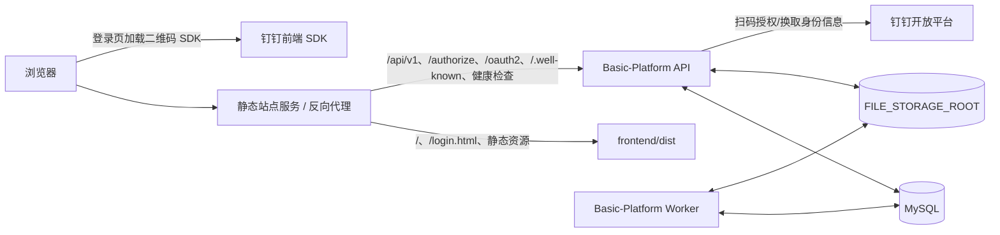

# Basic-Platform 前后端部署文档

> **适用范围**：本文仅根据当前工作区的项目源码、构建脚本和配置模板整理，不补充项目中不存在的 Docker、Nginx、systemd、Kubernetes 或 CI/CD 实现。
>
> **当前验证状态（2026-07-21）**：钉钉处理器装配参数已统一；后端全量测试、静态检查、钉钉模块竞态测试、迁移专项测试以及前端生产构建均已通过。该结论不代表已完成真实 MySQL 迁移和钉钉生产环境扫码联调；发布前仍须按本文验收。

---

## 1. 部署结论与运行组成

当前项目是一个前后端分离的应用，运行时由下列部分组成：

| 组成 | 源码位置/产物 | 作用 | 是否必须 |
|---|---|---|---|
| 前端静态站点 | `frontend/`，构建产物为 `frontend/dist/` | Vue 登录页、平台控制台、钉钉二维码组件 | 是 |
| HTTP API | `backend/cmd/api` | 认证、权限、管理、审计、OIDC、钉钉扫码回调等 HTTP 接口 | 是 |
| 异步 Worker | `backend/cmd/worker` | 处理 MySQL 驱动的异步审计导出任务，并写入本地文件存储 | 是；否则异步导出任务不会被消费 |
| 数据库迁移程序 | `backend/cmd/migrate` | 执行内嵌的 MySQL 迁移 | 每次新环境初始化和每次发布前需要执行 |
| MySQL | 外部服务 | 核心持久化、迁移记录、异步任务和钉钉扫码状态 | 是 |
| 本地持久化目录 | `FILE_STORAGE_ROOT`、`LOG_DIRECTORY` | 审计导出/归档文件及本地 JSON 日志 | 是 |
| 反向代理或静态站点服务 | **项目未提供配置** | 对外提供 HTTPS、托管前端 `dist`、将 API 请求转发至后端 | 生产环境需要由运维自行提供 |



### 1.1 项目明确未提供的部署产物

在当前代码库中未找到以下文件或配置：

- `Dockerfile`、`docker-compose.yml`；
- Nginx、Caddy、Apache 等反向代理配置；
- systemd service 文件；
- Kubernetes/Helm 清单；
- GitHub Actions 等持续部署工作流；
- 前端 Node.js 运行时版本约束（`frontend/package.json` 未声明 `engines`）；
- MySQL 具体最低版本、备份策略、TLS 证书和日志轮转方案。

因此，本文给出项目实际需要满足的**接口、路径、进程和配置约束**，但不将任一具体代理或容器配置伪装成项目既有配置。

---

## 2. 部署前置条件

### 2.1 构建与运行依赖

| 依赖 | 项目依据 | 部署要求 |
|---|---|---|
| Go | `backend/go.mod` 声明 `go 1.26.4` | 使用与该模块声明兼容的 Go 工具链进行后端编译。 |
| Node.js 与 npm | `frontend/package.json` 提供 npm scripts，未声明 Node 版本 | 选择能够安装当前依赖（Vue 3、Vite 7）的 Node.js/npm 组合；在正式流水线中固定实际版本并留档。 |
| MySQL | `gorm.io/driver/mysql`、`go-sql-driver/mysql`、MySQL 迁移 SQL | 准备可连接的 MySQL 实例、库、账号和密码。项目未声明具体 MySQL 版本，需由环境方验证兼容性。 |
| 网络 | 钉钉前端 SDK 与后端钉钉接口 | 若启用钉钉扫码，浏览器需能访问 `g.alicdn.com`，后端需能访问钉钉开放平台；回调地址必须能被钉钉访问。 |
| 可写文件系统 | API/Worker 启动时创建目录 | 运行用户必须能创建和写入 `FILE_STORAGE_ROOT`、`LOG_DIRECTORY`。 |
| HTTPS 与公网域名 | Cookie、OIDC、钉钉回调使用场景 | 生产环境应由外部反向代理或网关提供 HTTPS。项目自身仅监听 HTTP 地址，不负责 TLS 终止。 |

### 2.2 构建阻断项（必须先处理）

当前源码的钉钉 HTTP 处理器构造函数参数发生了不一致：

- `dingtalkhttp.NewHandler(...)` 当前签名需要 `browserContextProtector`；
- `buildDingTalkLoginHandler(...)` 仍少传此参数；
- 钉钉处理器测试也仍使用旧签名。

该问题会使 API 和 Worker 不能完成编译。部署前请由后端开发人员先统一构造函数签名、启动装配代码与测试代码。修复后应重新执行：

```bash
cd /Users/yglf/GOPATH/src/Basic-Platform/backend
GOCACHE=/tmp/basic-platform-go-build-cache go test ./...
```

> `GOCACHE` 仅用于避免受限运行环境不能写入默认 Go 构建缓存；实际部署机可按其正常缓存策略执行。

---

## 3. 目录与持久化规划

建议将可执行程序、配置、密钥、日志和导出文件分开管理。下表为**建议的目录职责**，不是项目内置目录结构：

| 类别 | 建议 | 项目行为 |
|---|---|---|
| 后端二进制 | 独立发布目录 | 可分别编译 API、Worker、Migrate 三个程序。 |
| 环境文件 | 例如 `/etc/basic-platform/production.env` | `ENV_FILE` 指向该文件时，环境变量优先级高于文件内容。 |
| JWT PEM 密钥 | 运行账号可读、非代码库目录 | API 启动时读取私钥与公钥；三个 JWT 管理器共用这对路径。 |
| 文件存储 | 例如 `/var/lib/basic-platform/uploads` | API 与 Worker 都会创建目录；审计 CSV 和 gzip 归档写入此处。 |
| 日志目录 | 例如 `/var/log/basic-platform` | 程序写入 `application.jsonl`，同时向标准输出写 JSON 日志。 |

### 3.1 相对路径的重要规则

`AUTH_JWT_PRIVATE_KEY_PATH`、`AUTH_JWT_PUBLIC_KEY_PATH`、`FILE_STORAGE_ROOT`、`LOG_DIRECTORY` 若配置为相对路径，程序会以**实际选用的环境文件所在目录**为基准解析，而不是以启动命令所在目录为基准。

例如，若：

```text
ENV_FILE=/etc/basic-platform/production.env
AUTH_JWT_PRIVATE_KEY_PATH=keys/jwt-ed25519-private.pem
```

则实际私钥路径为：

```text
/etc/basic-platform/keys/jwt-ed25519-private.pem
```

生产环境建议对日志、上传/导出目录使用绝对路径，以降低因环境文件移动导致的风险。

### 3.2 多实例限制

- Worker 通过 MySQL 中的锁处理异步导出任务，源码注释说明可运行多个 Worker 实例而不依赖 Redis。
- 但审计导出与归档文件写在本地 `FILE_STORAGE_ROOT`。如果 API 和 Worker 分布到多台机器，或 API 有多个实例，必须保证它们看到一致的文件存储（例如共享持久卷），否则生成文件的节点与下载文件的节点可能不一致。这是由源码使用本地路径推导出的部署约束；项目没有对象存储适配器。
- 登录、MFA、钉钉扫码等敏感接口的限流使用**进程内内存**、按 `RemoteAddr` 的 IP 值计数。多个 API 实例之间不共享限流状态，也未读取 `X-Forwarded-For`。多实例及反向代理部署时，应评估这一实际行为，不能将其当成分布式用户级限流。

---

## 4. 后端配置

### 4.1 配置加载顺序

后端 API、Worker、Migrate 使用同一套配置加载逻辑：

1. 如果设置了 `ENV_FILE`，读取该文件；
2. 如果未设置，从当前工作目录查找 `.env`，找不到时再查找父目录 `.env`；
3. 操作系统环境变量优先于环境文件中的同名值；
4. 缺失的 `.env` 文件不会被视为错误，但缺失必要配置或密钥会导致启动失败。

正式部署建议明确设置 `ENV_FILE`，不要依赖工作目录推断。

### 4.2 必须核对的配置项

以下表格按当前 `config.Config` 的实际读取逻辑整理。示例值均为占位符，不能直接用于生产。

| 分组 | 配置项 | 说明与部署要求 |
|---|---|---|
| 应用 | `APP_ENV` | 环境标识，默认 `development`。建议生产环境明确设置。 |
| 应用 | `APP_NAME` | 服务名，不能为空；健康检查与日志会使用。 |
| 应用 | `APP_TIMEZONE` | 当前会被加载到配置；源码未显示其用于设置进程全局时区，不能仅依赖它改变数据库/系统时区。 |
| HTTP | `APP_HTTP_ADDR` | API 监听地址，默认 `:8080`。通常仅向本机或内网监听，再由代理对外暴露。 |
| HTTP | `APP_PUBLIC_BASE_URL` | 必须是无凭据、query、fragment 的绝对地址；`APP_ENV=production` 时强制使用 HTTPS。 |
| CORS | `APP_CORS_ALLOWED_ORIGINS` | 至少一个精确 Origin，逗号分隔；不能为 `*`。凭据请求会返回 `Access-Control-Allow-Credentials: true`。 |
| MySQL | `MYSQL_HOST`、`MYSQL_PORT`、`MYSQL_DATABASE`、`MYSQL_USERNAME`、`MYSQL_PASSWORD` | 前四项（除密码）会做启动校验。端口必须在 1–65535。 |
| MySQL | `MYSQL_PARAMS` | 传给 MySQL 驱动的其他参数；项目固定使用 `parseTime=true` 和 UTC，配置中的同名参数会被忽略。 |
| JWT/OIDC | `AUTH_JWT_ISSUER` | 常规平台 JWT 的 issuer，不能为空。 |
| JWT/OIDC | `AUTH_JWT_AUDIENCE` | 常规平台 JWT audience，不能为空。 |
| JWT/OIDC | `AUTH_APPLICATION_JWT_AUDIENCE` | 应用集成 JWT audience，不能为空。 |
| JWT/OIDC | `OIDC_ISSUER` | 必须是没有 query/fragment 的绝对 Origin；未设置时取 `APP_PUBLIC_BASE_URL`；`APP_ENV=production` 时强制使用 HTTPS。 |
| JWT/OIDC | `AUTH_JWT_PRIVATE_KEY_PATH`、`AUTH_JWT_PUBLIC_KEY_PATH` | 必须指向可读的 Ed25519 PEM 私钥/公钥。API 会加载常规 JWT、应用 JWT 和 OIDC JWT 三个管理器。 |
| Cookie | `AUTH_SESSION_COOKIE_NAME` | 不能为空，默认 `bp_session`。 |
| Cookie | `AUTH_SESSION_COOKIE_SECURE` | 布尔值；`APP_ENV=production` 时代码强制要求为 `true`，否则进程拒绝启动。 |
| Cookie | `AUTH_SESSION_COOKIE_SAME_SITE` | 仅支持 `Lax`、`Strict`、`None`。若为 `None`，代码强制要求 `AUTH_SESSION_COOKIE_SECURE=true`。 |
| Cookie | `AUTH_SESSION_TTL` | Go duration 格式且必须大于 0，例如 `8h`。 |
| 身份安全 | `IAM_MFA_ENCRYPTION_KEY` | **API 启动必需**。应为 Base64 编码、解码后恰好 32 字节的 AES-256-GCM 密钥。 |
| 身份安全 | `IAM_MOBILE_ENCRYPTION_KEY` | 可为空，空值时应用能启动；但尝试持久化手机号会明确失败，不会明文保存。若业务会维护手机号，应配置 Base64 编码的 32 字节密钥。 |
| 身份安全 | `IAM_FEDERATED_PROVIDER_SECRET_ENCRYPTION_KEY` | 启用存储机密的身份提供商配置、钉钉扫码时需要；为 Base64 编码的 32 字节密钥。 |
| 身份安全 | `IAM_EXTERNAL_LOGIN_STATE_ENCRYPTION_KEY` | 启用钉钉扫码时需要；用于加密扫码状态等敏感载荷，为 Base64 编码的 32 字节密钥。 |
| 外部 OIDC | `IAM_EXTERNAL_OIDC_HTTP_TIMEOUT` | 每次外部 OIDC 请求超时，必须大于 0 且不超过 1 分钟。 |
| 钉钉 | `IAM_DINGTALK_HTTP_TIMEOUT` | 每次钉钉 OAuth API 请求超时，必须大于 0 且不超过 1 分钟。 |
| 外部 OIDC | `IAM_EXTERNAL_OIDC_ALLOW_INSECURE_HTTP` | 是否仅对明确配置的非生产 HTTP 提供商放行；生产应保持 `false`。 |
| 外部 OIDC | `IAM_EXTERNAL_OIDC_ALLOWED_HOSTS` | 精确 host 或 host:port 白名单，逗号分隔；不可使用 scheme、路径或通配符。此项不是钉钉扫码的开关。 |
| 初始化 | `IAM_BOOTSTRAP_TOKEN` | 可选；若设置，长度至少 32 字符，才会启用首次超级管理员初始化接口。 |
| 审计 | `AUDIT_APPLICATION_CODE`、`AUDIT_ENVIRONMENT_CODE` | 不能为空，且其引用的应用/环境记录必须存在于数据库。注意：`APP_ENV=production` 不会自动把审计环境改为生产。 |
| 文件与日志 | `FILE_STORAGE_ROOT`、`LOG_DIRECTORY` | 都不能为空，运行用户需有写权限。 |
| Worker | `ASYNC_WORKER_ID`、`ASYNC_WORKER_POLL_INTERVAL`、`ASYNC_WORKER_STALE_LOCK_TIMEOUT` | Worker 标识和两个 duration 都必须有效且大于 0。多 Worker 实例应使用可区分的 ID。 |
| 日志 | `LOG_LEVEL` | 仅支持 `debug`、`info`、`warn`/`warning`、`error`。 |
| 日志 | `LOG_FORMAT` | 当前只支持 `json`。 |

### 4.3 不应误认为已生效的 OTEL 配置

根目录 `.env.example` 中包含 `OTEL_*` 项，但当前 `backend/internal/shared/config/config.go` 的配置结构和读取逻辑未消费这些变量。仅设置这些变量不会得到可由当前源码证明的 OpenTelemetry 导出效果；如需接入，需要另行实现并验证。

### 4.4 生产环境配置示意

以下是字段关系示意，所有密钥、密码、域名均需替换；不要把真实值提交到 Git：

```dotenv
APP_ENV=production
APP_NAME=basic-platform
APP_HTTP_ADDR=127.0.0.1:8080
APP_PUBLIC_BASE_URL=https://platform.example.com
APP_CORS_ALLOWED_ORIGINS=https://platform.example.com

MYSQL_HOST=mysql.internal.example.com
MYSQL_PORT=3306
MYSQL_DATABASE=basic_platform
MYSQL_USERNAME=basic_platform
MYSQL_PASSWORD=<由密钥管理系统注入>
MYSQL_PARAMS=charset=utf8mb4

AUTH_JWT_ISSUER=basic-platform
AUTH_JWT_AUDIENCE=basic-platform-console
AUTH_APPLICATION_JWT_AUDIENCE=basic-platform-integration
OIDC_ISSUER=https://platform.example.com
AUTH_JWT_PRIVATE_KEY_PATH=/etc/basic-platform/keys/jwt-ed25519-private.pem
AUTH_JWT_PUBLIC_KEY_PATH=/etc/basic-platform/keys/jwt-ed25519-public.pem
AUTH_SESSION_COOKIE_NAME=bp_session
AUTH_SESSION_COOKIE_SECURE=true
AUTH_SESSION_COOKIE_SAME_SITE=Lax
AUTH_SESSION_TTL=8h

IAM_MFA_ENCRYPTION_KEY=<Base64编码的32字节密钥>
IAM_MOBILE_ENCRYPTION_KEY=<Base64编码的32字节密钥>
IAM_FEDERATED_PROVIDER_SECRET_ENCRYPTION_KEY=<Base64编码的32字节密钥>
IAM_EXTERNAL_LOGIN_STATE_ENCRYPTION_KEY=<Base64编码的32字节密钥>
IAM_DINGTALK_HTTP_TIMEOUT=10s

AUDIT_APPLICATION_CODE=platform
AUDIT_ENVIRONMENT_CODE=<已在系统中创建的生产环境编码>
FILE_STORAGE_ROOT=/var/lib/basic-platform/uploads
LOG_DIRECTORY=/var/log/basic-platform
ASYNC_WORKER_ID=basic-platform-worker-01
ASYNC_WORKER_POLL_INTERVAL=2s
ASYNC_WORKER_STALE_LOCK_TIMEOUT=5m
LOG_LEVEL=info
LOG_FORMAT=json
```

> 项目 Makefile 中的 `generate-dev-jwt-keys` 明确用于开发环境，并将密钥生成至 `../data/keys`。生产环境应由受控的密钥管理流程提供可读的 Ed25519 PEM 文件，而不是在应用目录中临时生成或提交私钥。

---

## 5. 数据库初始化与迁移

### 5.1 迁移机制

- SQL 迁移位于 `backend/migrations/`，使用 `//go:embed *.sql` 编入 `migrate` 二进制；
- 当前目录包含 `000001` 至 `000031` 共 31 个迁移；
- 迁移记录保存在 `platform_schema_migration` 表；
- 迁移器使用 MySQL 命名锁，避免并发运行相同迁移；
- 已执行迁移的 SHA-256 校验和会被记录。如果修改已执行的 SQL 文件，后续迁移会失败；应新增迁移文件，不能改历史迁移；
- 项目没有提供 down/rollback 迁移命令或迁移回退脚本。

其中 `000031_create_dingtalk_qr_login_state.sql` 创建钉钉扫码登录状态表。启用钉钉扫码前必须确保该迁移已成功执行。

### 5.2 执行顺序

在新环境或新版本发布时，推荐的顺序是：

1. 备份或确认数据库恢复方案（项目未提供备份实现）；
2. 准备环境文件、JWT 密钥、文件目录和数据库账号；
3. 先编译并通过后端测试；
4. 使用同一个环境文件运行 `migrate`；
5. 确认迁移成功后启动 API；
6. API 就绪后启动 Worker；
7. 发布/切换前端静态资源；
8. 进行健康检查、登录和权限冒烟验证。

示例命令如下（可执行文件路径可按发布规范调整）：

```bash
cd /Users/yglf/GOPATH/src/Basic-Platform/backend
mkdir -p ../bin

go build -o ../bin/basic-platform-api ./cmd/api
go build -o ../bin/basic-platform-worker ./cmd/worker
go build -o ../bin/basic-platform-migrate ./cmd/migrate

ENV_FILE=/etc/basic-platform/production.env ../bin/basic-platform-migrate
```

开发环境也可使用项目已有的 Makefile：

```bash
make -C /Users/yglf/GOPATH/src/Basic-Platform/backend migrate
```

### 5.3 首次超级管理员初始化

首次初始化依赖 `IAM_BOOTSTRAP_TOKEN`：

1. 在首次启动 API 前设置一个至少 32 字符的随机令牌；
2. 完成迁移并启动 API；
3. 使用 `POST /api/v1/iam/bootstrap/first-super-admin`，在请求头传入 `X-Bootstrap-Token`，请求体包含 `display_name`、`account_name`、`password`；
4. 初始化成功后从运行环境中移除 `IAM_BOOTSTRAP_TOKEN` 并重启 API。

令牌为空时该路由仍存在，但会返回 404；令牌错误会返回 403。设置令牌时，该接口还有每分钟 5 次的进程内限流。令牌不会被持久化、记录到日志或返回给调用方。

---

## 6. 后端进程部署

### 6.1 API 进程

API 可执行程序：

```bash
ENV_FILE=/etc/basic-platform/production.env \
  /opt/basic-platform/bin/basic-platform-api
```

当前源码中的 HTTP 服务行为：

| 项目 | 实际行为 |
|---|---|
| 监听地址 | 来自 `APP_HTTP_ADDR`。 |
| 启动时 MySQL | 初始化 GORM 句柄时关闭自动 Ping；因此进程可在 MySQL 短暂不可用时提供存活检查。 |
| 请求超时 | ReadHeader 10 秒、Read 30 秒、Write 30 秒、Idle 60 秒。 |
| 优雅退出 | 收到 `SIGINT` 或 `SIGTERM` 后，最多等待 15 秒完成 HTTP 关闭。外部进程管理器的停止宽限期应不小于 15 秒。 |
| 数据库连接池 | 每个进程最大打开连接数 25、最大空闲 10、连接最大生命周期 30 分钟、最大空闲 5 分钟。多 API/Worker 实例时需按实例数核算 MySQL 连接上限。 |

### 6.2 Worker 进程

Worker 可执行程序：

```bash
ENV_FILE=/etc/basic-platform/production.env \
  /opt/basic-platform/bin/basic-platform-worker
```

Worker 与 API 使用同一 MySQL 配置、日志配置和 `FILE_STORAGE_ROOT`。它监听 `SIGINT`、`SIGTERM` 后停止轮询。不要只部署 API 而不部署 Worker，否则审计导出任务会留在数据库中而不被处理。

### 6.3 日志与文件权限

应用启动时会尝试创建日志目录和文件存储目录，目录权限为 `0750`。日志文件固定为：

```text
<LOG_DIRECTORY>/application.jsonl
```

文件以追加方式打开，权限为 `0640`，并同时输出到 stdout。代码未实现日志轮转和集中日志投递，生产环境需要由日志平台、宿主机或运行平台提供相关能力。

---

## 7. 前端构建与静态资源部署

### 7.1 前端构建

前端脚本定义如下：

- `npm run dev`：Vite 开发服务，绑定 `0.0.0.0:5173`；
- `npm run build`：构建生产静态文件；
- `npm run preview`：Vite 预览服务，绑定 `0.0.0.0:4173`。

生产构建步骤：

```bash
cd /Users/yglf/GOPATH/src/Basic-Platform/frontend
npm install
npm run build
```

构建结果位于：

```text
/Users/yglf/GOPATH/src/Basic-Platform/frontend/dist/
```

当前构建为多页面入口，至少包含：

```text
index.html
login.html
assets/
```

### 7.2 前端构建配置

前端只读取以 `VITE_` 开头的变量；这些值由 Vite 编译进静态产物。因此，修改 API 地址、成功跳转地址或钉钉提供商编码后，必须重新构建并发布前端。

| 变量 | 默认值 | 用途 |
|---|---|---|
| `VITE_API_BASE_URL` | `/api/v1` | 前端请求后端认证 API 的基础路径。 |
| `VITE_LOGIN_SUCCESS_URL` | `/` | 登录成功后的默认跳转路径。 |
| `VITE_DINGTALK_PROVIDER_CODE` | `DINGTALK_QR` | 发起钉钉二维码会话时传给后端的提供商编码。必须与后端已配置的身份提供商编码一致。 |

同域部署时，可保留：

```dotenv
VITE_API_BASE_URL=/api/v1
VITE_LOGIN_SUCCESS_URL=/
VITE_DINGTALK_PROVIDER_CODE=DINGTALK_QR
```

前端认证请求使用 `fetch(..., { credentials: 'include' })`，即依赖浏览器 Cookie，而不是在浏览器本地持久化 access token/refresh token。

### 7.3 静态站点与反向代理必须满足的路径要求

后端源码没有 `FileServer`、`ServeFile` 或 `frontend/dist` 引用，**Go API 不会托管前端构建产物**。静态站点服务需要自行完成以下职责：

1. 对外提供 `frontend/dist` 中的 `index.html`、`login.html` 和 `assets/`；
2. 将 `/api/v1/...` 转发到 API；
3. 若启用 OIDC，还应将 `/authorize`、`/oauth2/...`、`/.well-known/openid-configuration` 转发到 API；
4. 将 `/healthz`、`/readyz` 转发到 API，或使用内部探针直连 API；
5. 钉钉回调路径 `/api/v1/auth/dingtalk/callback` 必须从互联网可达，并转发到 API；
6. 若需要用户直接访问前端控制台路径（例如 `/audit`），静态站点服务应将这类前端路由回退到 `index.html`。项目只提供 Vite 开发服务，未提供生产服务器回退规则。

### 7.4 同域与跨域部署选择

**推荐同域部署**：前端和 API 使用同一个公共 Origin，静态服务将 `/api/v1` 反向代理到 API。这样可以保留默认 `VITE_API_BASE_URL=/api/v1`，并减少 Cookie/CORS 复杂度。

如果前端和 API 使用不同 Origin：

- 前端构建时需要将 `VITE_API_BASE_URL` 指向正确的 API Origin；
- `APP_CORS_ALLOWED_ORIGINS` 必须精确包含前端 Origin（协议、主机、端口均需一致），不能使用通配符；
- API 的 CORS 预检只允许 `GET, POST, PUT, PATCH, DELETE, OPTIONS`，请求头只允许 `Accept, Content-Type, X-Request-ID`；
- 因前端请求带 Cookie，必须根据浏览器实际跨站 Cookie 场景选择 SameSite；代码规定一旦使用 `SameSite=None`，`AUTH_SESSION_COOKIE_SECURE` 必须为 `true`；
- 应在目标浏览器上验证登录、回调、刷新会话和退出，不能仅依据 CORS 响应判断 Cookie 一定可用。

---

## 8. 钉钉 App 扫码登录部署条件

本项目当前源码已包含前端二维码渲染、后端二维码会话、钉钉回调和数据库状态存储代码，并已通过本地编译、单元测试、钉钉模块竞态测试和前端生产构建；仍需完成真实 MySQL 迁移和钉钉生产 HTTPS 回调联调后发布。

### 8.1 运行开关与密钥

钉钉扫码处理器仅在以下两个配置均非空时装配：

```dotenv
IAM_FEDERATED_PROVIDER_SECRET_ENCRYPTION_KEY=<Base64编码的32字节密钥>
IAM_EXTERNAL_LOGIN_STATE_ENCRYPTION_KEY=<Base64编码的32字节密钥>
```

若任一为空，钉钉路由不会注册；普通账号密码登录和其他未依赖该处理器的功能不因此被启用。启用后：

- 钉钉扫码状态有效期为 5 分钟；
- 状态表为 `iam_dingtalk_qr_login_state`，由第 31 个迁移创建；
- 服务端只持久化 state 摘要和加密载荷，迁移注释明确不保存原始 state、授权码、SuiteSecret/客户端密钥、上游访问令牌和钉钉身份标识；
- 浏览器绑定上下文通过 HttpOnly 的短期 Cookie 保存，并在处理器代码中加密；
- 回调支持 `authCode`，并兼容 `code` 参数；最终登录会话通过 Cookie 写入，成功后以同源相对地址重定向。

### 8.2 后端身份提供商数据

仅设置环境变量不能凭空生成钉钉应用配置。还需要在系统的身份提供商管理数据中维护匹配的：

- 租户；
- 提供商编码（前端默认 `DINGTALK_QR`）；
- 钉钉 SuiteKey 与 SuiteSecret/客户端密钥；
- 回调地址；
- 用户外部身份绑定/映射关系。

这些配置属于业务数据，不应通过前端暴露 SuiteSecret/客户端密钥。相关管理接口在 `/api/v1/identity-providers` 下，且需要相应权限。

### 8.3 回调与网络

钉钉平台中登记的回调地址应与系统身份提供商配置中的回调地址完全一致，并应指向对外可访问的：

```text
https://<API公共域名>/api/v1/auth/dingtalk/callback
```

反向代理必须保留该路径、查询字符串和重定向响应。登录页通过固定 URL 加载钉钉 `DTFrameLogin` SDK：

```text
https://g.alicdn.com/dingding/h5-dingtalk-login/0.30.0/ddlogin.js
```

因此部署网络策略和前端 CSP（若由静态服务额外设置）需允许该可信脚本来源。项目 API 自己会设置安全响应头，但 API 不托管前端 HTML，静态站点的 CSP 需要单独配置和验证。

### 8.4 验收重点

钉钉扫码上线后应至少验证：

1. 打开 `login.html` 后二维码能正常显示；
2. `POST /api/v1/auth/dingtalk/qr-sessions` 返回二维码 SDK 所需会话信息；
3. 钉钉 App 扫码、确认后能到达回调地址；
4. 回调后能写入会话 Cookie，并按 `return_to` 或默认路径重定向；
5. 已启用 MFA 的账号会进入 MFA 验证，而不是直接获得会话；
6. 过期二维码、重复回调、错误 state、不同浏览器回调都被拒绝；
7. 后端日志和审计事件中不出现 SuiteSecret/客户端密钥、授权码、原始 state 或浏览器绑定值。

---

## 9. 健康检查、可观测性和安全边界

### 9.1 健康检查

API 提供两个无需认证的检查端点：

| 地址 | 语义 | 行为 |
|---|---|---|
| `GET /healthz` | 存活检查（liveness） | 仅证明 HTTP 进程仍在运行，不访问 MySQL。 |
| `GET /readyz` | 就绪检查（readiness） | 在 2 秒超时内执行 `SELECT 1`；MySQL 不可用时返回 503。 |

示例：

```bash
curl -fsS http://127.0.0.1:8080/healthz
curl -fsS http://127.0.0.1:8080/readyz
```

负载均衡或容器平台应将 `/healthz` 用于存活判断、将 `/readyz` 用于接流量判断。

### 9.2 API 已实现的安全响应与限制

API 全局中间件会设置安全响应头，并实施精确 Origin 的 CORS。敏感认证/外部登录路由使用进程内固定窗口限流：

| 路由 | 限流 |
|---|---|
| `/api/v1/auth/login` | 每 IP 每分钟 30 次（单进程） |
| `/api/v1/auth/login/mfa:verify` | 每 IP 每分钟 30 次（单进程） |
| `/api/v1/auth/external/login`、`/api/v1/auth/external/callback` | 每 IP 每分钟 30 次（单进程） |
| `/api/v1/auth/dingtalk/qr-sessions`、`/api/v1/auth/dingtalk/callback` | 每 IP 每分钟 30 次（单进程） |
| 首次管理员初始化（设置令牌时） | 每 IP 每分钟 5 次（单进程） |

这些机制不能替代网关/WAF 的分布式防护；项目没有提供 Redis 或其他共享限流实现。

---

## 10. 发布、回退与验收流程

### 10.1 建议发布顺序

1. 确认构建阻断问题已修复，并在目标版本代码上完成测试；
2. 备份 MySQL，并确认 `FILE_STORAGE_ROOT` 的持久化和恢复方案；
3. 准备新二进制、前端 `dist`、环境文件和密钥访问权限；
4. 在不接流量或维护窗口内运行迁移；
5. 启动 API，检查 `/healthz` 和 `/readyz`；
6. 启动 Worker，检查其启动日志和数据库连接；
7. 发布/切换前端静态资源；
8. 验证账号密码登录、权限接口、审计导出；若启用钉钉，再执行第 8.4 节的扫码验收；
9. 观察 API/Worker 日志及 MySQL 连接数后再扩大流量。

### 10.2 回退注意事项

- 当前项目仅提供向前迁移，不提供数据库 down migration；
- 已执行 SQL 文件带校验和，不能通过修改旧迁移“回退”；
- 前后端静态资源通常可以单独回退，但若新前端依赖新 API 字段或新 API 依赖新数据库结构，仍需由发布负责人确认兼容性；
- 所有 API/Worker 实例应使用一致的 JWT 公钥/私钥和加密密钥。密钥变更、会话兼容性和数据解密影响需要先进行专门评审；当前项目未提供密钥轮换流程。

### 10.3 上线验收清单

- [ ] 后端已完成编译，`go test ./...` 成功；
- [ ] `migrate` 成功且 `platform_schema_migration` 记录完整；
- [ ] API 的 `/healthz` 返回成功；
- [ ] API 的 `/readyz` 返回成功且 MySQL 可用；
- [ ] Worker 已启动且可处理审计导出任务；
- [ ] `FILE_STORAGE_ROOT`、`LOG_DIRECTORY` 对 API/Worker 均可写；
- [ ] 前端首页、`/login.html`、静态资源均可访问；
- [ ] 静态服务到 API 的路径转发符合第 7.3 节；
- [ ] 生产 Cookie 配置与 HTTPS/部署域名匹配；
- [ ] `APP_CORS_ALLOWED_ORIGINS` 不含 `*`，并包含实际前端 Origin；
- [ ] 首次管理员初始化完成后已移除 `IAM_BOOTSTRAP_TOKEN`；
- [ ] 若启用钉钉：迁移 000031 已执行、两项钉钉运行密钥已配置、身份提供商数据完整、回调地址可访问、二维码和回调实测成功；
- [ ] 已确认 MySQL 备份、文件存储备份、日志轮转/采集和证书续期由外部运维设施负责。

---

## 11. 相关源码索引

| 主题 | 文件 |
|---|---|
| 后端配置加载与校验 | `backend/internal/shared/config/config.go` |
| API 启动与优雅关闭 | `backend/cmd/api/main.go` |
| Worker 启动 | `backend/cmd/worker/main.go` |
| 数据库迁移入口 | `backend/cmd/migrate/main.go`、`backend/internal/migration/migration.go` |
| MySQL 连接池 | `backend/internal/shared/database/mysql.go` |
| 日志 | `backend/internal/shared/observability/logger.go` |
| HTTP 路由、健康检查 | `backend/internal/transport/http/router.go`、`backend/internal/transport/http/health_handler.go` |
| CORS、限流 | `backend/internal/transport/http/middleware/cors.go`、`backend/internal/transport/http/middleware/rate_limit.go` |
| 前端构建与入口 | `frontend/package.json`、`frontend/vite.config.js` |
| 前端 API 与 Cookie 请求 | `frontend/src/api/auth.js` |
| 钉钉二维码前端 | `frontend/src/views/LoginView.vue`、`frontend/src/utils/dingtalkQr.js` |
| 钉钉后端启动装配 | `backend/internal/bootstrap/dingtalk_login.go` |
| 钉钉 HTTP 回调 | `backend/internal/platform/identity/federation/dingtalk/interfaces/http/handler.go` |
| 钉钉状态迁移 | `backend/migrations/000031_create_dingtalk_qr_login_state.sql` |
