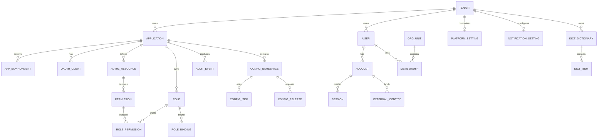
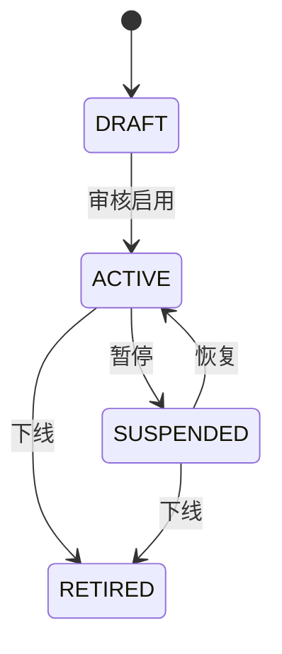
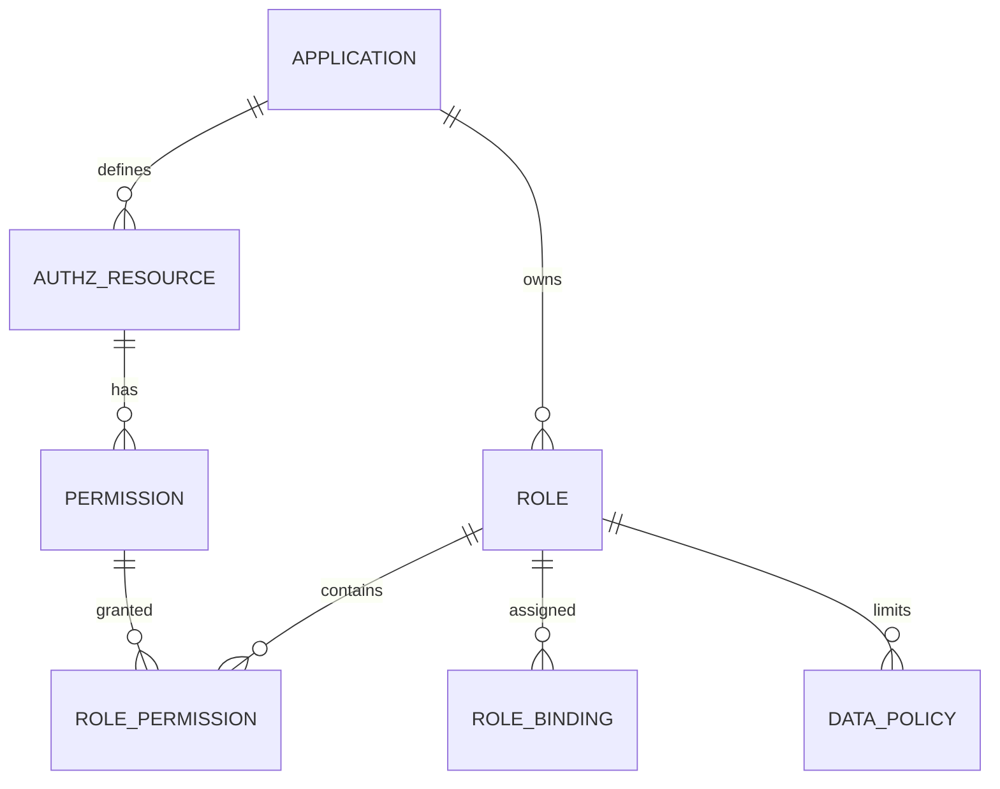
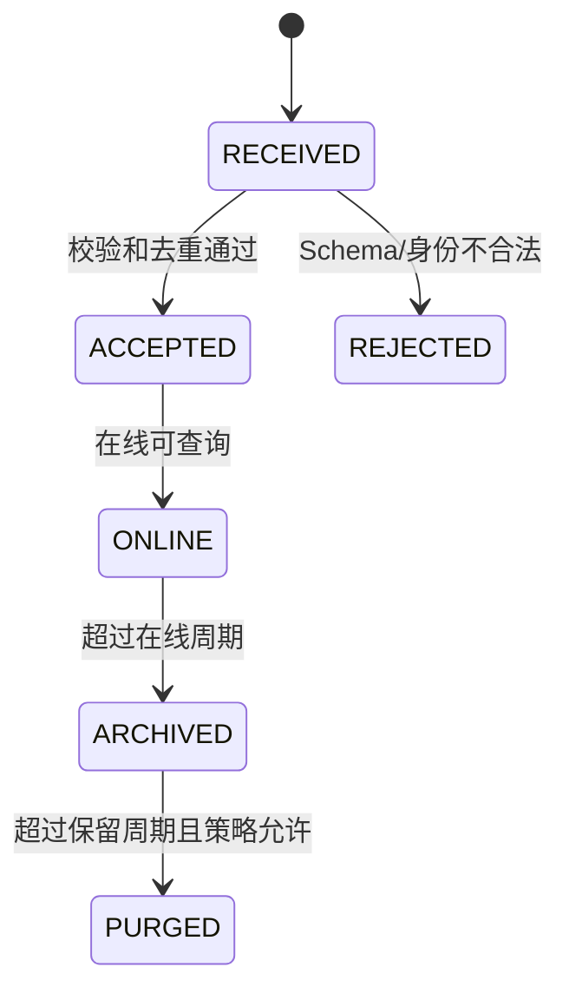
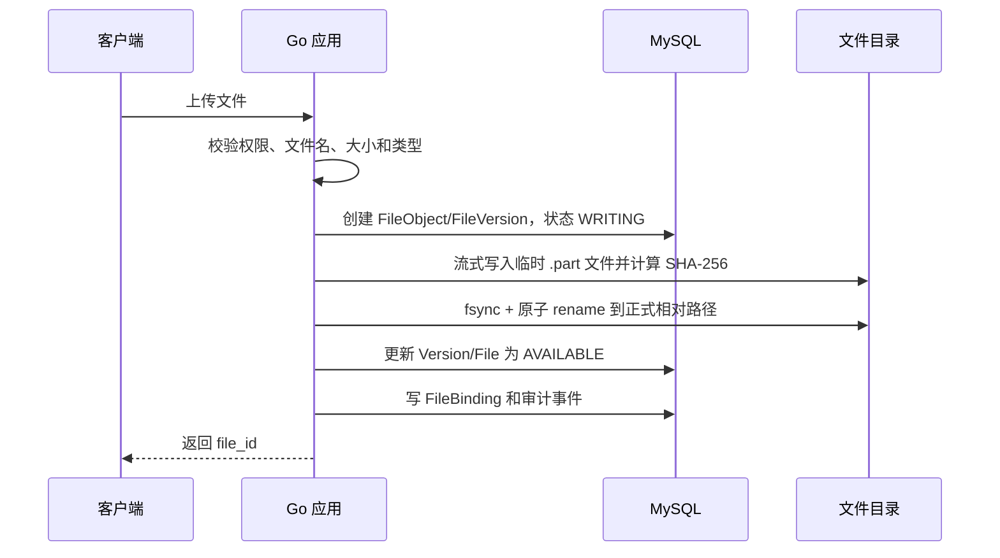

# 基础能力平台核心模型设计（MySQL）

> 数据库基线：MySQL 8.x，推荐使用 MySQL 8.4 LTS；存储引擎统一使用 InnoDB。
>
> 覆盖范围：应用接入、身份与组织、权限控制、安全会话、审计、配置、日志与可观测性元数据。

## 1. 设计目标

平台内部是一个 Go 模块化单体，但需要为多个外部业务系统提供统一能力。因此模型必须同时表达：

- 谁在使用平台：Tenant、User、Account、ServiceAccount。
- 哪个系统接入平台：Application、Environment、OAuthClient。
- 可以执行什么操作：Resource、Permission、Role、RoleBinding、DataPolicy。
- 谁做了什么：AuditEvent、AuditChange。
- 每个系统使用什么配置：ConfigNamespace、ConfigRelease。
- 每个系统如何接入日志：ObservabilityService、LogPolicy、AlertRule。

## 2. MySQL 统一规范

### 2.1 主键

核心业务表统一使用 ULID 字符串：

```sql
id CHAR(26) CHARACTER SET ascii COLLATE ascii_bin NOT NULL
```

原因：

- 可以由 Go 应用生成，不依赖数据库自增。
- 按时间大致有序，降低随机主键对聚簇索引的影响。
- 跨系统传递时比二进制 UUID 更方便排查。
- 不暴露业务数量。

高吞吐、纯内部记录可使用：

```sql
id BIGINT UNSIGNED NOT NULL AUTO_INCREMENT
```

例如登录尝试、异步任务和审计事件内部行号。

### 2.2 通用字段

可修改的聚合根统一包含：

```sql
id          CHAR(26)      NOT NULL,
tenant_id   CHAR(26)      NOT NULL,
status      VARCHAR(32)   NOT NULL,
version     BIGINT UNSIGNED NOT NULL DEFAULT 1,
created_at  DATETIME(3)   NOT NULL,
created_by  CHAR(26)      NULL,
updated_at  DATETIME(3)   NOT NULL,
updated_by  CHAR(26)      NULL
```

约定：

- 时间以 UTC 写入 `DATETIME(3)`。
- `version` 用于乐观锁：`UPDATE ... WHERE id=? AND version=?`。
- 状态使用稳定英文代码，不使用 MySQL `ENUM`，便于演进。
- 不给所有表统一加 `deleted_at`；身份、权限、配置优先通过状态禁用。
- 金额使用 `DECIMAL(19,4)` 或最小货币单位的整数。
- 代码、Client ID、Event ID 使用 `ascii_bin` 或二进制排序规则。
- 姓名、描述等自然语言使用 `utf8mb4`。
- JSON 只保存扩展属性、快照和条件，不替代核心关系。

### 2.3 隔离字段

| 范围 | 必备字段 |
|---|---|
| 租户级模型 | `tenant_id` |
| 应用级模型 | `tenant_id, application_id` |
| 环境级模型 | `tenant_id, application_id, environment_id` |
| 外部事件 | 上述字段 + `source_instance` |

即使第一阶段只有一个机构，也保留默认 `tenant_id`，避免未来接入其他机构时改造所有唯一索引。

### 2.4 外键原则

- 身份、权限、配置等低到中等数据量表使用 InnoDB 外键。
- 审计分区表不使用外键，通过应用层和去重表保证完整性。
- 核心主数据默认 `ON DELETE RESTRICT`，避免级联误删。
- 仅纯关联表可使用 `ON DELETE CASCADE`，例如角色删除时清理尚未发布的角色权限关联。
- 外部业务系统的资源 ID 只保存字符串引用，不建立外键。

## 3. 总体 ER 关系



## 4. 应用接入模型

### 4.1 聚合边界

```text
Application 聚合
├── ApplicationEnvironment
├── OAuthClient
│   ├── ClientRedirectURI
│   ├── ClientGrantType
│   ├── ClientScope
│   └── ClientCredential
└── ApplicationOwner
```

`Application` 表示接入平台的业务系统，不等同于某个部署实例。

### 4.2 platform_application

| 字段 | 类型 | 必填 | 说明 |
|---|---|---:|---|
| id | CHAR(26) | 是 | 应用 ID |
| tenant_id | CHAR(26) | 是 | 所属租户 |
| code | VARCHAR(64) | 是 | 稳定编码，如 contract |
| name | VARCHAR(128) | 是 | 应用名称 |
| application_type | VARCHAR(32) | 是 | spa/web/backend/mobile/third_party |
| owner_org_id | CHAR(26) | 否 | 责任部门 |
| owner_user_id | CHAR(26) | 否 | 责任人 |
| homepage_url | VARCHAR(512) | 否 | 首页 |
| description | VARCHAR(1000) | 否 | 描述 |
| status | VARCHAR(32) | 是 | DRAFT/ACTIVE/SUSPENDED/RETIRED |
| version | BIGINT UNSIGNED | 是 | 乐观锁 |
| created_at/updated_at | DATETIME(3) | 是 | 时间 |

唯一约束：

```sql
UNIQUE KEY uk_app_tenant_code (tenant_id, code)
```

应用进入 `ACTIVE` 后，`code` 原则上不可修改。

### 4.3 platform_application_environment

| 字段 | 类型 | 说明 |
|---|---|---|
| id | CHAR(26) | 环境 ID |
| tenant_id | CHAR(26) | 租户 |
| application_id | CHAR(26) | 应用 |
| environment | VARCHAR(32) | dev/test/staging/prod |
| base_url | VARCHAR(512) | 服务地址 |
| issuer_alias | VARCHAR(128) | 可选身份域别名 |
| status | VARCHAR(32) | ACTIVE/DISABLED |
| metadata | JSON | 非核心扩展属性 |

唯一约束：

```sql
UNIQUE KEY uk_app_environment (application_id, environment)
```

### 4.4 platform_oauth_client

| 字段 | 类型 | 说明 |
|---|---|---|
| id | CHAR(26) | 内部 ID |
| tenant_id | CHAR(26) | 租户 |
| application_id | CHAR(26) | 所属应用 |
| environment_id | CHAR(26) | 所属环境 |
| client_id | VARCHAR(128) ASCII | OAuth Client ID |
| client_name | VARCHAR(128) | 客户端名称 |
| client_type | VARCHAR(32) | public/confidential/service |
| token_auth_method | VARCHAR(64) | none/client_secret_basic/private_key_jwt |
| access_token_ttl_seconds | INT UNSIGNED | Access Token 时长 |
| refresh_token_ttl_seconds | INT UNSIGNED | Refresh Token 时长 |
| require_pkce | TINYINT(1) | 是否必须 PKCE |
| status | VARCHAR(32) | ACTIVE/DISABLED/EXPIRED |
| version | BIGINT UNSIGNED | 乐观锁 |

唯一约束：

```sql
UNIQUE KEY uk_oauth_client_id (client_id)
```

关联子表：

```text
platform_oauth_redirect_uri
platform_oauth_grant_type
platform_oauth_client_scope
platform_oauth_client_credential
```

不要把回调地址做成逗号分隔字符串。

### 4.5 platform_oauth_client_credential

| 字段 | 类型 | 说明 |
|---|---|---|
| id | CHAR(26) | 凭证版本 ID |
| oauth_client_id | CHAR(26) | 客户端 |
| credential_type | VARCHAR(32) | secret/public_key |
| secret_hash | VARBINARY(255) | 密钥摘要，不存明文 |
| public_key_jwk | JSON | 非对称认证公钥 |
| fingerprint | VARCHAR(128) | 指纹 |
| valid_from | DATETIME(3) | 生效时间 |
| valid_until | DATETIME(3) | 失效时间 |
| revoked_at | DATETIME(3) | 吊销时间 |
| status | VARCHAR(32) | ACTIVE/REVOKED/EXPIRED |

允许旧凭证和新凭证短时间并存，以支持无中断轮换。

### 4.6 应用状态



应用停用后：

- 禁止签发新 Token。
- 拒绝新的权限和配置 API 调用。
- 仍允许有权限的审计管理员查询历史审计。
- 不删除历史审计和授权快照。

## 5. 身份与组织模型

### 5.1 聚合划分

```text
Tenant 聚合
User 聚合
Account 聚合
Organization 聚合
Session 聚合
```

`User` 是自然人，`Account` 是登录主体。一个用户可以对应多个账号；服务账号可以没有 User。

### 5.2 iam_tenant

```text
Tenant
- id
- code
- name
- timezone
- locale
- status
- version
- created_at
- updated_at
```

唯一约束：

```sql
UNIQUE KEY uk_tenant_code (code)
```

### 5.3 iam_user

| 字段 | 类型 | 说明 |
|---|---|---|
| id | CHAR(26) | 统一用户 ID |
| tenant_id | CHAR(26) | 租户 |
| employee_no | VARCHAR(64) | 员工编号 |
| display_name | VARCHAR(128) | 展示名 |
| legal_name | VARCHAR(128) | 真实姓名，可按需加密 |
| email | VARCHAR(320) | 邮箱 |
| mobile_ciphertext | VARBINARY(512) | 手机号密文 |
| mobile_hash | BINARY(32) | 手机号检索摘要 |
| avatar_file_id | CHAR(26) | 头像文件 |
| primary_org_id | CHAR(26) | 主部门快照 |
| manager_user_id | CHAR(26) | 直属上级 |
| employment_status | VARCHAR(32) | ACTIVE/ON_LEAVE/TERMINATED |
| status | VARCHAR(32) | ACTIVE/DISABLED |
| version | BIGINT UNSIGNED | 乐观锁 |

唯一约束根据实际人事规则选择：

```sql
UNIQUE KEY uk_user_employee_no (tenant_id, employee_no)
```

手机号、身份证等敏感字段不建议作为普通明文唯一索引；可使用规范化后 HMAC/哈希列实现精确匹配。

### 5.4 iam_account

| 字段 | 类型 | 说明 |
|---|---|---|
| id | CHAR(26) | OIDC subject 的稳定来源 |
| tenant_id | CHAR(26) | 租户 |
| user_id | CHAR(26) | 自然人，可为空 |
| username | VARCHAR(128) | 本地登录名 |
| account_type | VARCHAR(32) | HUMAN/SERVICE |
| auth_source | VARCHAR(32) | LOCAL/OIDC/LDAP/DINGTALK/WECOM |
| locked_until | DATETIME(3) | 锁定截止 |
| last_login_at | DATETIME(3) | 最近登录 |
| status | VARCHAR(32) | ACTIVE/LOCKED/DISABLED/EXPIRED |
| version | BIGINT UNSIGNED | 乐观锁 |

唯一约束：

```sql
UNIQUE KEY uk_account_username (tenant_id, username)
```

如果系统不需要本地用户名，可允许 `username` 为空，主要通过外部身份登录。

### 5.5 iam_password_credential

密码凭证与账号分表：

```text
- id
- account_id
- password_hash
- hash_algorithm
- algorithm_params JSON
- password_changed_at
- expires_at
- must_change
- failed_attempts
- last_failed_at
- status
```

这样可以避免普通账号查询误读取密码摘要，并方便独立控制凭证访问权限。

### 5.6 iam_bootstrap_state

首个超级管理员初始化状态使用独立的一行标记，避免以“是否已有任意用户”推断初始化是否完成：

| 字段 | 类型 | 说明 |
|---|---|---|
| id | CHAR(26) | 初始化状态记录主键 |
| tenant_id | CHAR(26) | 默认租户；唯一约束确保一个租户只能初始化一次 |
| first_super_admin_user_id | CHAR(26) | 首个超级管理员用户 |
| first_super_admin_account_id | CHAR(26) | 对应本地人类账号；唯一约束防止同一账号重复标记 |
| initialized_at | DATETIME(3) | 初始化完成时间 |

`POST /iam/bootstrap/first-super-admin` 必须在同一个事务中锁定默认租户、检查该标记不存在、校验内建 `platform` 应用和 `platform-super-admin` 角色有效，然后创建用户、账号、Argon2id 密码凭据、`USER/TENANT` 角色绑定和状态标记。迁移 `000016_create_iam_bootstrap_state.sql` 仅创建状态表，不创建固定密码或默认人类账号。

### 5.7 iam_identity_provider / iam_external_identity / iam_dingtalk_qr_login_state

外部身份提供商采用统一聚合，但运行时适配器必须按 `provider_type` 分支。当前支持 `OIDC` 与 `DINGTALK_QR`：前者保存发行方、客户端和发现/JWKS 校验所需配置；后者的管理接口沿用 `app_key` / `app_secret` 字段名，运行时映射为钉钉当前 OAuth 接口的 `clientId` / `clientSecret`，并保存 HTTPS 回调地址及最小权限配置，**不是 OIDC 的别名**。第三方企业应用必须使用钉钉开放平台当前控制台发放的对应凭据，不得与企业内部应用凭据混用。

```text
iam_identity_provider
- id
- tenant_id
- code                         // 租户内唯一
- provider_type                // OIDC / DINGTALK_QR
- issuer                       // 仅 OIDC；DINGTALK_QR 为 NULL
- client_id                    // 仅 OIDC
- app_key                      // 仅 DINGTALK_QR
- client_secret_ciphertext      // OIDC 密钥的应用层加密密文；禁止回显
- app_secret_ciphertext         // 钉钉应用秘密（运行时 clientSecret）的应用层加密密文；禁止回显
- callback_uri
- authorization_scopes JSON
- display_name
- status                       // ACTIVE / DISABLED
- version
- created_at
- updated_at

iam_external_identity
- id
- tenant_id
- user_id                      // 预先绑定的平台用户，而非扫码时自动创建
- provider_id
- subject_hash BINARY(32)      // 稳定外部身份的不可逆哈希；不保存原文、unionId 或 profile
- status                       // ACTIVE / DISABLED
- version
- created_at
- updated_at

iam_dingtalk_qr_login_state
- id
- tenant_id
- provider_id
- state_hash BINARY(32)        // 仅保存 state 哈希
- browser_binding_hash BINARY(32)
- return_to                    // 已校验的本平台相对路径
- expires_at
- consumed_at NULL
- created_at
```

唯一约束和索引建议：

```sql
UNIQUE KEY uk_identity_provider_code (tenant_id, code)
UNIQUE KEY uk_external_subject_hash (provider_id, subject_hash)
UNIQUE KEY uk_external_identity_user_provider (user_id, provider_id)
UNIQUE KEY uk_dingtalk_state_hash (state_hash)
KEY idx_dingtalk_qr_login_expiry (expires_at, consumed_at)
```

安全边界：

- OIDC 与钉钉的提供商密钥统一保存在 `client_secret_ciphertext`，只能由应用层解密给对应适配器；任何管理 API、审计详情、错误信息或运行日志只能提供“是否已配置”。
- 钉钉原始 state、浏览器绑定值、授权码、上游令牌和原始身份标识不得落库、写入 Cookie、日志或审计详情。`iam_dingtalk_qr_login_state` 仅保存 `state_hash` 与加密服务端载荷；查询预绑定身份时在进程内立即计算 `subject_hash`。
- `iam_dingtalk_qr_login_state` 通过事务锁或条件更新将 `consumed_at IS NULL` 改为已消费，以防止授权码/state 重放；过期数据由受控清理任务删除。
- 钉钉授权结果不是平台 JWT。仅在扫码状态、提供商、外部身份绑定、用户/账号状态和 MFA 均通过后，才由既有会话服务写入 `iam_session` 并签发平台 Cookie。

### 5.8 iam_org_unit

组织树采用物化路径辅助查询：

```text
- id
- tenant_id
- parent_id
- code
- name
- org_type
- path                 // /root-id/parent-id/current-id/
- depth
- leader_user_id
- sort_order
- status
- version
```

索引：

```sql
UNIQUE KEY uk_org_code (tenant_id, code)
KEY idx_org_parent (tenant_id, parent_id, status)
KEY idx_org_path (tenant_id, path(191))
```

组织移动必须由领域服务更新当前节点及全部下级节点的 `path/depth`，不能让 Controller 直接改 `parent_id`。

### 5.9 iam_position / iam_membership

```text
Position
- id
- tenant_id
- org_unit_id
- code
- name
- position_level
- status

Membership
- id
- tenant_id
- user_id
- org_unit_id
- position_id
- membership_type       // PRIMARY/PART_TIME/PROJECT
- is_primary
- valid_from
- valid_until
- status
```

约束：

```sql
UNIQUE KEY uk_membership (
  tenant_id, user_id, org_unit_id, position_id, membership_type
)
```

用户主部门通过领域规则保证最多一个有效 `PRIMARY` Membership；因为 MySQL 普通唯一索引无法直接表达“仅对 ACTIVE 行唯一”，该规则由事务和锁保证。

### 5.10 iam_group / iam_group_member

Group 用于跨组织的授权集合：

```text
Group
- id
- tenant_id
- code
- name
- group_type             // STATIC/DYNAMIC
- rule_expression
- status

GroupMember
- group_id
- member_type            // USER/ORG/POSITION
- member_id
- valid_from
- valid_until
```

第一阶段可以只实现 STATIC 用户组。

### 5.11 iam_session

```text
- id
- tenant_id
- account_id
- oauth_client_id
- refresh_token_hash
- token_family_id
- device_id
- device_name
- ip_address VARBINARY(16)
- user_agent VARCHAR(1000)
- created_at
- last_seen_at
- expires_at
- revoked_at
- revoke_reason
- status
```

关键索引：

```sql
KEY idx_session_account (tenant_id, account_id, status, expires_at)
KEY idx_session_family (token_family_id)
KEY idx_session_expire (status, expires_at)
```

Refresh Token 只保存摘要；`token_family_id` 用于检测轮换后的旧 Token 重放。

## 6. 权限控制模型

### 6.1 权限关系



### 6.2 authz_resource

```text
- id
- tenant_id
- application_id
- code                    // contract/project/claim
- name
- resource_type           // API/DATA/MENU/FEATURE
- attribute_schema JSON   // 可用于策略校验
- status
- version
```

唯一约束：

```sql
UNIQUE KEY uk_resource_code (application_id, code)
```

### 6.3 authz_permission

```text
- id
- tenant_id
- application_id
- resource_id
- code                    // contract:contract:approve
- action                  // approve
- name
- description
- risk_level              // LOW/MEDIUM/HIGH/CRITICAL
- status
- version
```

唯一约束：

```sql
UNIQUE KEY uk_permission_code (application_id, code)
UNIQUE KEY uk_resource_action (resource_id, action)
```

Permission 表达原子能力，不要直接把 URL 当成 Permission。多个 API 可以对应同一个业务权限。

### 6.4 authz_role

```text
- id
- tenant_id
- application_id          // 平台角色可以为空
- code
- name
- role_type               // PLATFORM/APPLICATION/CUSTOM
- description
- built_in
- status
- version
```

唯一约束：

```sql
UNIQUE KEY uk_role_code (tenant_id, application_id, code)
```

注意 MySQL 唯一索引允许多个 NULL。平台角色建议使用固定“平台应用 ID”，不要依赖 `application_id IS NULL` 保证唯一。

### 6.5 authz_role_permission

```text
- role_id
- permission_id
- effect                  // ALLOW，第一期不建议实现 DENY
- created_at
- created_by
```

主键：

```sql
PRIMARY KEY (role_id, permission_id)
```

第一阶段只实现 ALLOW，可以避免 Deny、继承和多角色合并产生难以解释的冲突。

### 6.6 authz_role_binding

RoleBinding 是授权模型的核心：

```text
- id
- tenant_id
- application_id
- role_id
- subject_type            // USER/ORG/POSITION/GROUP/SERVICE_ACCOUNT
- subject_id
- scope_type              // TENANT/ORG/ORG_TREE/PROJECT/RESOURCE/CUSTOM
- scope_id
- valid_from
- valid_until
- status
- version
```

唯一约束建议：

```sql
UNIQUE KEY uk_role_binding (
  tenant_id,
  application_id,
  role_id,
  subject_type,
  subject_id,
  scope_type,
  scope_id
)
```

由于 `scope_id` 可能为空，建议无具体范围时写固定值 `'*'`，不要依赖 NULL 唯一语义。

### 6.7 authz_data_policy

```text
- id
- tenant_id
- application_id
- role_id
- resource_id
- action
- scope_type              // ALL/SELF/ORG/ORG_TREE/CUSTOM_ORG/PARTICIPANT
- scope_value JSON
- condition_expression TEXT
- priority
- status
- version
```

示例：

```json
{
  "scope_type": "CUSTOM_ORG",
  "scope_value": {
    "org_ids": ["org-1", "org-2"]
  }
}
```

第一阶段的 `condition_expression` 不允许执行任意脚本，只支持平台定义的有限表达式和字段白名单。

### 6.8 authz_policy_revision

用于外部系统缓存失效：

```text
- tenant_id
- application_id
- revision
- changed_at
- change_reason
```

主键：

```sql
PRIMARY KEY (tenant_id, application_id)
```

任何角色权限、角色绑定或数据策略变更，都在同一事务中递增 `revision`。

授权响应返回：

```json
{
  "allowed": true,
  "policy_version": 18,
  "cache_ttl_seconds": 30
}
```

### 6.9 权限计算顺序

```text
1. 校验应用、账号和租户状态
2. 加载用户直接绑定的角色
3. 加载组织、岗位、用户组继承的角色
4. 过滤有效期和应用范围
5. 检查角色是否拥有 Permission
6. 计算 RoleBinding Scope
7. 合并 DataPolicy
8. 根据资源属性和环境上下文判定
9. 返回 Decision + Reason + Policy Revision
10. 高风险判定写入审计
```

## 7. 安全模型

### 7.1 sec_login_policy（P0）

每个租户最多一条登录安全策略；无显式记录时，应用层使用默认值：最大失败次数 5、锁定 15 分钟、失败重置窗口 30 分钟。

```text
- tenant_id               // 主键，同时是 iam_tenant 外键
- max_failed_attempts
- lockout_duration_seconds
- failure_reset_window_seconds
- version                 // 乐观锁版本
- created_at / created_by
- updated_at / updated_by
```

### 7.2 sec_login_attempt（P0）

高频写入表，使用 BIGINT 自增；只保存认证安全摘要，不保存密码、Token 或其他认证秘密。

```text
- id BIGINT UNSIGNED AUTO_INCREMENT
- occurred_at DATETIME(3)
- tenant_id
- account_id
- username_snapshot
- ip_address VARBINARY(16)
- user_agent
- result
- failure_reason
- risk_score
- cleared_at              // 失败重置或管理员解锁后的逻辑关闭时间
```

索引：

```sql
KEY idx_sec_login_attempt_account_active (tenant_id, account_id, result, cleared_at, occurred_at)
KEY idx_sec_login_attempt_tenant_occurred (tenant_id, occurred_at)
```

### 7.3 sec_mfa_factor（P1）

```text
- id
- tenant_id
- account_id
- factor_type             // TOTP/WEBAUTHN/EMAIL
- display_name
- secret_ciphertext
- credential_data JSON
- enrolled_at
- last_used_at
- status
```

MFA 密钥必须加密保存，不进入普通日志和审计详情。

### 7.3.1 iam_mfa_login_pre_auth 与 sec_mfa_step_up_grant（已实现）

```text
iam_mfa_login_pre_auth
- id
- tenant_id / account_id
- credential_hash          // 仅保存 SHA-256 摘要，不保存原始预认证凭据
- attempt_count / max_attempts
- created_at / expires_at / consumed_at
- status                   // PENDING / CONSUMED / EXPIRED / LOCKED

sec_mfa_step_up_grant
- id
- tenant_id / account_id / session_id
- mfa_challenge_id
- challenge_hash / grant_hash
- created_at / expires_at / consumed_at
- status                   // PENDING / VERIFIED / CONSUMED / EXPIRED
```

登录预认证只允许在密码验证成功后创建，并且必须在 MFA 验证成功前禁止创建正式会话。高风险授权必须同时匹配租户、账号和会话，默认最长两分钟且只能被受保护接口消费一次。

### 7.4 sec_risk_event（P0）

```text
- id
- tenant_id
- account_id
- event_type              // 当前 P0：ACCOUNT_LOCKED / ACCOUNT_UNLOCKED
- subject_type
- subject_id
- risk_level
- risk_score
- source_ip
- detection_rule
- status                  // 当前 P0：OPEN / RESOLVED
- occurred_at
- resolved_at / resolved_by
- resolution_comment
- metadata JSON
- version                 // 处置更新使用乐观锁
- created_at / updated_at
```

达到登录失败阈值时写入状态为 `OPEN` 的锁定风险事件。管理员解锁会关闭关联锁定事件并写入已解决的解锁事件；也可通过风险事件处置接口填写处置说明并基于 `version` 解决开放事件。

### 7.5 不使用 Redis 时的短期状态模型

平台所有需要可靠保存的短期状态都进入 MySQL：

```text
oauth_authorization_code   // OIDC/OAuth 一次性授权码
oauth_token_family         // 一个原始授权上下文对应的 Refresh Token 家族
oauth_refresh_token        // 轮换的 Refresh Token 摘要
oauth_token_revocation     // 已撤销 JWT Access Token 的摘要
iam_session                // 控制台登录会话
sec_login_attempt          // 登录失败与风险判断
async_job                  // 可重试后台任务
authz_policy_revision      // 权限缓存版本
```

#### oauth_authorization_code

`000019_create_oidc_protocol.sql` 使用 `CHAR(26)` 主键及 `BINARY(32)` 的 `code_hash`，不保存授权码明文。授权码关联 `tenant_id`、`oauth_client_id`、`session_id`、`account_id`、`user_id`、精确 `redirect_uri`、规范化的空格分隔 `scope`、可选 `nonce` 和 PKCE `code_challenge` / `code_challenge_method`，并以 `created_at`、`expires_at`、`consumed_at` 与 `status` 记录生命周期。

唯一约束：

```sql
UNIQUE KEY uk_oauth_authorization_code_hash (code_hash)
```

兑换授权码时使用显式 GORM 事务和 `SELECT ... FOR UPDATE`：

```text
1. 按 code_hash 锁定授权码
2. 校验未消费、未过期、Client 与精确 Redirect URI 一致
3. 校验 PKCE verifier（S256 或 plain）
4. 标记授权码已消费
5. 创建固定 scope 的 Token Family 与首个 Refresh Token 摘要，签发 Access Token / ID Token
6. 提交事务
```

#### oauth_token_family、oauth_refresh_token 与 oauth_token_revocation

一个授权码兑换会建立 `oauth_token_family`，其 `scope`、授权主体和绝对过期时间在整个家族内固定。`oauth_refresh_token` 只保存 `token_hash`，并通过 `parent_refresh_token_id` 表示轮换链。每次 Refresh Token 成功使用都会在同一显式事务中锁定当前行、标记为已使用并生成后继令牌；已使用令牌被重放时，整个家族会撤销，避免攻击者继续使用后继令牌。

`oauth_token_revocation` 以 `token_hash`、`oauth_client_id`、`token_type`、`expires_at` 和撤销原因记录 Access Token 黑名单。RFC 7009 撤销对未知、过期或已撤销令牌仍返回成功，避免泄露令牌是否存在。所有表均按租户、客户端、会话或用户建立查询索引，并由外键绑定 IAM 与 OAuth Client 主数据。

Go 进程内缓存只用于性能优化：

- 权限定义、应用信息、JWKS 公钥和已发布配置可以进入内存缓存。
- 缓存项必须有 TTL 或版本号。
- MySQL 始终是事实来源。
- 进程重启后允许缓存全部丢失。
- 不能依赖内存缓存保存会话、授权码、任务和关键审计。

限流采用两层：

```text
普通 API 限流：Go 进程内 Token Bucket
登录安全限制：sec_login_attempt + iam_account.locked_until
```

如果部署多个应用实例，各实例的普通 API 限流是独立的；账号锁定和登录失败状态仍由 MySQL 保证全局一致。

## 8. 跨系统审计模型

### 8.1 模型原则

- 外部系统生成 `event_id`。
- 平台接收时间和业务发生时间分开保存。
- 平台按 `(application_id, event_id)` 幂等。
- 审计原始记录只追加，不允许修改。
- 审计数据按月分区或按月物理表归档。
- 外部资源仅保存字符串引用和名称快照。
- 敏感字段写入前完成脱敏。

### 8.2 为什么需要单独去重表

MySQL 分区表的所有唯一键都必须包含分区字段；同时 InnoDB 分区表不能使用外键。因此如果审计表按月份分区，仅在分区表上很难建立跨月份的 `(application_id, event_id)` 全局唯一约束。

采用：

```text
audit_event_dedup       // 非分区，全局幂等
        +
audit_event             // 按月份分区，高容量查询
```

### 8.3 audit_event_dedup

```text
- application_id CHAR(26)
- event_id VARCHAR(128) ASCII
- audit_row_id BIGINT UNSIGNED
- occurred_month INT UNSIGNED
- received_at DATETIME(3)
```

主键：

```sql
PRIMARY KEY (application_id, event_id)
```

接收事务：

```text
1. INSERT audit_event_dedup，audit_row_id 暂为空
2. 如果唯一冲突，返回 duplicated
3. INSERT audit_event，取得自增 id
4. UPDATE audit_event_dedup.audit_row_id
5. 提交事务
```

`audit_row_id` 在事务写入过程中允许暂时为空，事务提交前必须填充。

### 8.4 audit_event

建议使用内部自增行号和外部事件 ID：

| 字段 | 类型 | 说明 |
|---|---|---|
| id | BIGINT UNSIGNED | 内部行号 |
| occurred_month | INT UNSIGNED | 例如 202607，分区键 |
| event_id | VARCHAR(128) | 来源事件 ID |
| tenant_id | CHAR(26) | 租户 |
| application_id | CHAR(26) | 来源应用 |
| environment_id | CHAR(26) | 来源环境 |
| source_instance | VARCHAR(128) | 来源实例 |
| event_category | VARCHAR(32) | AUTHN/AUTHZ/ADMIN/DATA/BUSINESS/CONFIG/SECURITY |
| event_type | VARCHAR(64) | 事件类型 |
| occurred_at | DATETIME(3) | 来源发生时间 |
| received_at | DATETIME(3) | 平台接收时间 |
| actor_type | VARCHAR(32) | USER/SERVICE/SYSTEM/ANONYMOUS |
| actor_id | VARCHAR(128) | 统一用户或服务账号 |
| actor_name_snapshot | VARCHAR(128) | 姓名快照 |
| session_id | VARCHAR(128) | 会话 |
| client_id | VARCHAR(128) | OAuth Client |
| action | VARCHAR(128) | contract.approve |
| resource_type | VARCHAR(64) | contract/project/claim |
| resource_id | VARCHAR(128) | 外部业务 ID |
| resource_name_snapshot | VARCHAR(255) | 资源名快照 |
| business_id | VARCHAR(128) | 跨系统业务关联号 |
| request_id | VARCHAR(128) | 请求 ID |
| trace_id | CHAR(32) | Trace ID |
| source_ip | VARBINARY(16) | IPv4/IPv6 |
| user_agent | VARCHAR(1000) | User Agent |
| result | VARCHAR(32) | SUCCESS/FAILURE/DENIED/PARTIAL |
| reason_code | VARCHAR(128) | 原因码 |
| risk_level | VARCHAR(16) | LOW/MEDIUM/HIGH/CRITICAL |
| classification | VARCHAR(32) | INTERNAL/CONFIDENTIAL 等 |
| summary | VARCHAR(1000) | 人类可读摘要 |
| metadata | JSON | 扩展元数据 |
| changes | JSON | 已脱敏字段变更 |
| payload_hash | BINARY(32) | 规范化事件摘要 |

分区主键必须包含分区字段：

```sql
PRIMARY KEY (id, occurred_month)
```

查询索引：

```sql
KEY idx_audit_app_time
  (application_id, occurred_at, id),
KEY idx_audit_tenant_actor_time
  (tenant_id, actor_id, occurred_at, id),
KEY idx_audit_resource_time
  (application_id, resource_type, resource_id, occurred_at),
KEY idx_audit_trace
  (trace_id),
KEY idx_audit_result_risk_time
  (result, risk_level, occurred_at)
```

不要给所有 JSON 字段建立索引。确有高频查询需要时，增加生成列并索引该生成列。

### 8.5 分区示例

```sql
PARTITION BY RANGE (occurred_month) (
  PARTITION p202607 VALUES LESS THAN (202608),
  PARTITION p202608 VALUES LESS THAN (202609),
  PARTITION pmax VALUES LESS THAN MAXVALUE
);
```

运维任务每月提前创建未来分区。使用 `pmax` 可以避免因未创建新分区导致审计写入失败，但拆分 `pmax` 必须纳入运维流程。

如果第一阶段审计量较小，可以先使用普通表，达到容量阈值后再迁移为分区表；但字段中仍应保留 `occurred_month`。

### 8.6 审计事件生命周期



原始审计事件内容不可更新；状态迁移记录在归档批次或索引元数据中，不修改原始业务语义。

### 8.7 audit_archive_batch

```text
- id
- tenant_id
- application_id
- range_start
- range_end
- object_uri
- event_count
- checksum
- status
- created_at
- completed_at
```

## 9. 配置中心模型

### 9.1 聚合设计

```text
ConfigNamespace 聚合
├── ConfigItem（当前草稿）
├── ConfigRelease（不可变发布记录）
└── ConfigReleaseItem（发布快照）
```

使用发布快照，而不是让接入系统直接读取正在编辑的配置。

### 9.2 cfg_namespace

```text
- id
- tenant_id
- application_id
- environment_id
- name
- description
- current_release_no
- status
- version
- created_at
- updated_at
```

唯一约束：

```sql
UNIQUE KEY uk_cfg_namespace (
  tenant_id, application_id, environment_id, name
)
```

如果支持全租户默认配置，`tenant_id` 不使用 NULL，而使用固定默认租户/全局作用域 ID，避免 NULL 唯一语义问题。

### 9.3 cfg_item

表示当前待发布草稿：

```text
- id
- namespace_id
- config_key
- value_type              // STRING/NUMBER/BOOLEAN/JSON/SECRET_REF
- value_text
- value_json
- secret_ref
- schema_json
- description
- sensitive
- status
- version
- updated_at
- updated_by
```

唯一约束：

```sql
UNIQUE KEY uk_cfg_item_key (namespace_id, config_key)
```

值存储规则：

| value_type | 使用字段 |
|---|---|
| STRING/NUMBER/BOOLEAN | value_text |
| JSON | value_json |
| SECRET_REF | secret_ref |

禁止在 `value_text` 中保存数据库密码、OAuth Client Secret 等明文密钥。

### 9.4 cfg_release

```text
- id
- namespace_id
- release_no BIGINT UNSIGNED
- release_status          // ACTIVE/SUPERSEDED/ROLLED_BACK
- item_count
- checksum
- change_summary
- released_by
- released_at
- rollback_from_release_no
```

唯一约束：

```sql
UNIQUE KEY uk_cfg_release_no (namespace_id, release_no)
```

### 9.5 cfg_release_item

发布时从草稿复制形成不可变快照：

```text
- release_id
- config_key
- value_type
- value_text
- value_json
- secret_ref
- schema_json
- sensitive
```

主键：

```sql
PRIMARY KEY (release_id, config_key)
```

### 9.6 配置发布事务

```text
1. 锁定 cfg_namespace
2. 校验全部 cfg_item 的 Schema
3. release_no + 1
4. 写 cfg_release
5. 批量复制 cfg_release_item
6. 更新 namespace.current_release_no
7. 写配置审计事件
8. 递增配置版本/清理缓存
9. 提交事务
```

接入系统始终读取指定发布版本或当前发布版本，不读取草稿表。

### 9.7 平台设置、通知与业务字典

平台控制台自身的机构资料和通知偏好使用类型化表，不混入可发布的 `cfg_namespace` 配置聚合；它们与配置中心的发布、快照语义不同。所有记录以 `tenant_id` 隔离，读取和写入均从认证上下文取得租户及操作人。

#### platform_setting

每个租户至多一条，使用 `UNIQUE KEY uk_platform_setting_tenant (tenant_id)`：

```text
- id
- tenant_id
- organization_name
- organization_alias
- timezone
- qualification
- version
- created_at / created_by
- updated_at / updated_by
```

服务在记录不存在时返回默认展示值；首次更新插入版本 `1`，既有记录通过 `version` 乐观锁更新。该表只保存平台资料，不承载租户、应用或环境级业务配置。

#### notification_setting

每个租户至多一条，使用 `UNIQUE KEY uk_notification_setting_tenant (tenant_id)`：

```text
- id
- tenant_id
- inbox_enabled
- email_enabled
- reminder_frequency       // DAILY / EVERY_FOUR_HOURS / ONCE
- version
- created_at / created_by
- updated_at / updated_by
```

通知偏好由 `notification_setting` 保存；站内信模板、模板版本、渲染消息和用户投递状态由 `notification_template`、`notification_template_version`、`notification_message`、`notification_delivery` 独立保存。只实现站内信，不实现邮件、短信、SMTP 或 Webhook 发送；设置表不得保存消息正文或密钥。

#### dict_dictionary 与 dict_item

```text
dict_dictionary
- id, tenant_id, code, name, description, status, version
- created_at / created_by, updated_at / updated_by
- UNIQUE KEY (tenant_id, code)

dict_item
- id, tenant_id, dictionary_id, code, label, item_value
- sort_order, status, version
- created_at / created_by, updated_at / updated_by
- UNIQUE KEY (dictionary_id, code)
```

`dict_item.dictionary_id` 外键指向 `dict_dictionary.id`，两个表均限制删除。状态只允许 `ACTIVE`、`DISABLED`；管理侧通过更新状态启停，当前不提供删除接口。按字典编码的运行时读取先校验父字典为 `ACTIVE`，再只返回 `ACTIVE` 项，按 `sort_order` 升序排列。字典与字典项编码使用 1 至 64 位字母、数字、`.`、`_`、`-`，创建后不在更新接口中修改。

## 10. 本地文件存储模型

### 10.1 存储原则

文件正文写入受控文件根目录，MySQL 只保存元数据和业务绑定关系：

```text
MySQL：文件 ID、原始文件名、大小、摘要、版本、相对路径、业务绑定
文件目录：实际二进制内容
```

启动配置：

```text
PLATFORM_FILE_ROOT=/data/basic-platform/files
PLATFORM_FILE_TEMP=/data/basic-platform/tmp
PLATFORM_AUDIT_ARCHIVE_ROOT=/data/basic-platform/audit-archive
```

数据库只保存相对路径，不保存依赖具体服务器的绝对路径。

### 10.2 目录结构

```text
/data/basic-platform/files/
└── {tenant_id}/
    └── {application_id}/
        └── {yyyy}/
            └── {mm}/
                └── {file_id}/
                    └── {file_version_id}.bin
```

例如：

```text
/data/basic-platform/files/
  tenant-001/contract/2026/07/01JZFILE.../01JZVERSION....bin
```

路径中禁止使用用户上传的原始文件名，避免目录穿越、特殊字符和同名覆盖。

### 10.3 file_object

`FileObject` 表示逻辑文件：

```text
- id CHAR(26)
- tenant_id CHAR(26)
- application_id CHAR(26)
- original_name VARCHAR(512)
- file_extension VARCHAR(32)
- media_type VARCHAR(255)
- classification VARCHAR(32)     // INTERNAL/CONFIDENTIAL/RESTRICTED
- owner_user_id CHAR(26)
- owner_org_id CHAR(26)
- current_version_no INT UNSIGNED
- current_version_id CHAR(26)
- status VARCHAR(32)              // UPLOADING/AVAILABLE/QUARANTINED/DELETED/FAILED
- version BIGINT UNSIGNED
- created_at/updated_at DATETIME(3)
```

索引：

```sql
KEY idx_file_app_time (tenant_id, application_id, created_at)
KEY idx_file_owner (tenant_id, owner_user_id, created_at)
```

文件名只用于展示，不用于定位磁盘文件。

### 10.4 file_version

```text
- id CHAR(26)
- file_id CHAR(26)
- version_no INT UNSIGNED
- storage_relative_path VARCHAR(1000)
- size_bytes BIGINT UNSIGNED
- sha256 BINARY(32)
- media_type VARCHAR(255)
- original_name VARCHAR(512)
- uploader_user_id CHAR(26)
- upload_request_id VARCHAR(128)
- status VARCHAR(32)              // WRITING/AVAILABLE/FAILED/REMOVED
- created_at DATETIME(3)
```

约束：

```sql
UNIQUE KEY uk_file_version (file_id, version_no)
UNIQUE KEY uk_file_storage_path (storage_relative_path)
```

### 10.5 file_binding

同一个文件可绑定到合同、项目、报销或审计归档记录：

```text
- id CHAR(26)
- tenant_id CHAR(26)
- application_id CHAR(26)
- file_id CHAR(26)
- resource_type VARCHAR(64)
- resource_id VARCHAR(128)
- binding_type VARCHAR(64)        // ATTACHMENT/CONTRACT_TEXT/INVOICE/DELIVERABLE
- display_name VARCHAR(512)
- sort_order INT
- status VARCHAR(32)
- created_at DATETIME(3)
- created_by CHAR(26)
```

唯一约束：

```sql
UNIQUE KEY uk_file_binding (
  application_id, resource_type, resource_id, file_id, binding_type
)
```

`resource_id` 是外部业务系统资源引用，不建立数据库外键。

### 10.6 上传流程

MySQL 事务和文件系统无法形成一个真正的原子事务，因此采用状态机和补偿任务：



失败补偿：

- 数据库记录为 `WRITING` 但临时文件不存在：标记 `FAILED`。
- 文件已移动但数据库更新失败：后台扫描并清理孤儿文件。
- 临时目录中的 `.part` 文件超过阈值：后台任务清理。
- `AVAILABLE` 文件缺失或摘要不一致：标记异常并产生安全事件。

### 10.7 下载流程

```text
1. 根据 file_id 查询元数据和业务绑定
2. 调用授权中心检查 resource:read/download
3. 校验文件状态为 AVAILABLE
4. 清理并拼接 storage_relative_path
5. 确认最终路径仍位于 PLATFORM_FILE_ROOT 下
6. 禁止跟随指向根目录外部的符号链接
7. 流式返回文件
8. 记录下载审计
```

文件目录不直接暴露为匿名静态目录，所有下载必须经过 Go Handler 的身份和权限校验。

### 10.8 文件安全规则

- 上传大小必须有限制。
- 同时校验扩展名、声明 MIME 和文件头特征。
- 计算并保存 SHA-256。
- 原始文件名移除控制字符和路径分隔符。
- 文件权限建议目录 `0750`、文件 `0640`。
- 应用使用独立低权限操作系统账号运行。
- 文件根目录禁止执行脚本和二进制程序。
- 文件正文不写入普通应用日志和审计 JSON。
- 高风险附件可增加病毒扫描状态 `QUARANTINED`。

### 10.9 备份与多实例

备份必须同时覆盖：

```text
MySQL 数据
文件根目录
审计归档目录
```

恢复时必须校验 `file_version.sha256` 和文件存在性。

如果以后运行多个相同 Go 实例，所有实例必须挂载同一个共享文件目录；如果每个实例使用自己的本地磁盘，就无法保证任一实例都能读取全部文件。

## 11. 日志与可观测性模型

### 11.1 实际日志不存 MySQL

当前简化部署下，平台程序日志默认写入本地结构化 JSON 滚动文件；后续需要集中检索时，可再通过 OpenTelemetry/OTLP 接入专门存储。MySQL 只保存：

- 哪个应用接入了可观测性平台。
- 日志级别、采样率和脱敏策略。
- 告警规则元数据。
- 外部日志平台查询入口。

### 11.2 obs_service

```text
- id
- tenant_id
- application_id
- environment_id
- service_name
- service_namespace
- owner_user_id
- owner_org_id
- status
- created_at
- updated_at
```

唯一约束：

```sql
UNIQUE KEY uk_obs_service (
  application_id, environment_id, service_name
)
```

### 11.3 obs_log_policy

```text
- id
- service_id
- minimum_level           // DEBUG/INFO/WARN/ERROR
- sample_rate DECIMAL(6,5)
- retention_days
- pii_masking_enabled
- body_max_bytes
- attribute_allowlist JSON
- attribute_denylist JSON
- status
- version
```

### 11.4 obs_alert_rule

```text
- id
- tenant_id
- application_id
- environment_id
- name
- signal_type             // LOG/METRIC/TRACE/AUDIT
- expression
- severity
- duration_seconds
- notification_target_ids JSON
- status
- version
```

规则表达式仅保存经过平台校验的受限语法，不允许用户提交任意 SQL 或脚本。

### 11.5 统一 LogRecord 逻辑模型

此模型用于 SDK 和 Collector，不对应 MySQL 日志表：

```go
type LogRecord struct {
    Timestamp           time.Time
    ObservedTimestamp   time.Time
    SeverityText        string
    SeverityNumber      int
    Body                string
    TraceID             string
    SpanID              string
    RequestID           string
    TenantID            string
    ApplicationID       string
    Environment         string
    ServiceName         string
    ServiceVersion      string
    ServiceInstanceID   string
    Module              string
    Operation           string
    ErrorCode           string
    DurationMS          int64
    Attributes          map[string]any
}
```

日志和审计都可以带 `trace_id`，但不能共用数据表。

当前日志目录建议：

```text
/data/basic-platform/logs/
├── api/
│   └── 2026-07-15.json.log
├── worker/
│   └── 2026-07-15.json.log
└── security/
    └── 2026-07-15.json.log
```

日志文件按日期和大小滚动，超过保留周期后压缩或删除。日志目录与上传文件目录必须分离。

## 12. 异步任务模型

平台单体不使用消息队列，使用 MySQL 任务表支撑：

- 审计归档。
- 配置刷新通知。
- 站内信通知。
- 失败重试。
- 审计归档、保留期清理和死信重放等后台任务。

平台不开发邮件、短信或外部 Webhook 投递任务。

### async_job

```text
- id BIGINT UNSIGNED AUTO_INCREMENT
- tenant_id
- application_id
- job_type
- aggregate_type
- aggregate_id
- payload JSON
- status                  // PENDING/RUNNING/SUCCEEDED/FAILED/DEAD
- priority
- available_at
- locked_by
- locked_at
- attempts
- max_attempts
- last_error_code
- last_error_message
- created_at
- completed_at
```

领取任务时使用短事务和行锁；Worker 崩溃后根据 `locked_at` 超时重新入队。

关键索引：

```sql
KEY idx_job_poll (status, available_at, priority, id)
KEY idx_job_lock (status, locked_at)
KEY idx_job_aggregate (aggregate_type, aggregate_id)
```

## 13. Go 领域模型建议

### 13.1 Application 聚合

```go
type Application struct {
    ID              string
    TenantID        string
    Code            string
    Name            string
    Type            ApplicationType
    OwnerOrgID      string
    OwnerUserID     string
    Status          ApplicationStatus
    Version         uint64
    Environments    []Environment
}
```

应用激活、暂停、下线只能通过聚合方法：

```go
func (a *Application) Activate() error
func (a *Application) Suspend(reason string) error
func (a *Application) Retire(reason string) error
```

### 13.2 Account 聚合

```go
type Account struct {
    ID            string
    TenantID      string
    UserID        string
    Username      string
    Type          AccountType
    AuthSource    AuthSource
    Status        AccountStatus
    LockedUntil   *time.Time
    Version       uint64
}
```

核心方法：

```go
func (a *Account) Lock(until time.Time, reason string) error
func (a *Account) Unlock() error
func (a *Account) Disable(reason string) error
func (a *Account) RecordLoginSuccess(at time.Time)
```

### 13.3 Role 聚合

```go
type Role struct {
    ID            string
    TenantID      string
    ApplicationID string
    Code          string
    Name          string
    Type          RoleType
    Status        RoleStatus
    Permissions   map[string]PermissionGrant
    Version       uint64
}
```

角色修改和 `authz_policy_revision` 递增必须在一个数据库事务中完成。

### 13.4 AuditEvent 聚合

AuditEvent 是不可变值对象/记录：

```go
type AuditEvent struct {
    EventID          string
    TenantID         string
    ApplicationID    string
    EnvironmentID    string
    Category         string
    EventType        string
    OccurredAt       time.Time
    Actor            AuditActor
    Action           string
    Resource         AuditResource
    RequestID        string
    TraceID          string
    Result           string
    RiskLevel        string
    Metadata         map[string]any
    Changes          []AuditChange
}
```

创建后不提供 Setter，只允许完成校验、脱敏、规范化和持久化。

### 13.5 ConfigNamespace 聚合

```go
type ConfigNamespace struct {
    ID               string
    TenantID         string
    ApplicationID    string
    EnvironmentID    string
    Name             string
    DraftItems       map[string]ConfigItem
    CurrentReleaseNo uint64
    Status           string
    Version          uint64
}
```

核心方法：

```go
func (n *ConfigNamespace) SetItem(item ConfigItem) error
func (n *ConfigNamespace) RemoveItem(key string) error
func (n *ConfigNamespace) Validate() error
func (n *ConfigNamespace) CreateRelease(operator string) (ConfigRelease, error)
```

## 14. 模块间引用规则

| 来源模块 | 可以引用 | 不允许做的事 |
|---|---|---|
| authorization | user/account/org/application ID | 直接更新 IAM 表 |
| audit | 所有模块的字符串 ID 和快照 | 反向修改业务数据 |
| configuration | application/environment/tenant ID | 保存业务实体 |
| observability | application/environment/service ID | 把运行日志写入 MySQL |
| 外部业务系统 | user_id、application_id、permission code | 直连平台 MySQL |

跨模块查询通过应用服务：

```go
type IdentityReader interface {
    GetPrincipal(ctx context.Context, accountID string) (Principal, error)
}

type ApplicationReader interface {
    GetApplication(ctx context.Context, appID string) (ApplicationSnapshot, error)
}
```

不要让 authorization 模块直接导入 identity 的 infrastructure/repository 包。

## 15. 建议的首批迁移文件

```text
backend/migrations/
├── 000001_create_tenant.sql
├── 000002_create_application_registry.sql
├── 000003_create_identity.sql
├── 000004_create_organization.sql
├── 000005_create_oauth_clients.sql
├── 000006_create_authorization.sql
├── 000007_create_security.sql
├── 000008_create_audit.sql
├── 000009_create_configuration.sql
├── 000010_create_file_storage_metadata.sql
├── 000011_create_observability_metadata.sql
├── 000012_create_async_job.sql
├── 000013_add_external_application_and_audit_export.sql
├── 000014_create_login_security.sql
└── 000015_create_settings_and_dictionary.sql
```

建议先不建立几十张空表，而是按以下闭环落库：

```text
Application
 -> OAuthClient
 -> User/Account/Organization
 -> Session
 -> Permission/Role/RoleBinding
 -> Authorization Check
 -> AuditEvent
 -> ConfigNamespace/Release
```

## 16. 第一阶段必须实现的表

### P0 核心表

```text
iam_tenant
platform_application
platform_application_environment
platform_application_login_target
platform_oauth_client
platform_oauth_redirect_uri
platform_oauth_grant_type
platform_oauth_client_scope
platform_oauth_client_credential

iam_user
iam_account
iam_password_credential
iam_org_unit
iam_position
iam_membership
iam_session

authz_resource
authz_permission
authz_role
authz_role_permission
authz_role_binding
authz_policy_revision

audit_event_dedup
audit_event
audit_ingestion_receipt

cfg_namespace
cfg_item
cfg_release
cfg_release_item

platform_setting
notification_setting
dict_dictionary
dict_item

file_object
file_version
file_binding

async_job
```

### P1 扩展表

```text
iam_identity_provider
iam_external_identity
iam_group
iam_group_member

authz_data_policy

sec_mfa_factor

audit_archive_batch

obs_service
obs_log_policy
obs_alert_rule
```

## 17. 需要避免的模型问题

1. 把用户、账号、员工、客户端都放进 `user` 表。
2. 没有 Application 模型，导致权限和审计无法区分来源系统。
3. Permission 只保存 URL，业务语义与接口路由强耦合。
4. 角色直接绑定菜单，后端无法独立授权。
5. 把部门 ID 直接存在用户表中，无法表达兼岗和历史任职。
6. 把审计事件当普通日志处理，允许更新和删除。
7. 依靠分区审计表自身完成跨月份事件幂等。
8. 把所有配置都存成一个 JSON 大字段。
9. 把密码、Token、Client Secret 和敏感配置存成明文。
10. 把程序运行日志存进 MySQL 主业务库。
11. 使用用户原始文件名作为磁盘路径或把文件目录直接匿名暴露。
12. 对所有关系使用级联删除。
13. 使用可变的用户名、手机号或邮箱作为跨系统用户主键。
14. 使用 NULL 表达唯一约束中的“全局范围”，导致 MySQL 允许多条重复记录。

### 8.8 已实现的审计上报关联、应用身份与批次回执

跨系统审计事件保存原始业务链路的 `request_id`、`trace_id` 与 `correlation_id`：`request_id` 定位一次业务请求，`trace_id` 为 W3C Trace Context 的 32 位 trace-id，`correlation_id` 关联同一业务流程跨系统产生的多条事件。控制台审计 DTO 不返回这三类关联字段。

迁移 `000028_add_audit_correlation_id.sql` 已显式为 `audit_event` 增加 `correlation_id VARCHAR(128)` 及 `(correlation_id, occurred_at)` 索引；该变更不使用 GORM AutoMigrate。

批量审计上报同时存在两套不可混用的关联三元组：

- 每个 `audit_event` 保存该业务事件原始的 `request_id`、`trace_id`、`correlation_id`；
- 一次 `POST /api/v1/audit/events:batch` 的 `X-Request-ID`、`traceparent`、`X-Correlation-ID` 表示本次 Outbox 投递链路，保存于迁移 `000029_create_audit_ingestion_receipt.sql` 创建的 `audit_ingestion_receipt`。

`audit_ingestion_receipt` 是批次投递的运行记录，不是第二份审计事件：它绑定可信的 `tenant_id`、`application_id`、`environment_id`、`client_id`，并保存投递三元组、`event_count`、`accepted_count`、`duplicate_count`、`status`、来源 IP、User-Agent、接收时间。批次接收使用一个 GORM 事务同时写入逐条事件的幂等结果和状态为 `COMPLETED` 的投递回执；任一事件校验失败或存储失败都会回滚，既不留下部分事件，也不留下批次回执。合法批次中的重复事件仍是成功的逐项 `DUPLICATE` 结果，并计入 `duplicate_count`。

应用 Bearer Token 使用 Ed25519（JWT `EdDSA`）验签。接收端除校验签名、`iss`、`aud`、`token_use=application` 与时间声明外，还会以数据库**当前**启用的 OAuth Client、Application、ApplicationEnvironment 复核令牌中的客户端、租户、应用、环境和 scope 精确绑定；签发时有效不能替代调用时状态校验。审计接口仅接受具有 `audit.ingest` 的应用令牌。

外部审计请求体只提交事件业务字段以及显式的 `application_code`、`environment_code`；它不接受 `tenant_id` 或 `client_id`。服务端从已认证应用主体注入 `client_id`，并要求请求体的应用和环境编码与令牌精确一致。单条上报的请求头三元组必须等于事件体三元组；批量上报不得用投递三元组覆盖任一事件原始三元组。去重键保持 `(application_id, event_id)`，不得将 `correlation_id` 用作幂等键。


### 8.9 统一登录目标与 OAuth 回调地址的边界

`platform_application_login_target`（由并行迁移 `000027_create_application_login_target.sql` 建立）是 `ApplicationEnvironment` 下的业务落地目标模型，键为 `(environment_id, target_code)`，并对 `(environment_id, target_uri)` 保持唯一。它与 OAuth 客户端回调地址是两个不同的安全边界：

| 模型 | 解决的问题 | 能否作为 `/authorize` 回调地址 | 运行时确定方式 |
|---|---|---|---|
| `platform_application_login_target` | 统一登录完成后的已批准业务落地 | **不能** | 服务端以 `(tenant_id, application_id, environment_id, target_code)` 精确解析同租户、同应用、同环境且 `ACTIVE` 的记录 |
| `platform_oauth_redirect_uri` | OAuth 授权码回传给客户端 | **只能是它** | `/authorize` 以 `client_id` 与 `redirect_uri` 完整字符串精确匹配客户端登记 |

登录目标不能持有或覆盖 `OAuthClient.redirect_uri`，也不得把 `target_uri` 自动复制为客户端回调地址。解析失败、记录停用、租户/应用/环境不一致时必须失败关闭；不得退化为调用方提交的 URL、环境默认 URL 或前缀匹配。

当前登录目标只实现了内部受控解析：服务端以 `(tenant_id, application_id, environment_id, target_code)` 精确查找同租户、同应用、同环境且 `ACTIVE` 的记录。运行时不向浏览器开放匿名 URI 查询或任意跳转能力；OIDC `/authorize` 没有 `target_code` 参数，当前也未发布登录目标的创建、修改、启停、删除或解析 HTTP operation。后续若增加控制面，必须先补齐认证、最小权限、`version` 乐观锁和审计，再在契约中发布；在此之前不得把未实现 URI 承诺给接入方。
