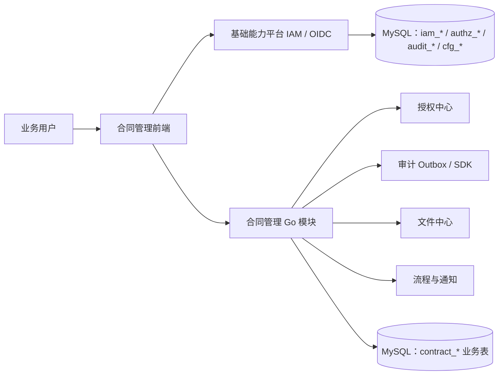

# 00 总览与架构对齐

## 1. 目标与系统边界

原始需求描述的是“机构合同管理系统”。根据基础能力平台架构，本系统应被定义为：

- 一个业务域模块：`contract`；拥有合同、客户/相对方、模板、履约、签署台账等业务数据。
- 一个基础能力平台的接入应用：先注册 `Application`、`Environment` 和 `OAuth Client`，再接入统一身份、授权、审计、配置和通知能力。
- 不单独建设第二套用户密码、角色权限、审计日志、配置中心或运行日志数据库。

## 2. 架构对齐决策（优先级高于原始需求中的冲突描述）

| 主题 | 实施基线 | 对原始需求的处理 |
|---|---|---|
| 架构 | Go + Vue 3 + JavaScript 的模块化单体；MySQL；不使用 Redis | 保留原功能，不新增微服务、RPC 网关或独立缓存组件 |
| 身份登录 | 合同系统使用 OIDC Authorization Code Flow + PKCE 接入统一登录；合同后端本地校验 JWT 的签名、Issuer、Audience | 原始“本地用户名密码直接登录/自行签发 JWT”调整为基础平台 IAM 能力；本地密码登录应移除或禁用 |
| 钉钉身份 | 通过 `iam_external_identity` 管理，`provider=ding_talk`、`provider_subject/union_id` 唯一约束 | 不在合同用户表增加 `dingtalk_unionid` 字段；扫码和绑定属于统一身份能力 |
| 用户/组织 | `User`、`Account`、`OrgUnit`、`Membership` 分离；一个用户可有多个账号、多个任职关系 | 不把用户与部门、登录账号、外部身份混为一个用户表 |
| 授权 | RBAC + ABAC + Data Scope；权限编码格式为 `{application}:{resource}:{action}` | 将 `contract.create` 等旧编码规范化为 `contract:contract:create`；角色与菜单分离 |
| 角色绑定 | 通过 `RoleBinding` 向用户、组织、岗位等主体授予角色，并声明范围和有效期 | 不使用“角色默认权限 ∪ 用户自定义权限”绕开统一授权决策；个性化授权应转为绑定/策略 |
| 审计 | 合同模块写本地 `audit_outbox`，通过 SDK/API 幂等上报基础平台；平台自身与业务操作均留痕 | 不由业务模块直接写 `audit_event`；审计与运行日志分离 |
| 文件 | 合同文件保存到受控本地/挂载目录；文件中心保存 `FileObject`、版本、摘要、绑定关系 | 不只维护裸文件路径或业务表中的单一附件字段 |
| 配置 | 运行期阈值、提醒天数、模板策略等使用配置中心命名空间、版本、发布与回滚 | 启动配置（数据库、目录、日志）仅通过环境变量/启动配置，不进业务配置表 |
| 可观测性 | 运行日志、Trace、Metric 采用结构化日志与 OTel/OTLP；不写业务 MySQL | 原始日志要求拆分为审计事件与运行日志两类 |

## 3. 建议交付顺序

| 阶段 | 交付范围 | 依赖 |
|---|---|---|
| P0 | Application/OAuth Client、统一登录、用户/组织、Permission/Role/RoleBinding、授权检查、审计 Outbox、合同草稿与合同查询 | 基础能力平台 P0 |
| P1 | 合同生命周期、流程审批、文件与模板、通知、到期提醒、报表 | P0 完成 |
| P2 | 签署回传、OCR、审批规则引擎、归档、审计导出/归档、高风险二次认证 | P1 完成 |

## 4. 通用验收约束

- 所有 API 使用 `/api/v1` 版本管理，并有 OpenAPI 描述。
- 业务资源权限需在 `Application=contract` 下注册；不得用无应用前缀的权限编码。
- 任何修改、审批、状态转换、附件访问、导出均生成具有稳定 `event_id` 的审计事件。
- 高风险操作（导出、归档、终止、权限变更、密钥/身份绑定变更）默认失败关闭，并可配置二次认证。
- 所有业务数据按 `tenant_id` 隔离；如当前只有一个组织，也保留默认租户字段和接口上下文。
- 业务模块不得跨模块直连平台表；与平台的协作仅通过 Go 应用服务、领域事件、REST API 或 SDK。
