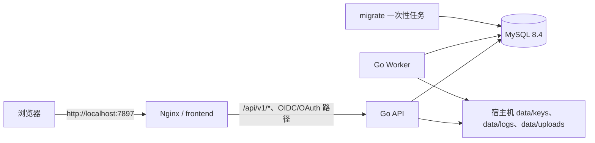

# Basic-Platform Docker 本地部署说明

> 本文档对应仓库根目录的 `compose.yaml`，用于在一台已安装 Docker Engine 与 Docker Compose Plugin 的 Linux 本地开发机或联调机上运行基础能力平台及其 MySQL 数据库。该方案**不修改项目现有 Go 后端、Vue/Vite 前端、Vue Router 或 MySQL/GORM 技术栈**，仅为现有启动方式提供容器化运行环境。
>
> **使用边界**：本文件只描述本地开发和联调。生产服务器部署、HTTPS、systemd、备份、回退和安全验收请使用[前后端部署文档](前后端部署文档.md)与[服务器上线检查清单](服务器上线检查清单.md)。
>
> **Linux 大小写提示**：请按代码块原样输入 `docker compose`、`scripts/prepare-docker-env.sh`、`docker/.env`、`APP_PUBLIC_BASE_URL` 等名称。Linux 下目录、文件和环境变量大小写不同即为不同对象。

## 1. 部署组成与访问边界

| Compose 服务 | 镜像/构建来源 | 职责 | 是否对宿主机暴露端口 |
| --- | --- | --- | --- |
| `frontend` | `frontend/Dockerfile` | 构建 Vue/Vite 静态页面，以 Nginx 提供页面与同源反向代理 | 是，`7897:80` |
| `api` | `backend/Dockerfile` | 运行 Go API 服务 | 否，仅限 Compose 网络 |
| `worker` | `backend/Dockerfile` | 运行异步审计等后台 Worker | 否，仅限 Compose 网络 |
| `migrate` | `backend/Dockerfile` | 执行内嵌 SQL 数据库迁移后退出 | 否，仅限 Compose 网络 |
| `mysql` | `mysql:8.4` | 持久化业务数据库 | 否，仅限 Compose 网络 |



前端请求仍使用同源 `/api/v1`；Nginx 会把该路径代理给 API。`/authorize`、`/.well-known/openid-configuration` 与 `/oauth2/*` 也会被代理，因此 OIDC/OAuth 端点能够从同一个本地入口访问。

## 2. 前置条件

1. Linux 主机已安装并启动 Docker Engine 与 Docker Compose Plugin。
2. 终端可执行以下命令：

   ```bash
   docker --version
   docker compose version
   docker info
   ```

3. 本机 `7897` 端口未被占用。
4. 已安装 `openssl`。初始化脚本使用它生成数据库密码、首次管理员初始化令牌和应用加密密钥。

> 本地配置的公开地址固定为 `http://localhost:7897`，并使用非安全 Cookie（`AUTH_SESSION_COOKIE_SECURE=false`），仅适用于本地开发。不要直接把此配置用于生产环境。

## 3. 首次启动

从项目根目录执行：

```bash
# 1) 生成 Docker 专用密钥、随机密码及持久化目录。
bash scripts/prepare-docker-env.sh

# 2) 构建前后端镜像并在后台启动。
docker compose up --build -d

# 3) 查看服务状态。
docker compose ps

# 4) 验证 API 存活与数据库就绪状态（经前端 Nginx 同源代理）。
curl -fsS http://localhost:7897/healthz
curl -fsS http://localhost:7897/readyz
```

成功后，在浏览器打开：`http://localhost:7897`。

首次 `docker compose up` 的启动顺序如下：

1. `mysql` 先启动并通过 `mysqladmin ping` 健康检查；
2. `migrate` 连接 MySQL，执行后端已内嵌的迁移文件并退出；
3. `api` 和 `worker` 仅在迁移任务成功后启动；
4. `frontend` 仅在 API 存活检查成功后暴露页面入口。

`migrate` 每次执行 `docker compose up` 都会检查并执行尚未应用的迁移；已执行的迁移不会重复写入。

## 4. 首次超级管理员初始化

数据库迁移会写入平台默认租户、应用、环境和角色等基础数据，但不会无中生有地创建业务管理员账号。启动完成后，请按现有接口规范初始化第一个超级管理员。

### 4.1 从本地 Docker 配置读取一次性令牌

`docker/.env` 内含敏感值，禁止提交、复制到工单或发送给无关人员。仅在本机终端读取：

```bash
BOOTSTRAP_TOKEN="$(sed -n 's/^IAM_BOOTSTRAP_TOKEN=//p' docker/.env)"
```

### 4.2 调用初始化接口

将以下示例中的姓名、账号和密码改为实际值；密码必须符合接口约束。

```bash
curl -i -X POST 'http://localhost:7897/api/v1/iam/bootstrap/first-super-admin' \
  -H 'Content-Type: application/json' \
  -H "X-Bootstrap-Token: ${BOOTSTRAP_TOKEN}" \
  --data '{
    "display_name": "平台管理员",
    "account_name": "platform.admin",
    "password": "Replace-With-A-Strong-Password-123"
  }'
```

成功后应返回 `201 Created`。该接口的实际请求字段和约束以 `docs/03_接口规范/平台接口规范.yaml` 为准：

- `display_name`：1～100 个字符；
- `account_name`：3～64 个字符，首字符为字母或数字，其余可使用字母、数字、`.`、`_`、`-`；
- `password`：12～128 个字符；
- `X-Bootstrap-Token`：必须与运行配置中的 `IAM_BOOTSTRAP_TOKEN` 完全匹配。

### 4.3 初始化成功后撤销令牌

为避免保留首次初始化入口，完成初始化后编辑 `docker/.env`，删除整行 `IAM_BOOTSTRAP_TOKEN=...`，再重建 API 与 Worker 容器：

```bash
docker compose up -d --force-recreate api worker
```

不要重新运行 `scripts/prepare-docker-env.sh --force`，除非明确需要替换本地数据库密码、应用加密密钥和初始化令牌；该操作会使当前 Compose 配置与已创建的 MySQL 用户密码不一致，通常需要同时重置本地数据库卷后重新部署。

## 5. 数据与密钥持久化位置

| 位置 | 内容 | 是否可安全删除 |
| --- | --- | --- |
| Docker 卷 `basic-platform_mysql_data` | MySQL 全量数据 | 否；删除即丢失数据库 |
| `data/keys/` | Ed25519 JWT 私钥、公钥 | 否；丢失私钥会导致已签发令牌无法继续验证 |
| `data/logs/` | API/Worker 日志 | 可按日志保留策略清理 |
| `data/uploads/` | 应用文件存储 | 仅确认无业务文件后才可清理 |
| `docker/.env` | 数据库密码、加密密钥、初始化令牌 | 否；需妥善备份且禁止提交 |

JWT 密钥由后端镜像入口程序在 `migrate` 容器首次启动时写入 `data/keys/`，随后 API、Worker 容器以只读方式挂载该目录。已有密钥不会被覆盖。

## 6. 常用运维命令

```bash
# 查看所有服务状态
docker compose ps

# 跟踪所有服务日志
docker compose logs -f

# 仅跟踪 API、Worker 或迁移日志
docker compose logs -f api worker
docker compose logs migrate

# 停止服务，保留 MySQL 卷与宿主机 data 目录
docker compose down

# 重新构建并后台拉起
docker compose up --build -d
```

如需**完全清空本地测试数据**，先确认不需要任何数据库、密钥和上传文件，再执行：

```bash
# 危险：删除 Compose 的 MySQL 数据卷
docker compose down -v

# 危险：删除本地 JWT 密钥、日志和上传文件
rm -rf data/keys data/logs data/uploads
```

清空后按“首次启动”重新执行。该操作不可恢复，生产环境不得使用。

## 7. 故障排查

| 现象 | 检查方式 | 处理建议 |
| --- | --- | --- |
| `docker info` 无法连接 daemon | `sudo systemctl status docker --no-pager`、`docker info` | 启动 Docker 服务，并确认当前用户具有访问 Docker Socket 的权限；不要把 Docker Socket 暴露到公网。 |
| `7897` 被占用 | `sudo ss -ltnp 'sport = :7897'` | 停止占用进程，或修改 `compose.yaml` 中 `frontend.ports` 左侧宿主机端口；同时修改 `APP_PUBLIC_BASE_URL` 和 `APP_CORS_ALLOWED_ORIGINS`。 |
| `migrate` 退出失败 | `docker compose logs migrate` | 优先检查 MySQL 是否健康、`docker/.env` 的 `MYSQL_*` 配置是否被手动修改。 |
| API 不健康 | `docker compose logs api` | 检查 `data/keys/` 是否可读、`IAM_MFA_ENCRYPTION_KEY` 是否为 Base64 编码的 32 字节密钥、迁移是否成功。 |
| 页面可打开但接口 5xx | `docker compose logs -f api worker mysql` | 先调用 `/readyz`；若返回失败，按 API 日志定位数据库或配置项。 |
| 前端路由刷新 404 | `docker compose exec frontend nginx -T` | 确认容器使用仓库中的 `frontend/nginx/default.conf`，其中应有 Vue Router 的 `try_files ... /index.html` 回退。 |

## 8. 钉钉扫码登录与外部可访问部署的注意事项

本 Compose 文件只部署当前项目已经实现的服务，不写入任何钉钉 `client_id`、`client_secret` 或回调地址，也不会假定这些凭证存在。钉钉扫码登录的提供方配置仍应通过项目已有的身份联邦/外部登录配置接口和页面完成。

本地 `http://localhost:7897` 适合联调，但第三方扫码回调通常需要第三方可访问的 HTTPS 地址。部署到可供钉钉访问的环境时，至少需要同步调整：

1. `APP_PUBLIC_BASE_URL` 与 `OIDC_ISSUER` 为真实的 HTTPS 公网地址；
2. `APP_CORS_ALLOWED_ORIGINS` 为实际前端源；
3. `AUTH_SESSION_COOKIE_SECURE=true`；
4. 在外层反向代理或 Ingress 终止 TLS，并正确传递 `X-Forwarded-Proto`；
5. 在钉钉开放平台登记与上述公网地址一致的合法回调地址；
6. 使用受控密钥管理和数据库备份机制替代本地 `docker/.env` 与宿主机目录。

这些是部署边界说明，不代表当前仓库内已预置钉钉应用凭证或公网域名。
