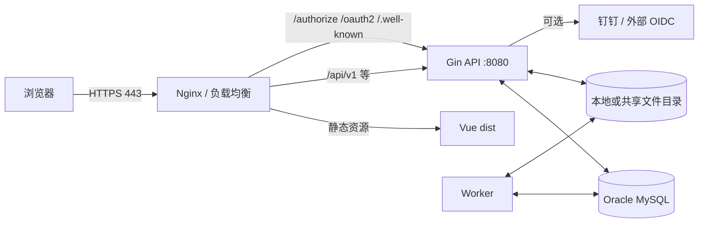

# Basic-Platform 前后端部署文档

> **适用范围**：本文面向 Linux 服务器，所有命令默认使用 Bash 并从项目根目录执行。本文同时覆盖“原生二进制 + systemd + Nginx”和“Docker Compose 单机部署”两种方式。
>
> **核对基线（2026-07-23）**：本文已按当前仓库中的 `compose.yaml`、前后端 Dockerfile、Nginx 配置、Gin 路由、GORM/MySQL 配置、迁移程序、Worker 和环境变量模板重新核对。服务器实际上线前仍必须在目标环境完成数据库备份、迁移演练、HTTPS、登录、权限、审计、文件和第三方回调验收。
>
> **大小写不可变更**：Linux 区分大小写。本文中的命令、目录、文件、环境变量、systemd 单元名和 HTTP 路径必须按代码块原样使用。例如 `ENV_FILE` 不等于 `env_file`，`SHA256SUMS` 不等于 `sha256sums`，`/healthz` 不等于 `/Healthz`，`basic-platform-api.service` 不等于 `Basic-Platform-API.service`。

---

## 1. 部署结论

Basic-Platform 是一个前后端分离、后端模块化单体的基础能力平台，不采用微服务。服务器运行时至少包含：

| 组件 | 代码或配置位置 | 运行职责 | 生产要求 |
|---|---|---|---|
| Vue 前端 | `frontend/` | 登录页、控制台、系统设置、审计等页面 | 构建为静态文件，由 Nginx 等静态服务器提供 |
| Gin API | `backend/cmd/api` | 身份、权限、会话、OIDC/OAuth、审计、配置、文件、通知等接口 | 必须运行 |
| 异步 Worker | `backend/cmd/worker` | 审计导出、审计归档和保留期任务 | 必须运行，否则异步任务不会持续处理 |
| 数据库迁移程序 | `backend/cmd/migrate` | 按版本执行内嵌 MySQL SQL 迁移 | 首次部署和每次版本发布时先执行 |
| Oracle MySQL | 外部服务或 Compose 服务 | 业务数据、会话、审计、异步任务、外部登录状态 | 必须持久化和备份 |
| 本地文件目录 | `FILE_STORAGE_ROOT` | 上传文件、审计导出和归档文件 | 必须持久化；API 与 Worker 必须访问同一份数据 |
| 日志目录 | `LOG_DIRECTORY` | API/Worker 的 `application.jsonl` | 必须可写并配置轮转、采集和保留策略 |
| JWT 密钥 | `AUTH_JWT_*_KEY_PATH` | 控制台、应用令牌和 OIDC Token 签名/验证 | 私钥必须保密并持久化，所有实例必须一致 |
| HTTPS 入口 | Nginx、网关或负载均衡器 | TLS 终止、静态文件、API/OIDC 反向代理 | 生产环境必须提供 |

当前仓库已经提供：

- `backend/Dockerfile`；
- `frontend/Dockerfile`；
- `frontend/nginx/default.conf`；
- `compose.yaml`；
- `scripts/prepare-docker-env.sh`；
- `scripts/bootstrap-linux.sh`；
- `scripts/ops-linux.sh`；
- API、Worker 和迁移程序源码。

当前仓库**没有**提供可直接用于所有生产环境的以下设施：

- 公网域名、TLS 证书及自动续期；
- 宿主机防火墙、WAF、堡垒机和安全组规则；
- 生产密钥管理系统；
- MySQL 高可用、备份和恢复平台；
- Kubernetes/Helm 清单；
- 集中式日志、Trace、Metric 存储；
- 跨主机共享文件系统；
- Redis 或跨实例共享限流。

因此，仓库中的 Compose 可以作为单机部署基础，但不能替代生产安全、备份和高可用设计。

---

## 2. 运行拓扑与访问边界

推荐使用同域部署，浏览器只访问一个 HTTPS 域名：



生产网络边界建议：

| 端口/方向 | 是否公开 | 说明 |
|---|---|---|
| `80/tcp` | 可公开 | 仅用于跳转 HTTPS 或 ACME 验证 |
| `443/tcp` | 公开 | 浏览器、业务系统和第三方回调统一入口 |
| `8080/tcp` | 不公开 | Gin API 只监听回环地址或内网地址 |
| `3306/tcp` | 不公开 | MySQL 仅允许应用服务器和管理网络访问 |
| SSH | 限制来源 | 只允许堡垒机或受信任运维地址 |
| 外部 HTTPS | 按需放行 | 钉钉、外部 OIDC、证书和依赖下载等 |

不要将 API 的 `8080`、MySQL 的 `3306` 或 Docker Socket 暴露到公网。

---

## 3. 部署方式选择

### 3.1 方式 A：原生二进制 + systemd + Nginx

适合：

- 需要清晰的 Linux 目录、权限和进程管理；
- MySQL 已由独立数据库服务提供；
- 希望 API、Worker、前端和反向代理分别管理；
- 生产环境不希望在服务器上保留完整构建工具链。

推荐做法是：在 CI 或专用构建机编译，服务器只接收二进制、前端静态文件和配置。

### 3.2 方式 B：Docker Compose 单机部署

适合：

- 开发、测试、验收或单机内部环境；
- 可以接受 API、Worker、MySQL 和前端运行在同一台主机；
- 已建立 Docker 镜像、数据卷和宿主机目录的备份机制。

当前 `compose.yaml` 默认是本地开发配置：

- 使用 `mysql:8.4`；
- 使用 `docker/.env`；
- 前端映射 `7897:80`；
- 默认生成的配置是 `APP_ENV=development`；
- Cookie 默认不是 Secure；
- 没有公网 TLS 终止。

因此，不能把未修改的本地 Compose 配置直接当作公网生产配置。

### 3.3 多实例部署限制

项目虽然可以启动多个 API 实例，但上线前必须处理以下约束：

1. 所有 API 和 Worker 必须使用同一个 MySQL；
2. 所有实例必须使用同一套 JWT 私钥、公钥和四类应用加密密钥；
3. `FILE_STORAGE_ROOT` 当前是本地文件存储，多主机时必须改为共享挂载或保证任务只落到可访问同一目录的主机；
4. 登录等敏感入口的固定窗口限流是进程内实现，多实例之间不共享计数；项目明确不使用 Redis，因此需要在网关/WAF 层增加统一限流；
5. 本地 JSON 日志、Trace 和 Metric 不是跨实例集中式存储，需要外部采集系统统一汇聚；
6. Worker 使用 MySQL 任务锁，但每个实例的 `ASYNC_WORKER_ID` 必须唯一；
7. 数据库迁移只能由一个发布任务执行，不能让所有 API 实例同时自动迁移。

在没有完成上述设计前，优先使用单 API 实例加单 Worker 实例。

---

## 4. 上线前必须确定的信息

发布负责人应在操作服务器前确认以下内容，并形成部署记录：

- [ ] 生产域名，例如 `https://platform.example.com`；
- [ ] DNS 已指向负载均衡或服务器；
- [ ] TLS 证书来源、私钥保管人和续期方式；
- [ ] 前端与 API 是否同域；推荐同域；
- [ ] MySQL 地址、版本、数据库、账号、备份和恢复负责人；
- [ ] JWT 私钥、公钥和应用加密密钥的生成、备份及恢复方式；
- [ ] `FILE_STORAGE_ROOT` 的容量、备份、清理和恢复方式；
- [ ] 日志保留天数、轮转、采集和脱敏规则；
- [ ] 是否启用钉钉或外部 OIDC，以及服务器出网白名单；
- [ ] 是否启用 OIDC Provider；如需显式指定公开签发方，再确认 `OIDC_ISSUER`；
- [ ] 首个超级管理员由谁初始化，初始化令牌何时销毁；
- [ ] 发布窗口、数据库迁移窗口和回退负责人；
- [ ] 单实例还是多实例部署；
- [ ] 监控、告警和紧急联系人。

未确认数据库备份、密钥备份和 HTTPS 时，不应开始生产发布。

---

## 5. Linux 服务器准备

### 5.1 基础要求

- 64 位 Linux，支持 `amd64/x86_64` 或 `arm64/aarch64`；
- 时间同步正常，避免 OIDC、TOTP、会话和审计时间异常；
- Oracle MySQL 8.x；当前 Compose 基线是 MySQL 8.4；
- 足够的磁盘空间用于数据库、上传文件、审计导出和日志；
- 生产服务器避免直接使用 `root` 运行 API 和 Worker；
- 服务器应启用安全更新、SSH 密钥登录和最小化开放端口。

资源不能只按“能启动”估算。初始 CPU、内存、磁盘和 MySQL 连接数应根据用户数、审计写入量、文件容量和并发压测确定。后端单进程数据库连接池当前上限为 25 个打开连接、10 个空闲连接；多实例时要按实例数量核算 MySQL 总连接数。

### 5.2 检测或补齐依赖

新 Linux 开发/构建主机可以先执行：

```bash
bash scripts/bootstrap-linux.sh --check
bash scripts/bootstrap-linux.sh --bootstrap --dry-run
```

确认预演无误后再执行：

```bash
sudo -v
bash scripts/bootstrap-linux.sh --bootstrap --yes
```

该脚本适合开发和验收环境。生产服务器更推荐只部署已经构建和验证的产物，不在生产机执行 `npm ci` 或在线下载工具链。详细说明见 [Linux 环境自动安装脚本说明](../04_后端开发/Linux环境自动安装脚本说明.md)。

### 5.3 创建专用运行用户和目录

以下是原生 systemd 部署的建议目录：

```bash
sudo useradd \
  --system \
  --home-dir /var/lib/basic-platform \
  --create-home \
  --shell /usr/sbin/nologin \
  basic-platform

sudo install -d -o root -g basic-platform -m 0750 /etc/basic-platform
sudo install -d -o basic-platform -g basic-platform -m 0750 /opt/basic-platform/releases
sudo install -d -o basic-platform -g basic-platform -m 0750 /var/lib/basic-platform/keys
sudo install -d -o basic-platform -g basic-platform -m 0750 /var/lib/basic-platform/uploads
sudo install -d -o basic-platform -g basic-platform -m 0750 /var/log/basic-platform
sudo install -d -o root -g root -m 0755 /var/www/basic-platform/releases
```

权限原则：

- `/etc/basic-platform/basic-platform.env`：`root:basic-platform`，权限 `0640`；
- JWT 私钥：`basic-platform:basic-platform`，权限 `0600`；
- JWT 公钥：权限可为 `0644`，但不需要公开到 Web 根目录；
- 上传、归档和日志目录：只允许应用用户写；
- 发布目录：发布用户写入，运行用户只读；
- 不要把生产 `.env`、私钥或数据库备份放进 Git 工作区。

### 5.4 主机安全和网络

以实际发行版防火墙为准，只开放必要端口。示例原则：

```text
公网 -> 80/443 -> Nginx 或负载均衡
Nginx -> 127.0.0.1:8080 -> Gin API
API/Worker -> 内网 3306 -> MySQL
API -> HTTPS 443 -> 已批准的钉钉/OIDC 主机
```

还应检查：

- `timedatectl status` 中时钟同步正常；
- 磁盘挂载不是只读；
- 上传目录所在磁盘有容量告警；
- MySQL、密钥和上传文件不在临时文件系统；
- SELinux/AppArmor 开启时为程序、Nginx 和目录配置正确策略，不要直接永久关闭安全模块；
- 容器部署时当前用户只在必要时拥有 Docker 权限，因为 Docker 权限近似主机 root 权限。

---

## 6. 构建与产物准备

### 6.1 构建原则

- 使用固定提交或版本标签构建；
- 后端版本与 `backend/go.mod` 保持一致；当前声明 Go `1.26.4`；
- 前端 Vite 7.3.6 要求 Node.js `^20.19.0` 或 `>=22.12.0`；建议在流水线固定具体版本；
- 使用 `package-lock.json` 和 `npm ci`，不要使用会改写依赖锁文件的安装方式；
- 构建前执行测试和静态检查；
- 构建产物生成 SHA-256 校验值并记录提交号；
- 不把 `node_modules/`、本地 `.env`、测试缓存和开发密钥打包到生产产物。

### 6.2 后端验证和编译

```bash
(
  cd backend
  gofmt_files="$(gofmt -l .)"
  test -z "$gofmt_files"
  go mod verify
  go vet ./...
  go test ./...

  mkdir -p ../release/bin
  CGO_ENABLED=0 GOOS=linux go build -trimpath -ldflags='-s -w' -o ../release/bin/api ./cmd/api
  CGO_ENABLED=0 GOOS=linux go build -trimpath -ldflags='-s -w' -o ../release/bin/worker ./cmd/worker
  CGO_ENABLED=0 GOOS=linux go build -trimpath -ldflags='-s -w' -o ../release/bin/migrate ./cmd/migrate
)
```

交叉编译时根据目标服务器设置 `GOARCH=amd64` 或 `GOARCH=arm64`。不要把为错误架构生成的二进制上传到服务器。

### 6.3 前端验证和构建

Vite 变量会在构建时写入静态文件，同域部署建议保留相对 API 地址：

```bash
(
  cd frontend
  npm ci --no-audit --no-fund
  npm test
  VITE_API_BASE_URL=/api/v1 \
  VITE_LOGIN_SUCCESS_URL=/ \
  VITE_DINGTALK_PROVIDER_CODE=DINGTALK_QR \
  npm run build

  cp -a dist ../release/frontend
)
```

构建后应同时存在入口文件和静态资源：

```bash
test -f release/frontend/index.html
test -f release/frontend/login.html
test -d release/frontend/assets
```

### 6.4 产物清单和校验

```bash
(
  cd release
  find bin frontend -type f -print0 \
    | sort -z \
    | xargs -0 sha256sum > SHA256SUMS
)
```

发布包至少包含：

```text
release/
├── bin/
│   ├── api
│   ├── migrate
│   └── worker
├── frontend/
│   ├── index.html
│   ├── login.html
│   └── assets/
└── SHA256SUMS
```

在服务器解压后执行：

```bash
export RELEASE_ID="20260723-gitsha"
cd "/opt/basic-platform/releases/$RELEASE_ID"
sha256sum -c SHA256SUMS
```

---

## 7. MySQL 准备与迁移

### 7.1 数据库要求

- 使用 Oracle MySQL 8.x，不要用 MariaDB 冒充兼容环境；
- 字符集使用 `utf8mb4`；
- MySQL 时区、应用 `APP_TIMEZONE` 和 DSN 的 `loc=UTC` 语义需要在验收环境核对；
- 数据库必须放在持久化磁盘上；
- 远程数据库应通过私有网络或受控加密链路访问；
- 生产账号密码不能写入命令行、Git 或普通日志；
- 上线前必须做备份，并实际验证备份可恢复。

数据库初始化示例：

```sql
CREATE DATABASE basic_platform
  CHARACTER SET utf8mb4
  COLLATE utf8mb4_0900_ai_ci;

CREATE USER 'basic_platform'@'10.%'
  IDENTIFIED BY 'REPLACE_WITH_A_SECRET_FROM_THE_SECRET_MANAGER';

GRANT ALL PRIVILEGES ON basic_platform.*
  TO 'basic_platform'@'10.%';

FLUSH PRIVILEGES;
```

示例中的 Host 范围和权限必须按真实网络缩小。若组织要求迁移账号与运行账号分离，可以分别准备两个环境文件：迁移时临时使用具有 DDL 权限的账号，API/Worker 使用受限运行账号。权限拆分必须在测试环境验证所有运行接口需要的 DML 权限。

### 7.2 迁移机制

迁移程序读取 `backend/migrations/` 中内嵌的版本化 SQL，并记录到 `platform_schema_migration`。规则：

1. 只允许新增更高版本迁移；
2. 不得修改已在任何环境执行过的历史迁移；
3. 迁移具有校验和；
4. 当前没有自动 down migration；
5. 回退应用版本不等于回退数据库结构；
6. 发布前必须在生产数据副本或预发布库演练。

### 7.3 执行迁移

原生部署：

```bash
sudo -u basic-platform \
  env ENV_FILE=/etc/basic-platform/basic-platform.env \
  /opt/basic-platform/releases/$RELEASE_ID/bin/migrate
```

Compose 部署：

```bash
docker compose run --rm migrate
```

迁移完成后检查：

```sql
SELECT version, name, checksum, applied_at
FROM platform_schema_migration
ORDER BY version;
```

迁移失败时：

- 不要立即启动新版本 API；
- 不要手工修改迁移记录绕过校验；
- 保留迁移日志和数据库状态；
- 判断失败语句是否已经部分生效；
- 由数据库负责人决定修复迁移、恢复备份或继续前滚。

---

## 8. 生产环境配置与密钥

### 8.1 配置加载规则

后端配置加载顺序为：

1. 如果设置 `ENV_FILE`，读取该文件；
2. 否则读取当前目录 `.env`；
3. 从 `backend/` 运行时会回退查找上一级 `.env`；
4. 操作系统环境变量优先于 `.env` 文件中的同名值。

生产 systemd 推荐只设置：

```text
ENV_FILE=/etc/basic-platform/basic-platform.env
```

由应用自行读取受控文件。不要让生产服务依赖仓库根目录 `.env`。

### 8.2 生产配置示例

以下仅是原生 systemd 部署的字段示例，所有 `REPLACE_*` 必须由部署系统或密钥管理系统替换。使用 Compose 时容器内监听地址必须保持 `APP_HTTP_ADDR=:8080`，不能照抄示例中的回环地址：

```dotenv
APP_ENV=production
APP_NAME=basic-platform
APP_TIMEZONE=Asia/Shanghai
APP_HTTP_ADDR=127.0.0.1:8080
APP_PUBLIC_BASE_URL=https://platform.example.com
APP_CORS_ALLOWED_ORIGINS=https://platform.example.com

MYSQL_HOST=10.0.0.20
MYSQL_PORT=3306
MYSQL_DATABASE=basic_platform
MYSQL_USERNAME=basic_platform
MYSQL_PASSWORD=REPLACE_WITH_DATABASE_PASSWORD
MYSQL_PARAMS=charset=utf8mb4&parseTime=true&loc=UTC

AUTH_JWT_ISSUER=basic-platform
AUTH_JWT_AUDIENCE=basic-platform-console
AUTH_APPLICATION_JWT_AUDIENCE=basic-platform-integration
# 可选：留空时后端自动使用 APP_PUBLIC_BASE_URL。
OIDC_ISSUER=
AUTH_JWT_PRIVATE_KEY_PATH=/var/lib/basic-platform/keys/jwt-ed25519-private.pem
AUTH_JWT_PUBLIC_KEY_PATH=/var/lib/basic-platform/keys/jwt-ed25519-public.pem
AUTH_SESSION_COOKIE_NAME=bp_session
AUTH_SESSION_COOKIE_SECURE=true
AUTH_SESSION_COOKIE_SAME_SITE=Lax
AUTH_SESSION_TTL=8h

IAM_MOBILE_ENCRYPTION_KEY=REPLACE_WITH_BASE64_32_BYTE_KEY
IAM_MFA_ENCRYPTION_KEY=REPLACE_WITH_DIFFERENT_BASE64_32_BYTE_KEY
IAM_FEDERATED_PROVIDER_SECRET_ENCRYPTION_KEY=REPLACE_WITH_DIFFERENT_BASE64_32_BYTE_KEY
IAM_EXTERNAL_LOGIN_STATE_ENCRYPTION_KEY=REPLACE_WITH_DIFFERENT_BASE64_32_BYTE_KEY
IAM_EXTERNAL_OIDC_HTTP_TIMEOUT=10s
IAM_DINGTALK_HTTP_TIMEOUT=10s
IAM_EXTERNAL_OIDC_ALLOW_INSECURE_HTTP=false
IAM_EXTERNAL_OIDC_ALLOWED_HOSTS=REPLACE_WITH_APPROVED_IDP_HOSTS
# 默认留空：首次管理员初始化时临时设置至少 32 字符的随机令牌，完成后删除。
IAM_BOOTSTRAP_TOKEN=

AUDIT_APPLICATION_CODE=platform
AUDIT_ENVIRONMENT_CODE=prod
FILE_STORAGE_ROOT=/var/lib/basic-platform/uploads
ASYNC_WORKER_ID=basic-platform-worker-01
ASYNC_WORKER_POLL_INTERVAL=2s
ASYNC_WORKER_STALE_LOCK_TIMEOUT=5m
LOG_LEVEL=info
LOG_FORMAT=json
LOG_DIRECTORY=/var/log/basic-platform

OTEL_ENABLED=false
OTEL_SERVICE_NAME=basic-platform
OTEL_EXPORTER_OTLP_ENDPOINT=
```

`OTEL_*` 当前属于环境模板中的预留配置，不能仅靠填写这些变量获得真实的 OpenTelemetry Collector、Trace 或 Metric 外发能力。服务器仍需独立部署采集器或监控 Agent，并以实际代码接入和验收结果为准。`AUDIT_APPLICATION_CODE` 与 `AUDIT_ENVIRONMENT_CODE` 必须对应平台内已经存在且启用的应用、环境编码，否则审计关联可能失败。

当前代码对生产配置有强制校验：

- `APP_ENV=production` 时 `APP_PUBLIC_BASE_URL` 必须使用 HTTPS；
- `OIDC_ISSUER` 留空时，后端自动使用 `APP_PUBLIC_BASE_URL`；如显式填写，在 `APP_ENV=production` 时必须使用 HTTPS；
- `APP_ENV=production` 时 `AUTH_SESSION_COOKIE_SECURE` 必须为 `true`；
- `APP_CORS_ALLOWED_ORIGINS` 至少包含一个精确 Origin，不能使用 `*`；
- `AUTH_SESSION_COOKIE_SAME_SITE` 只能是 `Lax`、`Strict` 或 `None`；
- SameSite 为 `None` 时必须使用 Secure Cookie；
- `IAM_BOOTSTRAP_TOKEN` 设置后至少 32 个字符；
- 外部 OIDC 和钉钉 HTTP 超时必须大于 0 且不超过 1 分钟；
- `LOG_FORMAT` 当前只支持 `json`；
- `IAM_MFA_ENCRYPTION_KEY` 必须是 Base64 编码的 32 字节密钥，否则 API 无法启动；
- JWT 私钥和公钥文件必须存在且可读。

### 8.3 生成开发外的密钥

生产密钥优先由 KMS、Vault、云密钥服务或受控离线流程生成和分发。若必须在受控 Linux 主机生成，先确认 OpenSSL 版本支持 Ed25519；CentOS 7 自带的 OpenSSL 1.0.2 **不支持** `ED25519`，不能执行下面的 OpenSSL 密钥对命令。使用 `scripts/bootstrap-linux.sh --deploy` 时无需手工判断：脚本会自动回退到项目自带的 Go 标准库生成器，并生成后端所需的 PKCS#8 私钥和 PKIX 公钥 PEM 文件。

支持 Ed25519 的 OpenSSL 主机可执行：

```bash
umask 077
openssl genpkey \
  -algorithm ED25519 \
  -out /var/lib/basic-platform/keys/jwt-ed25519-private.pem

openssl pkey \
  -in /var/lib/basic-platform/keys/jwt-ed25519-private.pem \
  -pubout \
  -out /var/lib/basic-platform/keys/jwt-ed25519-public.pem
```

在 CentOS 7 等旧版 OpenSSL 主机上，如确需在脚本外手工生成，使用与发布脚本相同的项目生成器（要求已安装项目要求的 Go 版本）：

```bash
umask 077
go run /root/Basic-Platform/scripts/generate-ed25519-jwt-key-pair.go \
  /var/lib/basic-platform/keys/jwt-ed25519-private.pem \
  /var/lib/basic-platform/keys/jwt-ed25519-public.pem
```

生成四个 Base64 应用加密密钥和一个可选的初始化令牌可使用：

```bash
openssl rand -base64 32
openssl rand -base64 32
openssl rand -base64 32
openssl rand -base64 32
openssl rand -hex 32
```

四个 Base64 密钥分别用于手机号、MFA、身份提供商密钥和外部登录状态，必须彼此不同，不能复用 JWT 私钥或数据库密码。

### 8.4 密钥不可丢失

必须备份并能恢复：

- JWT Ed25519 私钥和公钥；
- `IAM_MOBILE_ENCRYPTION_KEY`；
- `IAM_MFA_ENCRYPTION_KEY`；
- `IAM_FEDERATED_PROVIDER_SECRET_ENCRYPTION_KEY`；
- `IAM_EXTERNAL_LOGIN_STATE_ENCRYPTION_KEY`；
- 数据库密码及外部身份提供商密钥。

丢失或错误替换可能导致：

- 已签发 Token 无法验证；
- 手机号、TOTP 种子或身份提供商密钥无法解密；
- 外部登录状态无法继续完成；
- API 启动失败。

项目当前没有自动密钥轮换流程。任何轮换都必须先设计兼容期、历史数据重加密和 Token 失效策略。

---

## 9. 原生 systemd 部署

### 9.1 使用集成发布脚本安装发布产物

完成数据库/文件备份与 Nginx 配置后，推荐从项目根目录以 root 身份执行集成发布脚本。首次原生部署无需预先创建环境文件、发布/运行目录或 systemd 单元：脚本会创建默认 `basic-platform` 运行用户/组、生产环境文件目录、`/opt/basic-platform/releases`、JWT 密钥、运行目录和脚本托管的 API、Worker 单元。

```bash
sudo bash scripts/bootstrap-linux.sh \
  --deploy \
  --yes \
  --env-file /etc/basic-platform/basic-platform.env \
  --deploy-root /opt/basic-platform \
  --restart-services
```

若 `/etc/basic-platform/basic-platform.env` 不存在，第一次执行会：创建 `/etc/basic-platform` 和权限受控的生产模板、创建或复用 `basic-platform` 运行用户/组、创建 `/opt/basic-platform/releases`、生成 `/var/lib/basic-platform/keys/` 下的 Ed25519 JWT 密钥对、创建上传/日志目录并写入两个 systemd 单元。CentOS 7 的 OpenSSL 不支持 Ed25519 时，脚本会自动使用随项目发布的 Go 标准库生成器。随后脚本会刻意停止，不会构建或迁移。运维人员必须将模板中所有 `REPLACE_WITH_*` 值替换为实际生产配置（包括数据库连接信息、公开 HTTPS 地址和四个 Base64 编码的 32 字节 IAM 密钥），然后重新执行**同一条**命令。`IAM_BOOTSTRAP_TOKEN` 默认留空，首次创建超级管理员时再临时设置至少 32 字符的随机值。

若第一次执行因旧版 OpenSSL 的 Ed25519 不支持而中断，在同步修复后的 `bootstrap-linux.sh` 与 `generate-ed25519-jwt-key-pair.go` 后重新执行同一命令即可。脚本只会删除长度为 0 的失败残留密钥；若目录中只剩一个非空密钥文件，会停止以保护该文件，运维人员应先核实其来源和有效性，不能直接覆盖。

同名 systemd 单元若不含 `# Managed by Basic Platform bootstrap-linux.sh` 标记，脚本将保留原文件不覆盖；该情况下由运维负责确保其服务用户、`ENV_FILE`、`WorkingDirectory`、`ExecStart` 和写目录权限与本项目一致。

若使用远程 MySQL 且服务器没有安装 `mysql` 客户端，追加 `--skip-mysql-server`。该参数只放宽客户端检查；发布中的迁移仍会由应用程序使用 `ENV_FILE` 连接数据库。

脚本会构建 API、Worker、迁移程序及前端静态资源，在暂存目录中完成产物准备，执行迁移后原子更新 `current` 软链接。默认保留 5 个版本，可通过 `--keep-releases N` 调整：

```text
/opt/basic-platform/
├── current -> releases/<release-id>
└── releases/
    └── <release-id>/
        ├── bin/
        │   ├── api
        │   ├── worker
        │   └── migrate
        ├── frontend/
        └── release-info
```

`release-info` 记录发布号、UTC 构建时间和源码提交号。环境文件、数据库密码、JWT 私钥、上传文件、归档文件和日志不属于发布产物，也不会被脚本复制进版本目录。

如果在切换 `current` 前构建或迁移失败，原 `current` 不会被脚本替换；但是数据库迁移不会自动回退。因此必须在发布前完成备份，并确认旧应用版本与迁移后的数据库兼容，才可以进行应用版本回退。

不使用脚本时，也必须保持 API、Worker、前端静态资源在同一个 `/opt/basic-platform/releases/<release-id>/` 目录下，并在迁移成功后再原子更新 `/opt/basic-platform/current`。

### 9.1.1 使用运维自动化脚本执行日常操作

完成本节的首次部署后，日常巡检、服务控制、备份、迁移、发布、应用回退和 Nginx 重载应优先使用 `scripts/ops-linux.sh`，避免直接手工修改 `current` 软链接或遗漏健康检查。例如：

```bash
cd /srv/basic-platform/source
sudo bash scripts/ops-linux.sh doctor
sudo bash scripts/ops-linux.sh backup --yes
sudo bash scripts/ops-linux.sh deploy --release-id 20260723.1 --yes
```

该脚本仅适用于 Linux 的原生 systemd 部署，不用于 Docker Compose。`deploy` 会在调用现有发布脚本前执行 MySQL 备份；`rollback` 只回退应用文件，不回退数据库。因此，迁移兼容性、密钥管理、异机备份和恢复演练仍需按本文件和[Linux 运维自动化脚本说明](Linux运维脚本说明.md)执行。

### 9.2 API systemd 参考单元

首次 `--deploy` 会将下面的默认内容写入 `/etc/systemd/system/basic-platform-api.service`，并添加 `# Managed by Basic Platform bootstrap-linux.sh` 标记。以下模板用于审计默认配置，或供需要自行维护 systemd 单元的部署参考；自行维护的同名单元不会被脚本覆盖：

```ini
[Unit]
Description=Basic Platform API
After=network-online.target
Wants=network-online.target

[Service]
Type=simple
User=basic-platform
Group=basic-platform
WorkingDirectory=/opt/basic-platform/current
Environment=ENV_FILE=/etc/basic-platform/basic-platform.env
ExecStart=/opt/basic-platform/current/bin/api
Restart=on-failure
RestartSec=5s
TimeoutStopSec=30s
KillSignal=SIGTERM
NoNewPrivileges=true
PrivateTmp=true
ProtectHome=true
ProtectSystem=strict
ReadWritePaths=/var/lib/basic-platform /var/log/basic-platform
UMask=0027
LimitNOFILE=65535

[Install]
WantedBy=multi-user.target
```

脚本托管模式下无需手工保存；自定义模式保存为 `/etc/systemd/system/basic-platform-api.service` 后执行 `sudo systemctl daemon-reload`。

### 9.3 Worker systemd 参考单元

首次 `--deploy` 同样会创建脚本托管的 Worker 单元；以下内容供审计或自定义部署参考。

```ini
[Unit]
Description=Basic Platform Worker
After=network-online.target
Wants=network-online.target

[Service]
Type=simple
User=basic-platform
Group=basic-platform
WorkingDirectory=/opt/basic-platform/current
Environment=ENV_FILE=/etc/basic-platform/basic-platform.env
ExecStart=/opt/basic-platform/current/bin/worker
Restart=on-failure
RestartSec=5s
TimeoutStopSec=30s
KillSignal=SIGTERM
NoNewPrivileges=true
PrivateTmp=true
ProtectHome=true
ProtectSystem=strict
ReadWritePaths=/var/lib/basic-platform /var/log/basic-platform
UMask=0027
LimitNOFILE=65535

[Install]
WantedBy=multi-user.target
```

脚本托管模式下无需手工保存；自定义模式保存为 `/etc/systemd/system/basic-platform-worker.service` 后执行 `sudo systemctl daemon-reload`。

### 9.4 启动顺序

```bash
# 1. 先检查配置文件和目录权限。
sudo -u basic-platform test -r /etc/basic-platform/basic-platform.env
sudo -u basic-platform test -r /var/lib/basic-platform/keys/jwt-ed25519-private.pem
sudo -u basic-platform test -w /var/lib/basic-platform/uploads
sudo -u basic-platform test -w /var/log/basic-platform

# 2. 备份数据库后执行迁移。
sudo -u basic-platform \
  env ENV_FILE=/etc/basic-platform/basic-platform.env \
  /opt/basic-platform/current/bin/migrate

# 3. 加载并启动服务。
sudo systemctl daemon-reload
sudo systemctl enable --now basic-platform-api.service
sudo systemctl enable --now basic-platform-worker.service

# 4. 查看状态和日志。
sudo systemctl status basic-platform-api.service --no-pager
sudo systemctl status basic-platform-worker.service --no-pager
sudo journalctl -u basic-platform-api.service -n 100 --no-pager
sudo journalctl -u basic-platform-worker.service -n 100 --no-pager
```

### 9.5 健康检查

```bash
curl -fsS http://127.0.0.1:8080/healthz
curl -fsS http://127.0.0.1:8080/readyz
```

含义：

| 端点 | 用途 | 依赖 MySQL |
|---|---|---|
| `/healthz` | 存活检查，判断 HTTP 进程是否运行 | 否 |
| `/readyz` | 就绪检查，2 秒内执行数据库探测 | 是；失败返回 503 |

只有 `/readyz` 成功后才应向该 API 实例转发业务流量。


### 9.6 关闭与卸载

#### 9.6.1 关闭服务但保留部署数据

维护窗口内需要停止后端处理进程、但保留当前版本以便后续启动或排查时，执行：

```bash
sudo bash scripts/bootstrap-linux.sh --stop --yes
```

该操作停止并禁用 `basic-platform-api.service`、`basic-platform-worker.service`，不会删除发布版本、环境文件、数据库、文件存储、日志或 JWT 密钥。

Nginx 静态站点不会随此操作停止。因此浏览器可能仍能打开前端页面，但 API、登录、OIDC 和钉钉扫码回调均不可用。不得为了关闭本应用而直接停止共享的 Nginx；若该虚拟主机仅供本应用使用，应按下文卸载时通过显式站点配置路径下线。

#### 9.6.2 卸载本应用

卸载前必须完成数据库、`FILE_STORAGE_ROOT`、日志和密钥的归档/备份；`--uninstall` 不提供恢复或回滚能力。

仅删除应用程序与本机运行文件、保留 MySQL 数据库时：

```bash
sudo bash scripts/bootstrap-linux.sh \
  --uninstall --yes \
  --env-file /etc/basic-platform/basic-platform.env \
  --deploy-root /opt/basic-platform
```

脚本会停止并禁用 API、Worker，删除 `/opt/basic-platform`、两个应用 systemd 单元、环境文件，以及环境文件中 `FILE_STORAGE_ROOT`、`LOG_DIRECTORY`、`AUTH_JWT_PRIVATE_KEY_PATH`、`AUTH_JWT_PUBLIC_KEY_PATH` 对应的应用文件。

若服务器中的数据库、Nginx 虚拟主机和 `basic-platform` 运行用户均专用于本应用，并且确认要彻底删除项目数据，可使用：

```bash
sudo env MYSQL_ADMIN_PASSWORD='数据库管理员密码' \
  bash scripts/bootstrap-linux.sh \
  --uninstall --yes \
  --env-file /etc/basic-platform/basic-platform.env \
  --deploy-root /opt/basic-platform \
  --purge-database \
  --nginx-site /etc/nginx/conf.d/basic-platform.conf \
  --remove-system-user basic-platform
```

`--purge-database` 会删除 `MYSQL_DATABASE`。仅在本机数据库（`MYSQL_HOST` 为 `127.0.0.1` 或 `localhost`）时，脚本还会移除其初始化流程创建的 `MYSQL_USERNAME@127.0.0.1` 和 `MYSQL_USERNAME@localhost` 账号；远程数据库的账号主机范围必须由数据库管理员确认后手动清理。`--nginx-site` 只应传入本应用独占的站点文件，且路径必须位于 `/etc/nginx/` 或 `/usr/local/nginx/conf/` 下；脚本会在删除后校验并重载 Nginx。`--remove-system-user` 只删除显式指定的专用用户及其同名空用户组。

脚本不会删除共享的 MySQL/Nginx 服务、Docker、Go/Node.js 工具链或其他项目资源。执行前可先增加 `--dry-run` 查看计划操作。

---

## 10. Nginx、HTTPS 与前端部署

### 10.1 必须代理的后端路径

| 路径 | 作用 |
|---|---|
| `/api/` | REST API、登录、外部登录和钉钉回调 |
| `/authorize` | OAuth/OIDC 授权入口 |
| `/oauth2/` | Token、PAR、撤销、同意、JWKS、UserInfo 和 Logout |
| `/.well-known/openid-configuration` | OIDC Discovery |
| `/healthz` | 存活检查 |
| `/readyz` | 就绪检查 |

其他路径由前端静态站点处理，并为 Vue Router 回退到 `/index.html`。

### 10.2 Nginx 参考配置

仓库内的 `frontend/nginx/default.conf` 用于容器内部同源代理。原生服务器可参考以下 HTTPS 配置，并按组织证书规范调整：

```nginx
server {
    listen 80;
    server_name platform.example.com;
    return 301 https://$host$request_uri;
}

server {
    listen 443 ssl http2;
    server_name platform.example.com;

    ssl_certificate /etc/nginx/tls/platform.example.com/fullchain.pem;
    ssl_certificate_key /etc/nginx/tls/platform.example.com/privkey.pem;

    root /opt/basic-platform/current/frontend;
    index index.html;

    client_max_body_size 22m;

    add_header X-Content-Type-Options "nosniff" always;
    add_header Referrer-Policy "same-origin" always;

    location = /healthz {
        proxy_pass http://127.0.0.1:8080/healthz;
        proxy_set_header Host $host;
        proxy_set_header X-Real-IP $remote_addr;
        proxy_set_header X-Forwarded-For $proxy_add_x_forwarded_for;
        proxy_set_header X-Forwarded-Proto https;
    }

    location = /readyz {
        proxy_pass http://127.0.0.1:8080/readyz;
        proxy_set_header Host $host;
        proxy_set_header X-Real-IP $remote_addr;
        proxy_set_header X-Forwarded-For $proxy_add_x_forwarded_for;
        proxy_set_header X-Forwarded-Proto https;
    }

    location /api/ {
        proxy_pass http://127.0.0.1:8080;
        proxy_http_version 1.1;
        proxy_set_header Host $host;
        proxy_set_header X-Real-IP $remote_addr;
        proxy_set_header X-Forwarded-For $proxy_add_x_forwarded_for;
        proxy_set_header X-Forwarded-Proto https;
        proxy_read_timeout 60s;
    }

    location = /authorize {
        proxy_pass http://127.0.0.1:8080/authorize;
        proxy_set_header Host $host;
        proxy_set_header X-Real-IP $remote_addr;
        proxy_set_header X-Forwarded-For $proxy_add_x_forwarded_for;
        proxy_set_header X-Forwarded-Proto https;
    }

    location = /.well-known/openid-configuration {
        proxy_pass http://127.0.0.1:8080/.well-known/openid-configuration;
        proxy_set_header Host $host;
        proxy_set_header X-Forwarded-Proto https;
    }

    location /oauth2/ {
        proxy_pass http://127.0.0.1:8080;
        proxy_set_header Host $host;
        proxy_set_header X-Real-IP $remote_addr;
        proxy_set_header X-Forwarded-For $proxy_add_x_forwarded_for;
        proxy_set_header X-Forwarded-Proto https;
    }

    location / {
        try_files $uri $uri/ /index.html;
    }
}
```

文件上传应用层默认上限是 20 MiB，请让代理的 `client_max_body_size` 略高于应用上限；示例使用 22 MiB。不要在没有同步评估磁盘、超时和应用限制的情况下任意放大。

### 10.3 启用配置

```bash
sudo nginx -t
sudo systemctl reload nginx
```

上线后检查：

```bash
curl -fsS https://platform.example.com/healthz
curl -fsS https://platform.example.com/readyz
curl -fsS https://platform.example.com/.well-known/openid-configuration
curl -I https://platform.example.com/login.html
```

### 10.4 Cookie、CORS 和同域原则

推荐前端、API、OIDC 端点使用同一 Origin：

```text
https://platform.example.com
```

对应配置：

```dotenv
APP_PUBLIC_BASE_URL=https://platform.example.com
APP_CORS_ALLOWED_ORIGINS=https://platform.example.com
# 可选：留空时后端自动使用 APP_PUBLIC_BASE_URL。
OIDC_ISSUER=
AUTH_SESSION_COOKIE_SECURE=true
AUTH_SESSION_COOKIE_SAME_SITE=Lax
```

如果必须跨域：

- `APP_CORS_ALLOWED_ORIGINS` 必须列出精确 Origin；
- 前端请求必须携带 Cookie；
- SameSite、Secure、域名和浏览器策略必须联合测试；
- 不允许使用 `*` 配合凭证；
- 需要额外验证 CSRF、退出和第三方回调行为。

---

## 11. Docker Compose 服务器部署注意事项

本地完整操作见 [Docker 本地部署说明](Docker本地部署说明.md)。服务器使用 Compose 时，还要额外完成以下生产化调整。

### 11.1 不直接复用开发配置

不要直接运行：

```bash
bash scripts/prepare-docker-env.sh
docker compose up --build -d
```

然后就对公网开放。该脚本生成的是开发配置。生产环境至少要：

1. 将 `APP_ENV` 改为 `production`；
2. 使用真实 HTTPS `APP_PUBLIC_BASE_URL`；`OIDC_ISSUER` 可留空（自动复用前者）或填写真实 HTTPS 地址；
3. 设置 `AUTH_SESSION_COOKIE_SECURE=true`；
4. 将 `APP_CORS_ALLOWED_ORIGINS` 改为真实 Origin；
5. 使用受控生产密码和密钥，不使用本地脚本生成后无人备份的值；
6. 将前端端口只绑定回环地址，例如 `127.0.0.1:7897:80`；
7. 在外层 Nginx/负载均衡提供 HTTPS；
8. 为 MySQL 卷、`data/keys` 和 `data/uploads` 建立备份；
9. 固定镜像版本或镜像摘要，不在生产每次临时拉取浮动标签；
10. 验证宿主机重启后容器、卷和目录权限正常。

### 11.2 外层 TLS 与转发协议

当前容器内 `frontend/nginx/default.conf` 会把 `X-Forwarded-Proto` 设置为容器收到请求时的 `$scheme`。如果外层 TLS 代理以 HTTP 转发到前端容器，内层 Nginx 看到的 `$scheme` 是 `http`。

生产使用双层代理时必须明确处理可信代理头，避免错误的协议判断。可选方案：

- 外层 Nginx 直接托管前端静态文件并直接代理 Gin API；或
- 为生产镜像提供经过评审的 Nginx 配置，保留外层可信 `X-Forwarded-Proto`；或
- 在同一 TLS 终止层完成静态文件和 API 代理，避免重复代理。

无论采用哪种方式，`APP_PUBLIC_BASE_URL` 必须是最终外部 HTTPS 地址；`OIDC_ISSUER` 可留空以自动复用该地址，如显式填写也必须是最终外部 HTTPS 地址。

### 11.3 数据持久化

| Compose 位置 | 内容 | 处理要求 |
|---|---|---|
| `basic-platform_mysql_data` | MySQL 数据 | 必须做数据库级备份；不能只复制运行中的卷目录 |
| `data/keys/` | JWT 密钥 | 加密备份；恢复时保持内容不变 |
| `data/uploads/` | 上传、导出、归档 | 与数据库保持一致性备份 |
| `data/logs/` | JSON 日志 | 轮转、采集、保留 |
| `docker/.env` | 密码和应用加密密钥 | 权限 `0600`，禁止提交，安全备份 |

`docker compose down` 默认保留命名卷；`docker compose down -v` 会删除 MySQL 卷，生产环境禁止在未确认的情况下执行。

### 11.4 Compose 发布顺序

```bash
# 1. 拉取代码或准备已验证的镜像，并备份数据库和文件。

# 2. 先构建镜像，不切换运行服务。
docker compose build

# 3. 单独执行迁移并检查结果。
docker compose run --rm migrate

# 4. 更新 API 和 Worker。
docker compose up -d --no-deps api worker

# 5. API 就绪后更新前端。
docker compose up -d --no-deps frontend

# 6. 验证。
docker compose ps
curl -fsS http://127.0.0.1:7897/healthz
curl -fsS http://127.0.0.1:7897/readyz
```

当前 `compose.yaml` 中 `migrate` 是一次性服务，完整 `up` 时会等待 MySQL 健康并在 API/Worker 前执行迁移。生产发布仍建议显式观察迁移日志：

```bash
docker compose logs --no-color migrate
```

---

## 12. 首次超级管理员初始化

首次部署可通过受控接口创建一个超级管理员。该流程没有普通前端入口。

### 12.1 初始化前

- 在环境配置中临时设置至少 32 字符的 `IAM_BOOTSTRAP_TOKEN`；
- 只允许部署管理员在受控网络执行；
- 不要通过聊天、工单明文发送令牌；
- 确认数据库中尚未完成首次管理员初始化。

### 12.2 调用接口

请求字段以 [平台 OpenAPI 接口规范](平台接口规范.yaml) 为准。调用时使用：

```text
POST /api/v1/iam/bootstrap/first-super-admin
X-Bootstrap-Token: <一次性令牌>
Content-Type: application/json
```

初始化密码必须满足当前强密码规则。生产操作记录不应包含明文密码或令牌。

### 12.3 初始化后立即关闭入口

1. 从 `/etc/basic-platform/basic-platform.env` 或生产 Secret 中删除 `IAM_BOOTSTRAP_TOKEN`；
2. 重启 API；
3. 确认初始化接口返回 404；
4. 由管理员登录并配置 MFA；
5. 将初始密码按组织规则立即更换；
6. 在审计日志中核对初始化事件。

原生部署：

```bash
sudo systemctl restart basic-platform-api.service
```

Compose：

```bash
docker compose up -d --force-recreate api
```

---

## 13. OIDC、外部登录和钉钉部署

### 13.1 OIDC Provider

- `OIDC_ISSUER` 是可选的公开签发方：留空时后端自动使用 `APP_PUBLIC_BASE_URL`；如显式配置，必须与外部客户端看到的 HTTPS Origin 一致；
- Discovery 地址为 `/.well-known/openid-configuration`；
- JWKS 地址由 Discovery 返回，当前路由位于 `/oauth2/jwks`；
- 客户端回调地址必须精确注册；
- 代理不能重写授权码、state、查询字符串或 Logout 跳转参数；
- JWT 私钥不可在实例之间不一致。

### 13.2 外部 OIDC 登录

- 默认只允许 HTTPS；
- `IAM_EXTERNAL_OIDC_ALLOWED_HOSTS` 使用精确 host 或 host:port，不能填 URL、路径或通配符；
- `IAM_EXTERNAL_OIDC_ALLOW_INSECURE_HTTP=true` 只能用于明确的非生产测试；
- 服务器 DNS、CA 证书和出网策略必须允许访问已批准的身份提供商；
- 外部身份必须按平台规则预绑定或受控关联，不得绕过本地账号状态和权限校验。

### 13.3 钉钉扫码登录

生产启用钉钉时至少满足：

- `IAM_FEDERATED_PROVIDER_SECRET_ENCRYPTION_KEY` 已配置；
- `IAM_EXTERNAL_LOGIN_STATE_ENCRYPTION_KEY` 已配置；
- 数据库中的 `DINGTALK_QR` 提供商已启用；
- SuiteKey、SuiteSecret/客户端密钥通过管理接口加密保存；
- 平台用户已由管理员预绑定钉钉稳定身份；
- 钉钉开放平台回调地址与平台配置完全一致；
- 回调使用生产 HTTPS 地址；
- 浏览器能加载钉钉二维码 SDK；
- API 服务器能访问钉钉接口；
- 日志和审计中不记录授权码、Token、SuiteSecret、原始 state 或原始外部身份。

回调路径：

```text
https://platform.example.com/api/v1/auth/dingtalk/callback
```

真实上线必须完成一次已绑定账号扫码测试，并验证启用 MFA 的账号仍会进入 MFA 流程。

---

## 14. 日志、监控、备份和容量

### 14.1 应用日志

API 和 Worker 都会：

- 向标准输出写 JSON；
- 向 `LOG_DIRECTORY/application.jsonl` 追加 JSON 日志。

注意 API 和 Worker 如果共享同一个 `LOG_DIRECTORY`，会写同名文件。单机部署可运行，但集中采集时应依据 systemd unit、容器标签或日志字段区分进程。当前代码不负责日志轮转，必须使用 `logrotate`、容器日志驱动或外部 Agent。

日志中禁止出现：

- 密码、恢复码、TOTP 种子；
- Session Cookie、Authorization Bearer Token；
- JWT 私钥和应用加密密钥；
- OAuth 授权码、Refresh Token、客户端密钥；
- 钉钉 SuiteSecret、访问令牌和原始外部身份；
- 未脱敏手机号或敏感业务正文。

### 14.2 监控建议

至少监控：

- `/healthz`、`/readyz` 状态和延迟；
- API 5xx、401、403、429 比例；
- 登录失败、账号锁定、MFA 失败；
- MySQL 连接数、慢查询、磁盘、复制和备份状态；
- Worker 是否持续运行、任务积压和失败数；
- `FILE_STORAGE_ROOT` 和日志磁盘使用率；
- TLS 证书到期时间；
- 外部 OIDC/钉钉请求失败率；
- 审计上报失败、死信和重放结果。

项目中的本地 Trace、Metric 和日志查询能力不能替代基础设施级监控。

### 14.3 备份范围

完整恢复至少需要：

1. MySQL 一致性备份；
2. `FILE_STORAGE_ROOT`；
3. JWT 私钥和公钥；
4. 四类应用加密密钥；
5. 外部身份提供商密钥；
6. 生产环境配置；
7. 对应版本的 API、Worker 和前端产物；
8. 发布记录和迁移版本。

数据库与文件应尽量使用同一恢复点。只恢复数据库、不恢复上传或归档文件，会产生元数据存在但文件缺失的问题。

原生 Linux 部署可使用 `scripts/ops-linux.sh backup --yes` 生成 MySQL 与上传目录备份及 SHA-256 校验文件。该脚本不会备份环境文件、JWT 私钥、应用加密密钥或外部身份提供商密钥；这些敏感材料必须使用独立且受控的密钥备份机制保存。

### 14.4 恢复演练

备份成功不代表可恢复。至少定期在隔离环境演练：

- 恢复 MySQL；
- 恢复 JWT 和应用加密密钥；
- 恢复上传目录；
- 启动相同版本 API/Worker；
- 验证登录、MFA、文件下载、审计查询和 OIDC Token；
- 记录 RPO、RTO 和缺失项。

---

## 15. 发布流程

推荐顺序：

1. 冻结发布提交，记录提交号和构建环境；
2. 完成 `gofmt`、`go mod verify`、`go vet`、`go test`、`npm test` 和前端构建；
3. 生成并校验产物 SHA-256；
4. 在预发布环境使用生产等价配置演练；
5. 确认域名、证书、数据库、密钥、文件目录和备份；
6. 运行 `sudo bash scripts/ops-linux.sh backup --yes`，确认生产 MySQL 与本地文件备份及校验文件成功生成；
7. 使用 `sudo bash scripts/ops-linux.sh deploy --release-id <release-id> --yes` 调用受控发布流程，在暂存目录构建前后端产物；
8. 观察迁移执行结果并检查 `platform_schema_migration`；
9. 由发布脚本原子切换 `/opt/basic-platform/current`，使后端与前端静态目录同时切换；
10. 由运维脚本重启 API、Worker，并检查 `/healthz`、`/readyz`；
11. 执行登录、权限、审计、文件和 OIDC 冒烟测试；
12. 若启用钉钉或外部 OIDC，执行真实回调测试；
13. 观察错误率、数据库连接、任务积压和磁盘；
14. 确认稳定后再清理旧发布目录。

不要在 API 已接收流量时并行运行未经演练的破坏性迁移。

---

## 16. 回退策略

### 16.1 应用回退

原生部署应使用运维脚本切回已存在的旧版本：

```bash
cd /srv/basic-platform/source
sudo bash scripts/ops-linux.sh rollback --target 20260720-previous-gitsha --yes
```

脚本会切换 `/opt/basic-platform/current`、重启 API/Worker 并检查就绪状态；若目标版本无法就绪，会自动恢复切换前的应用版本。Nginx 配置有变化时，再执行：

```bash
sudo bash scripts/ops-linux.sh reload-nginx --yes
```

回退前必须确认旧版本与已经执行的新数据库结构兼容。

### 16.2 数据库回退

当前迁移没有自动 down migration。发生不兼容迁移时只能：

- 使用已经评审的前滚修复迁移；或
- 在停机和数据影响评估后恢复备份。

不得通过删除 `platform_schema_migration` 记录、修改历史 SQL 或手工伪造校验和来回退。

### 16.3 密钥回退

密钥不是普通版本文件。回退应用时仍应使用能够解密现有数据和验证现有 Token 的原密钥。未经轮换设计，不要随应用版本切换密钥。

---

## 17. 常见故障排查

| 现象 | 优先检查 | 处理方向 |
|---|---|---|
| API 无法启动 | `journalctl`/容器日志 | 环境变量格式、MFA 密钥、JWT 文件、日志目录权限 |
| `/healthz` 正常但 `/readyz` 503 | MySQL 网络和账号 | 地址、端口、密码、库名、权限、MySQL 状态 |
| 登录成功但浏览器没有会话 | Cookie 和 HTTPS | `Secure`、SameSite、域名、代理协议、浏览器请求凭证 |
| 前端刷新子路由 404 | Nginx | `try_files $uri $uri/ /index.html` |
| API 返回 CORS 错误 | `APP_CORS_ALLOWED_ORIGINS` | 使用精确 Origin，包含协议和端口，不使用路径 |
| 上传返回 413 | Nginx 和应用限制 | `client_max_body_size` 至少略高于 20 MiB 应用限制 |
| OIDC issuer 不匹配 | `OIDC_ISSUER`/代理 | 留空时核对 `APP_PUBLIC_BASE_URL`；显式填写时必须与外部看到的 HTTPS Origin 完全一致 |
| 钉钉二维码可见但回调失败 | 回调、出网、提供商配置 | HTTPS 回调、SuiteKey、预绑定、state、服务器出网 |
| Worker 不处理任务 | Worker 日志和 MySQL | Worker 是否运行、ID 是否唯一、数据库权限、任务锁 |
| 文件记录存在但下载失败 | `FILE_STORAGE_ROOT` | 文件未同步、权限错误、数据库和文件恢复点不一致 |
| 磁盘持续增长 | 日志和上传目录 | 日志轮转、清理任务、容量告警、保留策略 |
| 迁移校验和不一致 | 历史 SQL 被修改 | 恢复原文件，不要绕过校验，新增修复迁移 |
| 多实例限流不一致 | 网关策略 | 进程内限流不共享，在网关/WAF 增加统一限流 |

排查时先保留第一个错误，不要只处理后续连带错误；同时避免在日志和工单中粘贴完整 `.env`、Cookie、Token 或密钥。

---

## 18. 上线验收清单

完整可打印清单见 [服务器上线检查清单](服务器上线检查清单.md)。最低验收项如下：

### 18.1 系统和网络

- [ ] Linux 时间同步正常；
- [ ] 只开放 80/443 和受控 SSH；
- [ ] API 8080 和 MySQL 3306 未暴露公网；
- [ ] 域名、DNS、HTTPS 和证书续期已验证；
- [ ] 服务器出网只允许必要目标。

### 18.2 配置和密钥

- [ ] `APP_ENV=production`；
- [ ] `APP_PUBLIC_BASE_URL` 使用真实 HTTPS 地址；`OIDC_ISSUER` 留空或使用同样可信的 HTTPS 地址；
- [ ] Secure Cookie 已开启；
- [ ] CORS 只包含精确可信 Origin；
- [ ] JWT 和四类应用加密密钥已安全备份；
- [ ] 配置文件和私钥权限正确；
- [ ] 首次初始化后已移除 `IAM_BOOTSTRAP_TOKEN`。

### 18.3 数据和进程

- [ ] MySQL 已备份且恢复流程已验证；
- [ ] 迁移成功且记录完整；
- [ ] API 和 Worker 都由 systemd/容器编排托管；
- [ ] `/healthz`、`/readyz` 成功；
- [ ] 上传、日志和密钥目录持久化；
- [ ] 日志轮转、采集和磁盘告警已配置；
- [ ] Worker 能处理审计导出和保留任务。

### 18.4 功能和安全

- [ ] 本地密码登录、退出和会话刷新正常；
- [ ] MFA 登录和高风险操作二次验证正常；
- [ ] 权限拒绝返回符合接口规范；
- [ ] 审计事件包含 Request ID/关联信息且没有敏感值；
- [ ] 文件上传、授权下载和清理正常；
- [ ] OIDC Discovery、JWKS、授权码和 Logout 正常；
- [ ] 如启用钉钉/外部 OIDC，已完成真实回调验收；
- [ ] 备份、回退、故障联系人和发布记录已归档。

---

## 19. 相关文档和源码

| 主题 | 位置 |
|---|---|
| 项目总览 | [项目说明](../项目说明.md) |
| 服务器上线逐项检查 | [服务器上线检查清单](服务器上线检查清单.md) |
| Docker 本地部署 | [Docker 本地部署说明](Docker本地部署说明.md) |
| Linux 环境初始化 | [Linux 环境自动安装脚本说明](../04_后端开发/Linux环境自动安装脚本说明.md) |
| Linux 日常运维、备份、发布与回退 | [Linux 运维自动化脚本说明](Linux运维脚本说明.md) |
| 数据库迁移 | [数据库迁移说明](../04_后端开发/数据库迁移说明.md) |
| 接口契约 | [平台 OpenAPI 接口规范](平台接口规范.yaml) |
| JWT/OIDC | [JWT 文档](JWT文档.md) |
| 平台接入 | [平台接入说明](../01_架构设计/平台接入说明.md) |
| 配置加载与校验 | `backend/internal/shared/config/config.go` |
| API 启动与关闭 | `backend/cmd/api/main.go` |
| Worker 装配 | `backend/cmd/worker/main.go`、`backend/internal/bootstrap/worker.go` |
| 数据库迁移入口 | `backend/cmd/migrate/main.go` |
| MySQL 连接池 | `backend/internal/shared/database/mysql.go` |
| Gin 路由与健康检查 | `backend/internal/transport/http/router.go` |
| 结构化日志 | `backend/internal/shared/observability/logger.go` |
| 原生发布与日常运维脚本 | `scripts/bootstrap-linux.sh`、`scripts/ops-linux.sh` |
| Compose | `compose.yaml` |
| 后端镜像 | `backend/Dockerfile`、`backend/docker-entrypoint.sh` |
| 前端镜像和代理 | `frontend/Dockerfile`、`frontend/nginx/default.conf` |
