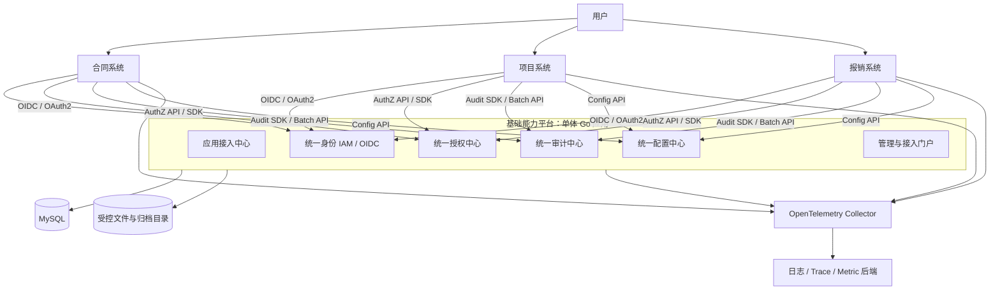
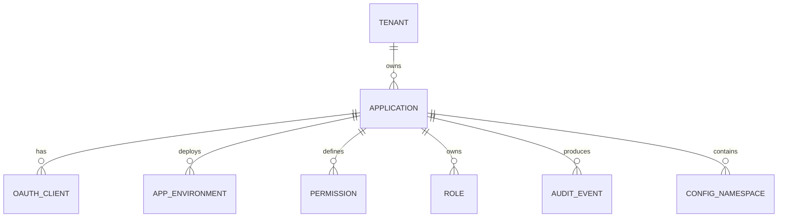
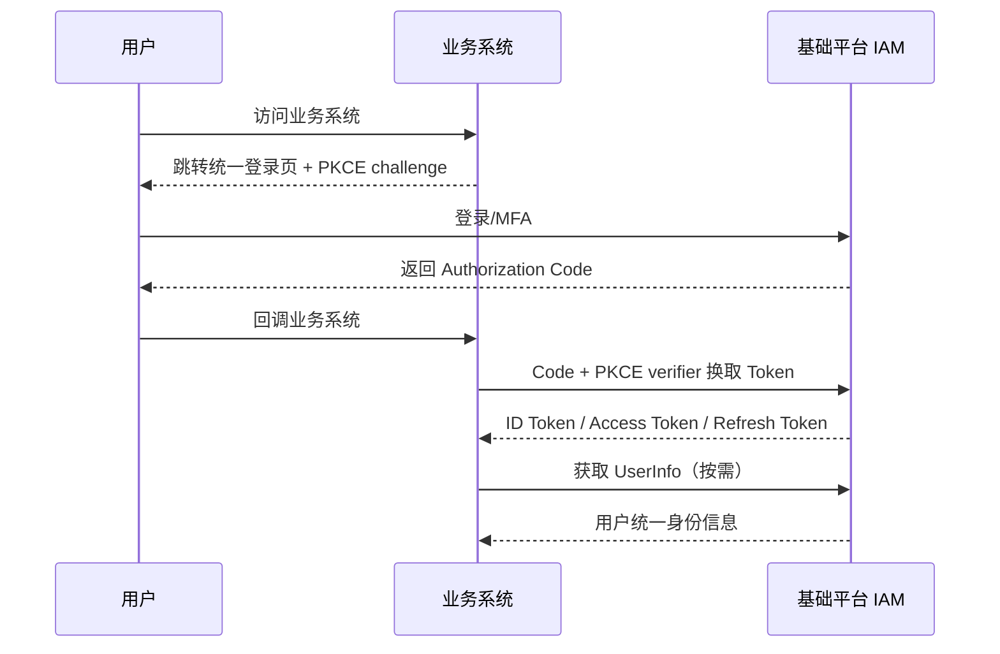
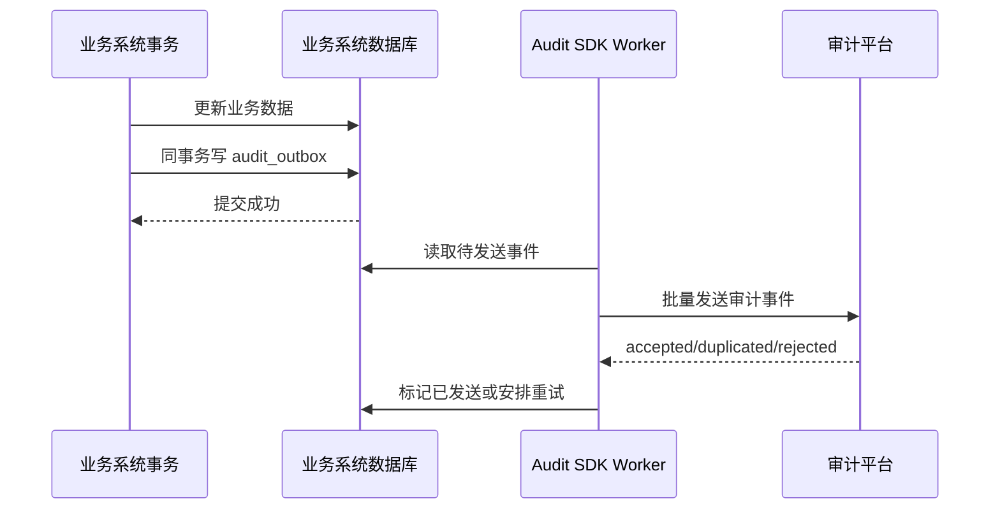

# 基础能力平台对外接入架构

> 适用范围：当前平台采用 Go 单体应用实现，不采用微服务；其他业务系统通过标准协议、开放 API 和 SDK 复用身份、权限、审计、配置与日志能力。

## 1. 平台定位

当前建设的不是某个业务系统内部的 `common` 模块，而是一个可被多个系统接入的统一基础能力平台。

```text
实现形态：一个 Go 单体应用
部署形态：统一身份与治理平台
使用形态：多个业务系统通过协议/API/SDK 接入
```

“其他系统通过网络访问平台”不等于“平台内部采用微服务”。平台内部仍然保持单体部署、单一数据库和模块化代码结构。

平台负责：

- 统一用户、账号、组织和登录会话。
- 统一应用注册和客户端凭证。
- 统一权限定义、角色、授权关系和权限判定。
- 接收、存储和查询各系统的审计事件。
- 提供按应用、环境、租户隔离的运行期配置。
- 提供统一可观测性接入规范和日志查询入口。
- 提供 Go SDK、JavaScript SDK、OpenAPI 文档和接入示例。

平台不负责：

- 保存所有业务系统的业务数据。
- 代替业务系统执行最终的数据查询。
- 把所有程序运行日志写入平台 MySQL。
- 直接修改外部业务系统的表。
- 让外部系统共享平台数据库账号。

## 2. 总体架构



## 3. 必须新增的核心模型：Application

既然其他系统会接入，`Application` 必须成为平台一级模型，不能只围绕 User 和 Role 设计。



### 3.1 Application

```text
Application
- id
- tenant_id
- code                      // contract/project/expense
- name
- description
- owner_org_id
- owner_user_id
- application_type          // web/spa/backend/mobile/third_party
- homepage_url
- status
- created_at
```

应用编码一旦发布原则上不可修改，因为它会进入权限编码、Token audience、审计来源和配置命名空间。

### 3.2 ApplicationEnvironment

```text
ApplicationEnvironment
- id
- application_id
- environment               // dev/test/staging/prod
- base_url
- status
- metadata_json
```

生产、测试环境的客户端凭证、回调地址和配置必须隔离。

### 3.3 OAuthClient

```text
OAuthClient
- id
- application_id
- environment_id
- client_id
- client_type               // public/confidential/service
- client_secret_hash
- token_endpoint_auth_method
- grant_types
- redirect_uris
- allowed_scopes
- access_token_ttl
- refresh_token_ttl
- status
- secret_expires_at
```

客户端凭证只在创建或轮换时显示一次，平台只保存摘要或公钥信息。

> **当前实现范围（2026-07-21）**：平台管理 API 已提供 Application、Environment、OAuth Client、
> Scope、精确回调地址、独立 post-logout URI、客户端公钥，以及客户端密钥创建、禁用和轮换的受控管理能力。
> 根路径 OIDC/OAuth 运行时已支持 `GET /authorize`、Authorization Code + PKCE、Refresh Token 轮换、
> RFC 7009 Revocation、Discovery、JWKS、UserInfo、Logout、`private_key_jwt`、PAR 与签名 JAR；协议响应不使用
> `/api/v1` 业务响应包裹。密钥明文只在创建或轮换响应中显示一次，授权码与刷新令牌仅保存 SHA-256
> 摘要。TOTP MFA、标准 OIDC 外部身份登录及钉钉预绑定扫码登录已经接入既有 MySQL 会话和审计流程。
> 用户授权同意的后端查询、授权和撤回接口已开放，独立 Vue 同意页仍待实现。

## 4. 统一身份接入

### 4.1 推荐协议

平台作为统一身份提供方，对接系统作为客户端：

- 用户登录：OpenID Connect Authorization Code Flow + PKCE。
- 后端机器调用：OAuth Client Credentials，条件允许时使用非对称客户端认证。
- 用户和组织同步：平台内部 API；需要标准化时增加 SCIM。
- Token 验证：JWT 签名 + JWKS 公钥发布。
- 服务发现：`/.well-known/openid-configuration`。

服务端机器调用继续以 HTTP Basic 携带 `client_id:client_secret` 调用 `POST /oauth2/token`，提交
`grant_type=client_credentials` 与可选 `scope`。浏览器和原生客户端可使用 `GET /authorize` 发起
Authorization Code Flow；公开客户端以表单 `client_id` 交换 code/refresh token，机密客户端只接受
HTTP Basic。授权码必须与登记的精确回调地址和 PKCE verifier 绑定；Refresh Token 每次使用都会轮换，
已消费 Token 的重放会撤销整个 token family。

不要让合同、项目、报销系统各自保存用户密码。

### 4.2 登录流程



### 4.3 Token Claims

Access Token 建议只放稳定且必要的信息：

```json
{
  "iss": "https://identity.example.com",
  "sub": "account-id",
  "aud": ["contract-api"],
  "exp": 1784100000,
  "iat": 1784099100,
  "jti": "token-id",
  "sid": "session-id",
  "tenant_id": "tenant-id",
  "user_id": "user-id",
  "client_id": "contract-web",
  "scope": "openid profile contract.basic"
}
```

不建议把用户的全部角色、全部部门和几百条权限都放进 Token：

- Token 会过大。
- 权限变化不能及时生效。
- 多应用权限容易泄漏给不相关客户端。
- 数据权限通常无法仅依靠静态 Claims 表达。

可在 Token 中携带少量粗粒度 Scope，细粒度权限由授权中心判定。

### 4.4 本地 Token 验证

业务系统应通过 SDK 在本地验证：

- 签名。
- `iss`。
- `aud`。
- `exp`/`nbf`。
- 允许的签名算法。
- Client/Application 是否匹配。

JWKS 公钥允许缓存。这样平台短暂不可用时，已有 Token 在有效期内仍可以被业务系统验证，不需要每个请求都远程调用身份平台。

### 4.5 用户标识规则

跨系统使用：

```text
user_id     // 人员主键
account_id  // 登录账号主键
subject     // OIDC sub，通常对应 account_id
```

业务系统保存统一 `user_id` 或 `sub` 作为引用，但需要展示姓名时可保存快照：

```text
created_by_user_id
created_by_name_snapshot
```

不要用用户名、手机号、邮箱作为跨系统主键，因为这些字段可能变化。

## 5. 统一权限中心

### 5.1 平台和业务系统职责

采用 PEP/PDP 分工：

```text
PEP（Policy Enforcement Point）
- 位于业务系统
- 拦截请求
- 收集当前用户和资源属性
- 调用授权中心
- 根据结果允许或拒绝

PDP（Policy Decision Point）
- 位于基础平台授权中心
- 读取角色、授权关系和策略
- 计算最终 Allow/Deny
- 返回决策原因和策略版本
```

基础平台负责“做决定”，业务系统负责“执行决定”。

### 5.2 权限编码

权限编码必须包含应用命名空间：

```text
contract:contract:read
contract:contract:create
contract:contract:approve
contract:contract:export

project:project:read
project:project:update
project:member:manage

expense:claim:create
expense:claim:approve
expense:payment:confirm
```

格式：

```text
{application}:{resource}:{action}
```

避免所有系统都注册一个无法区分来源的 `user:read` 或 `data:export`。

### 5.3 权限定义模型

```text
Permission
- id
- application_id
- code
- resource
- action
- name
- description
- risk_level
- status
```

业务系统负责声明自己有哪些资源和操作；平台管理员负责把权限授权给角色、用户、组织或岗位。

### 5.4 角色模型

建议分三种角色：

```text
PlatformRole     // 超级管理员、安全管理员、审计管理员
ApplicationRole  // 合同管理员、项目经理、报销审批人
CustomRole       // 某机构自行创建的角色
```

```text
Role
- id
- tenant_id
- application_id          // 平台角色可为空
- code
- name
- role_type
- status

RolePermission
- role_id
- permission_id
- effect                  // allow/deny；第一期优先只做 allow

RoleBinding
- id
- tenant_id
- application_id
- subject_type            // user/org/position/group/service_account
- subject_id
- role_id
- scope_type              // tenant/org/org_tree/project/custom
- scope_id
- valid_from
- valid_until
```

### 5.5 权限判定 API

#### 单次判定

```http
POST /api/v1/authorization/check
```

```json
{
  "subject": {
    "user_id": "u-1001",
    "tenant_id": "t-001"
  },
  "application": "contract",
  "resource": "contract",
  "action": "approve",
  "object": {
    "id": "c-20260001",
    "owner_org_id": "org-finance",
    "owner_user_id": "u-2001",
    "amount": 300000,
    "classification": "confidential"
  },
  "context": {
    "ip": "10.0.0.8",
    "time": "2026-07-15T10:00:00+08:00"
  }
}
```

```json
{
  "allowed": true,
  "decision_id": "dec-001",
  "policy_version": 18,
  "reason_code": "ROLE_PERMISSION_ALLOWED",
  "cache_ttl_seconds": 30
}
```

#### 批量判定

```http
POST /api/v1/authorization/batch-check
```

用于列表页一次判断多个按钮或资源，避免出现 N+1 网络请求。

#### 获取数据范围

```http
POST /api/v1/authorization/data-scope
```

```json
{
  "application": "contract",
  "resource": "contract",
  "action": "read"
}
```

```json
{
  "scope_type": "org_tree",
  "user_ids": [],
  "org_ids": ["org-a", "org-a-1", "org-a-2"],
  "constraints": {
    "classification_max": "confidential"
  },
  "policy_version": 18
}
```

业务系统把返回的数据范围转换成自己的 SQL 条件。权限平台不直接查询合同、项目或报销数据库。

### 5.6 可用性策略

如果每个请求都同步调用授权中心，授权中心故障会影响所有接入系统，因此采用混合模式：

| 权限类型 | 推荐方式 |
|---|---|
| Token 身份验证 | 本地验签，不远程调用 |
| 页面/功能粗粒度权限 | Token Scope 或短期本地缓存 |
| 数据权限 | 调用授权 API，短时间缓存 |
| 审批、导出、权限管理等高风险动作 | 实时调用，失败关闭 |
| 只读低风险操作 | 可使用很短时间的最近决策，必须明确配置 |

默认规则：

```text
高风险动作：授权中心不可用 -> 拒绝
普通写操作：授权中心不可用 -> 拒绝
低风险只读：可按应用策略使用短期缓存
```

所有权限缓存必须关联 `policy_version`，角色或策略变化后可主动失效。

## 6. 跨系统统一审计

### 6.1 审计平台职责

其他系统不需要把业务表同步到平台，只需要把有治理意义的事件发送到审计中心：

- 登录、退出和认证失败。
- 权限允许和拒绝，特别是高风险拒绝。
- 用户、组织、角色和权限变更。
- 新增、修改、删除、提交、审批、撤回。
- 数据导出和批量下载。
- 敏感数据查看。
- 配置发布和回滚。
- 安全策略修改。
- 外部接口调用和关键失败。

### 6.2 审计事件统一模型

```text
AuditEvent
- event_id                 // 来源系统生成，全局或应用内唯一
- application_id
- environment
- source_instance
- event_type
- occurred_at              // 业务系统发生时间
- received_at              // 平台接收时间
- tenant_id
- actor_type               // user/service/system/anonymous
- actor_id
- actor_name_snapshot
- session_id
- client_id
- action
- resource_type
- resource_id
- resource_name_snapshot
- business_id
- request_id
- trace_id
- source_ip
- user_agent
- result                   // success/failure/denied/partial
- reason_code
- risk_level
- data_classification
- metadata_json
```

可选变更明细：

```text
AuditChange
- event_id
- field
- before_value_masked
- after_value_masked
- value_type
```

### 6.3 审计事件示例

```json
{
  "event_id": "01JZ-AUDIT-00001",
  "application": "contract",
  "environment": "prod",
  "event_type": "BUSINESS_OPERATION",
  "occurred_at": "2026-07-15T10:12:31.235+08:00",
  "tenant_id": "t-001",
  "actor": {
    "type": "user",
    "id": "u-1001",
    "name_snapshot": "张三"
  },
  "action": "contract.approve",
  "resource": {
    "type": "contract",
    "id": "c-20260001",
    "name_snapshot": "采购框架合同"
  },
  "request_id": "req-001",
  "trace_id": "3f6...",
  "source_ip": "10.0.0.8",
  "result": "success",
  "risk_level": "high",
  "metadata": {
    "workflow_task_id": "task-100",
    "comment": "同意"
  }
}
```

### 6.4 接收 API

```http
POST /api/v1/audit/events
POST /api/v1/audit/events:batch
```

批量接口响应：

```json
{
  "accepted": ["event-001", "event-002"],
  "duplicated": ["event-003"],
  "rejected": [
    {
      "event_id": "event-004",
      "reason": "INVALID_OCCURRED_AT"
    }
  ]
}
```

接入接口必须使用 `Authorization: Bearer <access_token>`，并要求令牌包含 `audit.ingest` scope。
平台从 Bearer Token 取得租户、应用和环境绑定；请求中的 `application_code`、`environment_code`
若传入，必须与令牌一致，不能借由请求体跨租户或伪造其他应用来源。

平台使用 `(application_id, event_id)` 唯一约束实现幂等，接入系统重试不会产生重复审计记录。

### 6.5 不丢审计的接入方式

外部系统不能在业务事务中直接同步调用审计 API 后再决定是否提交业务事务，否则平台短暂不可用会阻塞全部业务。

推荐每个业务系统使用本地 Outbox：



这可以保证：

- 业务更新成功后一定存在待发送的审计事件。
- 审计平台短暂不可用时，事件留在业务系统本地重试。
- 通过 `event_id` 解决至少一次投递导致的重复问题。
- Worker 在服务端获取和轮换 Client Credentials Token；不得把客户端密钥、Bearer Token 写入
  Outbox、审计正文、应用日志或浏览器代码。

高风险操作还应遵循：

```text
如果本地 audit_outbox 都无法写入，则业务事务回滚。
```

### 6.6 审计数据安全

- 审计表只追加，不提供普通更新和删除 API。
- 平台管理员不能修改原始审计事件。
- 密码、Token、Cookie、客户端密钥禁止写入审计。
- 身份证、银行卡、手机号等按字段策略脱敏。
- 查询和导出审计记录本身也必须产生审计事件。
- 审计保留周期按事件类型、风险级别和法规要求配置。
- 可对每日或每批事件计算哈希链/签名，用于发现篡改。
- 超过在线查询周期的数据归档为压缩文件，写入受控的只读归档目录，并保存校验摘要。

### 6.7 审计导出作业（P7）

控制台创建 `POST /api/v1/audit/export-jobs` 后只得到异步作业标识。独立的
`cmd/worker` 进程通过 MySQL `async_job` 行锁领取作业、在失败时按有限次数重试，并将 CSV
写入 `FILE_STORAGE_ROOT` 下按租户、应用、年月和文件版本划分的本地目录。导出完成后：

- 作业和文件元数据写回 MySQL；不会在响应中暴露磁盘绝对路径。
- 具有 `platform:audit:export` 权限的控制台用户通过
  `GET /api/v1/audit/export-jobs/{job_id}/download` 下载完成文件。
- 该实现不依赖 Redis、消息队列、对象存储或文件上传服务。
- 归档、保留策略、脱敏强化和哈希链校验仍属于 P1。

### 6.8 跨系统关联

统一使用：

```text
trace_id    // 跨 HTTP/任务调用链
request_id  // 单次入口请求
business_id // 跨系统业务关联号，例如项目号、合同号
user_id     // 统一用户
application // 来源系统
```

例如从项目创建合同，再发起报销，可以通过同一个 `project_id/business_id` 和 Trace 关联多个系统的审计记录。

## 7. 统一配置中心

### 7.1 配置隔离层级

```text
Application
  └── Environment
       └── Tenant
            └── Namespace
                 └── ConfigItem
```

覆盖优先级示例：

```text
应用默认配置
 < 环境配置
 < 租户配置
```

### 7.2 配置模型

```text
ConfigNamespace
- id
- application_id
- environment_id
- tenant_id
- name
- description

ConfigItem
- id
- namespace_id
- key
- value_type
- value_json
- secret_ref
- schema_json
- version
- status

ConfigRelease
- id
- namespace_id
- release_version
- snapshot_json
- released_by
- released_at
- rollback_from
```

### 7.3 读取协议

```http
GET /api/v1/config/applications/{app}/namespaces/{namespace}
If-None-Match: "config-version-18"
```

```json
{
  "application": "contract",
  "environment": "prod",
  "namespace": "workflow",
  "version": 18,
  "items": {
    "large_amount_threshold": 300000,
    "contract_no_rule": "HT-{yyyy}-{seq}"
  }
}
```

SDK 应具备：

- 内存缓存。
- ETag/版本增量检查。
- 定时刷新。
- 最近一次有效配置快照。
- Schema 校验。
- 刷新失败继续使用 Last Known Good 配置。

敏感配置只返回密钥引用或由专门的密钥系统解析，不通过普通配置查询接口返回明文。

## 8. 统一日志与可观测性

### 8.1 审计日志不等于运行日志

```text
审计事件：
谁在什么时间，对什么资源做了什么，结果是什么。

运行日志：
程序执行过程中发生了什么，为什么报错，调用耗时多少。
```

两者不能使用同一张表和同一种保留策略。

### 8.2 其他系统日志接入

平台自身在当前阶段可直接写结构化 JSON 滚动日志文件。其他系统如需统一收集运行日志、Trace 和 Metric，再通过 OpenTelemetry/OTLP 发送到 Collector：

```text
业务系统
  -> OpenTelemetry SDK
  -> OpenTelemetry Collector
  -> 日志/链路/指标存储后端
```

不要设计：

```http
POST /api/v1/logs
```

然后把所有程序日志写进基础平台 MySQL。这样会快速产生容量、查询和稳定性问题。

### 8.3 统一资源标签

所有接入系统至少设置：

```text
service.name
service.version
deployment.environment
service.instance.id
application.id
tenant.id
```

日志记录至少包含：

```text
timestamp
severity
message
trace_id
span_id
request_id
application
module
operation
error_code
duration_ms
```

禁止记录：

- 密码、Access Token、Refresh Token。
- Cookie、Session Secret、客户端密钥。
- 完整身份证号、银行卡号。
- 未脱敏的合同敏感正文和附件内容。

### 8.4 日志平台职责

基础能力平台可以提供：

- 统一接入规范。
- Collector 配置模板。
- Trace、Metric、Log 跳转入口。
- 按应用和环境隔离查询权限。
- 告警规则管理。
- 日志脱敏和采样规范。

日志数据本身应进入专用可观测性存储，不进入审计业务库。

## 9. SDK 设计

为了降低其他团队接入成本，至少提供 Go SDK；前端再提供轻量 JavaScript SDK。

### 9.1 Go SDK

```text
platform-sdk-go/
├── identity/       # JWT/JWKS 验证和当前用户解析
├── authorization/  # check、batch-check、data-scope、缓存
├── audit/          # 事件构造、Outbox、批量发送、重试
├── config/         # 拉取、缓存、ETag、Last Known Good
├── middleware/     # HTTP 中间件
└── observability/  # OTel 初始化和公共标签
```

使用方式示例：

```go
principal, err := identity.ParseRequest(r)
if err != nil {
    return unauthorized(err)
}

allowed, err := authz.Check(ctx, authz.Request{
    Subject:     principal.UserID,
    Application: "contract",
    Resource:    "contract",
    Action:      "approve",
    Object: map[string]any{
        "id": contract.ID,
        "owner_org_id": contract.OwnerOrgID,
        "amount": contract.Amount,
    },
})
if err != nil || !allowed {
    return forbidden()
}
```

审计事件应提供强类型 Builder，避免各系统随意拼接 JSON：

```go
event := audit.NewBusinessEvent("contract.approve").
    Actor(principal.UserID, principal.DisplayName).
    Resource("contract", contract.ID, contract.Title).
    ResultSuccess().
    TraceFromContext(ctx).
    Build()
```

### 9.2 JavaScript SDK

前端 SDK 主要提供：

- OIDC 登录跳转和回调处理。
- 当前用户信息。
- 路由和按钮权限辅助。
- Trace/Request ID 透传。

浏览器端不应持有审计接入密钥，也不应作为关键审计事件的唯一发送方。关键审计必须由业务系统后端产生。

## 10. 对外 API 分组

```text
标准身份协议：
/.well-known/openid-configuration
/authorize
/oauth2/token
/oauth2/revoke
/oauth2/jwks
/oauth2/userinfo
/oauth2/logout

以上端点均已接入 Gin 路由。`/authorize` 未认证时只重定向至平台同源 `/login.html`，登录后通过
`return_to` 回到原授权请求；仅在回调地址与客户端登记值完全一致时才会重定向到外部系统。Logout
仅接受已验证 `id_token_hint` 或显式 `client_id` 对应的精确登记回调地址作为 post-logout 目标；不通过
校验时回到平台 `/login.html`。管理 API 登记的 `authorization_code`、`refresh_token`、PKCE 和精确回调地址已由协议运行时实际校验；接入方可按本文的 Authorization Code + PKCE 流程联调。

应用与 OAuth 客户端管理：
/api/v1/applications
/api/v1/applications/{application_id}
/api/v1/applications/{application_id}/environments
/api/v1/applications/{application_id}/environments/{environment_id}
/api/v1/oauth-clients
/api/v1/oauth-clients/{oauth_client_id}
/api/v1/oauth-clients/{oauth_client_id}/scopes
/api/v1/oauth-clients/{oauth_client_id}/redirect-uris
/api/v1/oauth-clients/{oauth_client_id}:disable
/api/v1/oauth-clients/{oauth_client_id}/credentials
/api/v1/oauth-clients/{oauth_client_id}/credentials:rotate
/api/v1/oauth-clients/{oauth_client_id}/credentials/{credential_id}:disable

授权中心：
/api/v1/authorization/check
/api/v1/authorization/batch-check
/api/v1/authorization/data-scope
/api/v1/authorization/my-permissions

审计中心：
/api/v1/audit/events
/api/v1/audit/events:batch
/api/v1/audit/search
/api/v1/audit/events/{id}
/api/v1/audit/export-jobs
/api/v1/audit/export-jobs/{job_id}/download

配置中心：
/api/v1/config/namespaces
/api/v1/config/items
/api/v1/config/releases
/api/v1/config/applications/{app}/namespaces/{namespace}
```

所有自定义 API 使用 OpenAPI 描述，并进行 `/api/v1` 版本管理。OIDC/OAuth 端点遵循标准协议，不套入普通业务 API 风格。

## 11. 平台单体模块结构

```text
backend/internal/platform/
├── applicationregistry/    # 接入应用、环境、客户端凭证
├── identity/               # 用户、账号、组织、OIDC/OAuth
├── authorization/          # 权限、角色、授权、决策
├── audit/                  # 审计接收、存储、查询、归档
├── configuration/          # 配置命名空间、发布、回滚
├── observability/          # OTel 规范、查询入口、告警配置
├── security/               # 会话、MFA、客户端安全、风险事件
├── developerportal/        # 接入文档、密钥管理、SDK 下载
└── shared/
```

对外接入不是通过共享 Go 内部包完成，而是通过：

```text
标准协议 + REST API + SDK
```

否则其他系统会和平台代码仓库、数据库结构、发布节奏产生强耦合。

## 12. 核心数据库表

```text
应用接入：
platform_application
platform_application_environment
platform_oauth_client
platform_client_redirect_uri
platform_client_scope

身份组织：
iam_tenant
iam_user
iam_account
iam_external_identity
iam_org_unit
iam_position
iam_membership
iam_session

权限：
authz_permission
authz_role
authz_role_permission
authz_role_binding
authz_policy
authz_policy_version

审计：
audit_event
audit_change
audit_archive_batch

配置：
cfg_namespace
cfg_item
cfg_release

安全：
sec_client_credential_history
sec_login_attempt
sec_risk_event
sec_mfa_factor
```

`audit_event` 数据量会远大于用户和权限表，应从第一版考虑：

- 按发生时间分区。
- 应用、租户、时间的复合索引。
- 在线和归档数据分层。
- 大字段与常用检索字段分离。
- 批量写入。

## 13. 接入系统最小改造清单

每个系统接入时完成：

1. 在基础平台注册 Application 和 Environment。
2. 为服务端审计上报创建 `service` OAuth Client，限定 `audit.ingest` 等最小 scope，并安全保存仅显示一次的密钥；完整 OIDC 客户端还需配置精确回调地址。
3. 接入统一登录，移除或禁用业务系统自建的本地密码登录，并按 Authorization Code + PKCE 流程完成联调。
4. 本地校验 Token 签名、Issuer 和 Audience。
5. 注册本系统的权限资源和动作。
6. 在后端关键接口加入授权中间件。
7. 建立本地 `audit_outbox`，通过 SDK 上报审计。
8. 设置统一 Trace、Request ID 和 OTel Resource 标签。
9. 按需接入配置 SDK。
10. 完成权限拒绝、平台故障和审计重试测试。

## 14. 第一阶段最小可用范围

### P0：必须首先完成

- Application、Environment、OAuthClient 模型及其受控管理接口：应用/环境登记、客户端、Scope、回调地址和客户端密钥生命周期。
- 用户、账号、组织、会话。
- 本地账号密码登录、会话和退出；服务端 Client Credentials Token；以及浏览器侧 Authorization Code + PKCE、Refresh Token、撤销、Discovery、JWKS、UserInfo 和 RP-initiated Logout。
- Permission、Role、RoleBinding。
- `/authorization/check` 和 `/batch-check`。
- 审计事件 Schema、单条/批量接收、幂等。
- 审计查询和按应用隔离。
- Go SDK：Token 验证、AuthZ Client、Audit Outbox。
- 平台自身成功登录、退出以及已实现管理操作接入审计。
- MySQL 异步审计 CSV 导出、受控本地文件保存和权限下载（P7）。

### P1：形成完整平台能力

- Data Scope。
- 权限策略版本和缓存失效。
- 配置命名空间、发布、回滚和 SDK 缓存。
- 已完成：TOTP MFA、标准 OIDC 外部身份登录、钉钉预绑定扫码登录、用户授权同意后端接口、`private_key_jwt`、PAR/JAR 与独立 post-logout URI 注册。待完成：独立 Vue 同意页，以及审计归档、遥测和告警。
- 风险事件的高级检测策略与处置自动化。
- OpenTelemetry Collector 接入规范。
- 审计归档、保留策略、脱敏和哈希校验。
- 认证失败审计和其他平台管理操作的审计覆盖。
- 开发者接入门户。

### P2：增强能力

- SCIM 用户和组织同步。
- 高风险操作 Step-up Authentication。
- 自助应用注册审批。
- Webhook 和配置变更通知。
- 审计规则、异常行为检测和告警。
- 多语言 SDK。

## 15. 最重要的设计决策

1. 平台内部仍是单体，但对外是标准化平台服务。
2. 所有外部系统先注册 Application，再创建客户端和权限。
3. 身份使用 OIDC/OAuth，不自定义登录协议。
4. Token 本地验签，避免身份平台成为每个请求的同步依赖。
5. 细粒度权限由授权 API 判定，高风险操作失败关闭。
6. 其他系统通过本地 Outbox 上报审计，平台按 Event ID 幂等接收。
7. 审计和运行日志完全分离。
8. 运行日志、Trace、Metric 使用 OpenTelemetry/OTLP，不写入业务 MySQL。
9. 配置 SDK 必须支持缓存和 Last Known Good，避免平台故障拖垮业务系统。
10. 其他系统禁止直连平台数据库，只能通过协议、API 或 SDK 接入。

## 16. 跨应用登录、应用身份与审计链路强制契约

本节是接入系统后端与基础能力平台之间的强制性协议约束；字段定义、状态码和 URI 以 `api/openapi/平台接口规范.yaml` 为准。本节不允许业务系统通过共享数据库、共享 Cookie 或转发用户密码实现接入。

### 16.1 跨应用统一登录目标关联

统一登录链路有两个**职责分离、独立登记**的地址模型：

```text
统一登录落地：Application → ApplicationEnvironment → ApplicationLoginTarget(target_code → target_uri)
OIDC 协议回调：Application → ApplicationEnvironment → OAuthClient → 精确 redirect_uri
```

`platform_application_login_target` 是 `ApplicationEnvironment` 下按 `target_code` 唯一登记的**业务落地目标**。它解决“用户完成统一登录后应回到子系统哪个已批准入口”的问题；`OAuthClient.redirect_uri` 只解决“授权服务器向客户端回传授权码”的协议问题。二者不得互相替代、自动复制或通过请求参数临时指定。

1. 子系统发起 OIDC 浏览器登录时只能调用根路径 `GET /authorize`，不能自行拼接平台登录页地址。`/authorize` 只接受 `client_id` 与该 OAuth Client 的精确 `redirect_uri`，**不接受** `target_code`、`target_uri`、`return_to`、`target_url`、`redirect` 或任何动态落地地址。平台实现内部可使用仅恢复已校验 `/authorize` 请求的会话绑定恢复状态；该状态不是接入方可调用的跨应用跳转参数，不能影响最终客户端回调或业务落地地址。
2. 统一入口如需使用登录目标，必须在服务端以已经认证或已校验的上下文调用内部解析契约：`(tenant_id, application_id, environment_id, target_code) → ACTIVE target_uri`。四个输入必须精确匹配同一租户、同一应用、同一环境的单条启用记录；缺失、停用、不存在或不一致时失败关闭，绝不回退到调用方地址或环境默认地址。
3. `target_uri` 不得作为 `/authorize` 的 `redirect_uri`，也不得导入、拼接或覆盖 OAuth Client 的回调地址。协议回调始终使用 OAuth Client 已登记的精确 `redirect_uri`；客户端回调完成换码、校验 `state` 后，才在子系统服务端依据受控映射决定最终业务落地位置。
4. 子系统必须保存随机 `state` 与本地一次性登录事务的映射。映射可保存已校验的 `target_code` 或本地深链标识，但 URL、用户标识、密码、令牌、Cookie、密钥及原始目标 URL 不得放入 `state`。平台只原样返回 `state`；回调后子系统必须校验其存在性、一次性和过期时间。
5. 授权码流程必须使用 `code_challenge_method=S256`。授权码、Cookie、access token、refresh token、用户标识、密码、客户端密钥和其他凭据不得进入 URL、`state`、浏览器日志或 Referer。
6. 回调处理完成后，子系统应立即销毁本地 `state` 映射；授权码仅能通过根路径 `POST /oauth2/token` 兑换一次。

#### 16.1.1 登录目标管理与解析边界

- **管理控制面**：已在 Application Environment 管理域下发布登录目标查询、创建和更新接口，并由 `platform:application-login-target:read/create/update` 权限保护。更新必须提交 `version` 进行乐观锁校验；同一 `environment_id` 下 `target_code` 与 `target_uri` 均保持唯一。该模型不保存 OAuth Client Secret，也不替代 OAuth Client 的回调地址集合。
- **运行时解析面**：解析由平台登录服务在用户密码认证成功后，以可信会话租户和请求中完整提供的 `(application_id, environment_id, login_target_code)` 元组调用内部服务完成；不发布匿名 `/resolve`，也不接受调用方提交 `target_uri`、`return_to` 或任意 URL。目标必须是启用记录和 HTTPS 地址，解析失败时安全回退到平台根路径 `/`。
- **当前 HTTP 边界**：本地密码登录请求允许完整携带 `application_id`、`environment_id` 与 `login_target_code`，三者必须同时提供或同时省略；启用 MFA 时解析后的安全地址会随登录预认证结果保留，并在 MFA 成功创建真实会话后用于顶层跳转。根路径 `GET /authorize` 仍不接受这些字段，标准 OIDC、外部 OIDC 与钉钉扫码登录目前也未接入该目标元组；OAuth Client 的精确 `redirect_uri` 规则保持不变。

### 16.2 子系统后端应用身份校验

子系统后端调用机器接口前，通过根路径 `POST /oauth2/token` 使用 `client_credentials` 和 HTTP Basic 获取应用 Bearer Token。该 Token 仅可保存在服务端内存或受控密钥存储，不得下发给浏览器、移动端或写入前端配置。

平台接收端必须同时校验：

- JWT 的 EdDSA 签名、`iss`、`aud`、`token_use=application`、`iat`、`nbf` 与 `exp`；
- Token 中的 `tenant_id`、`application_id/application_code`、`environment_id/environment_code`、`oauth_client_id/client_id` 与当前数据库启用记录的精确绑定；
- 目标接口所需 scope。审计写入只接受 `audit.ingest`；
- OAuth Client、Application 和 Environment 当前均为启用状态。签发时有效不代表调用时仍然有效。

调用方不得在请求体中传入或覆盖 `tenant_id`，也不得以请求体内 `client_id`、`application_code` 或 `environment_code` 跨越令牌边界。控制台 Cookie 会话和用户访问令牌不是子系统机器接口凭据。

### 16.3 子系统后端审计上报

审计接收接口仅供子系统后端调用：

| 场景 | 精确 URI | 认证 | 限制 |
|---|---|---|---|
| 单条事件 | `POST /api/v1/audit/events` | `Authorization: Bearer <应用 Token>`，scope 必须含 `audit.ingest` | HTTP body 最大 256 KiB |
| 批量事件 | `POST /api/v1/audit/events:batch` | 同上 | 1 至 100 条，HTTP body 最大 256 KiB |

两类接口均必须带：

```text
Authorization: Bearer <application access token>
X-Request-ID: <投递或请求标识>
traceparent: <W3C Trace Context>
X-Correlation-ID: <端到端业务关联标识>
Content-Type: application/json
```

当前接收端只接受 55 字符、四段小写十六进制的 W3C `traceparent` 基础格式；拒绝 `ff` 版本、全零 trace-id、全零 parent-id、额外字段和大写字符。

单条上报时，`X-Request-ID`、`traceparent` 中的 trace-id、`X-Correlation-ID` 必须分别与事件体的 `request_id`、`trace_id`、`correlation_id` 一致。批量上报时，请求头三元组表示一次 Outbox 投递动作；每条事件体仍必须携带其原始三元组，接收端不得用投递三元组覆盖原始业务链路。

`event_id` 由事件产生系统生成，在同一 `application_id` 内永久稳定。平台以 `(application_id, event_id)` 去重；同一键的重复投递返回 `202` 和 `DUPLICATE`，不得再写入第二条事件。批量请求先校验全部事件的结构、令牌绑定和关联字段：任一事件不合法即返回 `422`，不会写入任何事件或批次投递回执。全部合法时，平台在一个事务中写入事件/去重结果与 `audit_ingestion_receipt` 投递回执；响应顺序与输入数组一致，允许其中部分项目为 `DUPLICATE`，并分别累计 `accepted_count` 与 `duplicate_count`。

#### 16.3.1 批次投递回执与外部请求体边界

`audit_ingestion_receipt` 是平台内部的批次投递运行记录，不是子系统提交的事件字段，也没有已发布的回执查询或管理接口。它保存本次 Outbox 投递的可信应用绑定、请求头三元组、事件总数、接收数、重复数和完成状态；每条 `audit_event` 仍保存自己原始业务三元组。

外部事件 JSON 使用严格字段集，**不得包含 `client_id`**（也不得包含 `tenant_id`）。`client_id` 仅从已经通过 Ed25519 `EdDSA` JWT 验证并经数据库当前状态复核的应用主体取得，再由平台写入内部审计模型。请求体中的 `application_code`、`environment_code` 仅用于与令牌绑定作精确一致性校验，不能选择或切换调用方身份。

### 16.4 审计敏感数据与链路边界

审计事件、变更摘要、`metadata`、接收侧访问日志和异常日志中，均禁止出现：

- 密码、密码摘要以外的可用密码材料、恢复码；
- `Authorization` 内容、Cookie、JWT、access token、refresh token、会话凭据；
- OAuth Client Secret、私钥、API Key、数据库连接串、证书私钥；
- 原始 HTTP 请求/响应、文件二进制、完整堆栈和可用于重放的安全材料；
- 未脱敏的身份证号、手机号、邮箱、银行卡号及其他完整个人信息。

`metadata` 仅允许一层最小化标量摘要，禁止嵌套对象和数组。变更摘要必须先由业务系统脱敏；涉及敏感字段时不传字段值，也不传以密码、token、secret、cookie、credential、private_key 等命名的字段。`session_id` 仅可传不可逆的平台会话标识，绝不能传 Cookie 或 JWT。

审计查询、详情、导出 DTO 不返回主体原始标识、`request_id`、`trace_id`、`correlation_id`。这些字段仅用于受控排障和合规关联，并应按最小权限、最短保留和访问审计原则使用。
