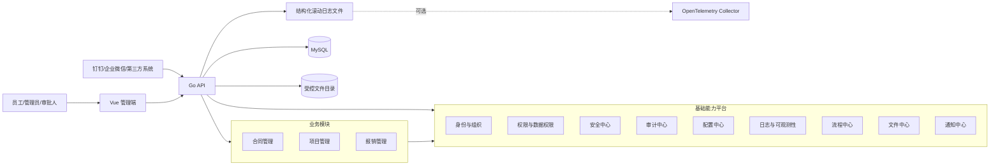
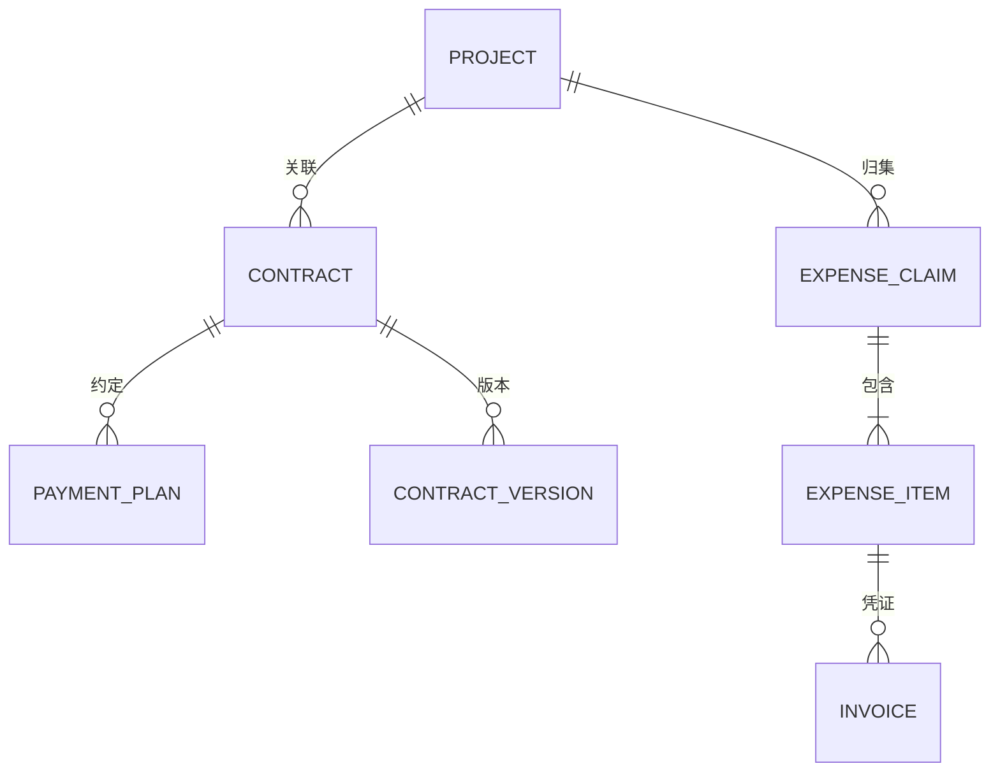
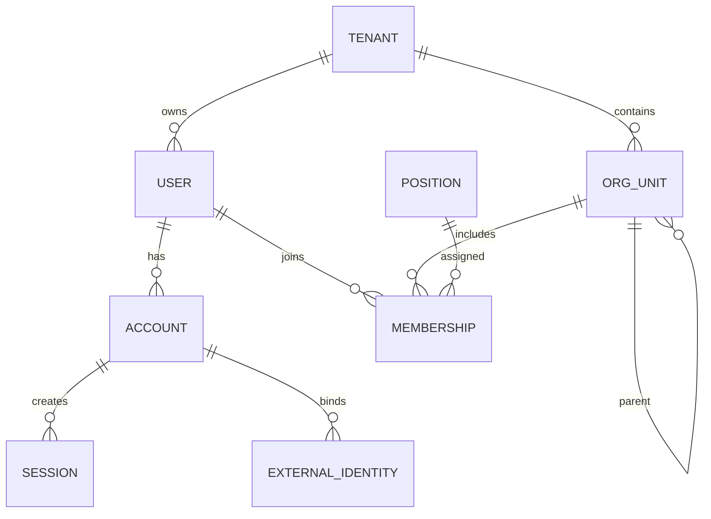
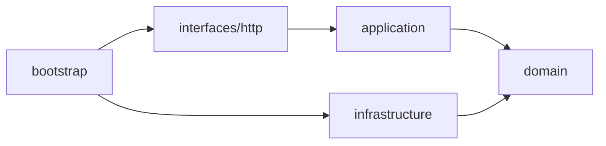

# Basic Platform 模型与工程架构设计

> 技术方向：Go + Vue 3 + JavaScript
>
> 建设目标：先建立身份、权限、安全、审计、配置、日志等公共能力，再逐步接入合同、项目、报销等业务模块。

## 1. 总体结论

项目明确采用 **模块化单体（Modular Monolith）**，不采用微服务架构：

- 一个 Go 后端应用，按领域模块隔离代码和数据访问。
- 后台任务与 API 共用同一套代码和数据库，可按部署需要运行在同一进程或同一应用的 Worker 进程中。
- 一个 Vue 管理端，按业务模块组织页面、路由和状态。
- 一个 MySQL 主库，所有模块共用一个数据库，通过明确的表前缀区分数据所有权。
- 不使用 Redis：会话、登录锁定、权限版本和异步任务持久化到 MySQL，热点数据使用 Go 进程内缓存。
- 文件上传到受控的本地或挂载目录，MySQL 保存文件元数据、绑定关系和校验摘要。
- 模块之间通过 Go 接口、应用服务和进程内领域事件协作，不引入服务发现、RPC 网关和分布式事务。

核心原则：

1. **认证、授权、菜单、数据权限是四个不同概念，不混为一体。**
2. **审计日志与程序运行日志分离。**
3. **业务模块只依赖平台公开能力，不直接操作平台模块的数据表。**
4. **数据库表属于模块，跨模块通过应用服务或事件协作。**
5. **模块化是为了控制单体复杂度，不以未来拆分微服务为前提。**
6. **默认支持租户字段，但如果确定永远只有单组织，可先固定一个默认租户。**

## 2. 系统上下文



## 3. 领域模块划分

### 3.1 平台核心模块

| 模块 | 主要职责 | 核心聚合/实体 |
|---|---|---|
| tenant | 租户与租户隔离 | Tenant、TenantSetting |
| organization | 部门、岗位、成员关系 | OrgUnit、Position、Membership |
| identity | 用户、账号、登录身份、外部身份 | User、Account、ExternalIdentity、Credential |
| authorization | 角色、权限、授权、数据范围 | Role、Permission、RoleBinding、DataPolicy |
| security | 会话、MFA、限流、锁定、风险事件 | Session、MFAFactor、LoginAttempt、RiskEvent、APIClient |
| audit | 登录审计、操作审计、数据变更审计 | AuditEvent、ChangeSet |
| configuration | 参数、密钥引用、环境发布、版本 | ConfigNamespace、ConfigItem、ConfigRelease |
| observability | 应用日志、链路、指标、告警接入 | 不承载业务聚合，以标准遥测为主 |
| workflow | 流程定义、实例、任务、审批动作 | ProcessDefinition、ProcessInstance、Task、Action |
| file | 文件元数据、版本、访问控制 | FileObject、FileVersion、FileBinding |
| notification | 站内信模板、消息、收件箱投递与已读状态 | Notification、Template、Delivery |
| dictionary | 业务字典和可配置枚举 | Dictionary、DictionaryItem |
| scheduler | 定时任务与执行记录 | JobDefinition、JobExecution |

### 3.2 业务模块

| 模块 | 自有核心模型 | 依赖的平台能力 |
|---|---|---|
| contract | Contract、ContractParty、ContractVersion、PaymentPlan、ContractChange | IAM、权限、流程、文件、审计、通知 |
| project | Project、ProjectMember、Milestone、ProjectTask、Deliverable | IAM、权限、文件、审计、通知 |
| expense | ExpenseClaim、ExpenseItem、Invoice、PaymentRecord | IAM、权限、流程、文件、审计、通知 |

业务关系建议：



不要把合同、项目、报销放在一个“business”大包中；它们应该是三个独立领域模块。

## 4. 身份与组织模型

### 4.1 模型关系



### 4.2 核心实体

#### Tenant

```text
Tenant
- id
- code
- name
- status
- plan
- timezone
- locale
- created_at
```

#### User

`User` 表示自然人，不直接等于登录账号。

```text
User
- id
- tenant_id
- employee_no
- display_name
- email
- mobile
- avatar_file_id
- status
- primary_org_id
- manager_user_id
```

#### Account

`Account` 表示可登录主体。一个用户可以拥有本地账号、钉钉身份、企业微信身份等。

```text
Account
- id
- tenant_id
- user_id
- username
- account_type        // human/service
- password_hash
- password_changed_at
- locked_until
- status
- last_login_at
```

#### ExternalIdentity

```text
ExternalIdentity
- id
- tenant_id
- account_id
- provider            // ding_talk/wecom/oidc/ldap
- provider_subject
- union_id
- profile_json
```

#### OrgUnit / Membership

```text
OrgUnit
- id
- tenant_id
- parent_id
- path                 // 祖先路径或物化路径
- code
- name
- type                 // company/department/team
- leader_user_id
- sort_order
- status

Membership
- id
- tenant_id
- user_id
- org_unit_id
- position_id
- is_primary
- start_at
- end_at
- status
```

这里使用 `Membership`，不要只在用户表中保存一个 `department_id`，否则无法表达兼岗、跨部门项目成员、历史任职关系。

## 5. 权限模型

采用 **RBAC + ABAC + Data Scope** 的组合模型：

- RBAC：决定用户是否拥有某类操作权限。
- ABAC：根据用户、资源、环境属性做条件判断。
- Data Scope：决定用户能操作哪些数据行。
- Resource Ownership：业务对象保存创建人、所属部门、负责人等归属属性。

### 5.1 权限判定请求

统一抽象为：

```text
CanAccess(subject, tenant, resource, action, object, context) -> Decision
```

例如：

```json
{
  "subject": "user:1001",
  "tenant": "tenant:default",
  "resource": "contract",
  "action": "approve",
  "object": {
    "id": "contract:2026-001",
    "owner_org_id": "org:finance",
    "amount": 300000
  },
  "context": {
    "ip": "10.0.0.8",
    "time": "2026-07-15T10:00:00+08:00"
  }
}
```

### 5.2 权限实体

```text
Permission
- id
- code                 // contract:create
- resource             // contract
- action               // create/read/update/delete/submit/approve/export
- description
- risk_level

Role
- id
- tenant_id
- code
- name
- role_type             // system/business/custom
- status

RolePermission
- role_id
- permission_id
- effect                // allow/deny，初期可只实现 allow

RoleBinding
- id
- tenant_id
- subject_type          // user/org/position/group/service_account
- subject_id
- role_id
- scope_type            // tenant/org/project
- scope_id
- valid_from
- valid_until

DataPolicy
- id
- tenant_id
- role_id
- resource
- action
- scope_type            // all/self/org/org_tree/custom
- scope_value_json
- condition_expr
```

### 5.3 数据权限

建议第一期只支持有限、可解释的数据范围：

| 范围 | 语义 |
|---|---|
| all | 当前租户全部数据 |
| self | `created_by = current_user` 或 `owner_user_id = current_user` |
| org | 所属部门数据 |
| org_tree | 所属部门及下级部门数据 |
| custom_org | 指定部门集合 |
| participant | 当前用户是项目成员、合同经办人或流程参与人 |

统一由各模块实现 `ScopeProvider`，权限模块只计算范围，不直接拼接业务 SQL：

```go
type DataScope struct {
    All        bool
    UserIDs    []string
    OrgIDs     []string
    ObjectIDs  []string
    Conditions []Condition
}

type ScopeProvider interface {
    Resolve(ctx context.Context, subject Subject, resource, action string) (DataScope, error)
}
```

业务仓储接收 `DataScope` 并把它转成查询条件。对于高敏感表，可在 MySQL 不提供等价的原生行级安全能力，数据权限必须在应用层统一生成查询条件，并通过仓储层强制执行。

### 5.4 菜单与权限分离

```text
Menu
- id
- parent_id
- route_name
- path
- component
- icon
- sort_order
- visible
- required_permissions[]
```

- 菜单用于前端导航。
- 权限用于后端强制授权。
- 隐藏菜单不代表禁止访问。
- 后端 API 必须独立执行权限校验。

## 6. 安全模型

### 6.1 认证

建议统一通过标准身份协议接入第三方身份源：

- 本地用户名密码。
- OIDC 单点登录。
- 钉钉/企业微信作为外部身份提供方适配。
- 外部系统调用平台 API 时使用 `APIClient`/服务账号，不复用个人账号。

会话模型：

```text
Session
- id
- tenant_id
- account_id
- refresh_token_hash
- client_type
- device_id
- ip
- user_agent
- created_at
- expires_at
- revoked_at
- revoke_reason
```

建议：

- Access Token 短有效期。
- Refresh Token 可撤销并做轮换。
- 服务端保存刷新令牌摘要与会话状态。
- 密码使用 Argon2id 等专用密码哈希算法。
- 登录失败执行账号/IP 维度限流。
- 高风险动作支持二次认证或 MFA。

### 6.2 安全策略

```text
SecurityPolicy
- tenant_id
- password_policy_json
- session_policy_json
- login_policy_json
- mfa_policy_json
- ip_policy_json
```

高风险动作示例：

- 导出大批量合同或报销数据。
- 变更角色、权限和安全策略。
- 重置其他用户密码/MFA。
- 审批超过阈值的合同或报销。
- 下载敏感附件。

当前平台已将管理员重置密码、登录安全策略更新、管理员解锁、资源/权限/角色/角色绑定写入、审计导出，以及 OAuth 客户端 JWK、禁用和密钥生命周期操作纳入会话绑定的一次性 MFA 二次验证；具体接口以 `api/openapi/平台接口规范.yaml` 的 `x-mfa-step-up` 为准。

## 7. 审计、日志与可观测性

必须明确区分三类记录：

### 7.1 操作审计日志

用于回答“谁在什么时间，对什么对象做了什么，结果如何”。

```text
AuditEvent
- id
- tenant_id
- occurred_at
- actor_type
- actor_id
- actor_name_snapshot
- action
- resource_type
- resource_id
- request_id
- trace_id
- source_ip
- user_agent
- result
- risk_level
- reason
- metadata_json
```

### 7.2 数据变更审计

```text
ChangeSet
- id
- audit_event_id
- entity_type
- entity_id
- version_before
- version_after
- changed_fields_json
- before_json_masked
- after_json_masked
```

注意：

- 密码、Token、密钥、银行卡完整号码等禁止进入审计明文。
- 审计记录原则上只追加，不允许业务用户修改。
- 关键审计可以异步归档为压缩文件并写入只读归档目录，归档文件保存校验摘要。
- 审计写入失败时，高风险操作应根据策略选择失败关闭，而不是静默忽略。

### 7.3 程序运行日志

采用结构化 JSON 日志，至少包含：

```text
 timestamp, level, service, module, environment,
 request_id, trace_id, span_id,
 tenant_id, user_id,
 operation, duration_ms, error_code
```

不要在日志中输出：密码、Token、Cookie、身份证完整号码、银行卡完整号码、合同敏感全文。

### 7.4 指标和链路

通过 OpenTelemetry 统一采集：

- Trace：API、MySQL、文件操作、后台任务和外部系统调用链。
- Metric：请求量、错误率、延迟、队列堆积、登录失败、审批耗时。
- Log：结构化日志并关联 Trace ID/Span ID。

推荐关键业务指标：

- 合同审批平均时长、超时数量。
- 报销审批平均时长、驳回率。
- 项目延期率、里程碑逾期数。
- 权限拒绝次数、高风险操作次数。
- 登录失败率、账号锁定数。

## 8. 配置中心模型

配置应区分：

1. 系统启动配置：数据库地址、文件根目录、日志目录等，由环境变量或启动配置文件提供。
2. 运行期业务配置：金额阈值、编号规则、审批规则等，存数据库。
3. 敏感配置：只保存密钥引用，不保存可直接展示的明文。

```text
ConfigNamespace
- id
- tenant_id
- module
- environment
- name

ConfigItem
- id
- namespace_id
- key
- value_type
- value_json
- secret_ref
- schema_json
- version
- status

ConfigRelease
- id
- namespace_id
- version
- snapshot_json
- released_by
- released_at
- rollback_from
```

能力要求：

- 配置 Schema 校验。
- 修改、发布、回滚分别审计。
- 乐观锁避免覆盖修改。
- 发布后通过领域事件通知模块刷新缓存。
- 配置读取降级：缓存不可用时可读取数据库，数据库短暂不可用时可使用最近一次快照。

## 9. 工作流模型

合同审批和报销审批不要把状态流转硬编码在 Controller 中。第一期可实现轻量状态机，后续再接 BPMN 引擎。

```text
ProcessDefinition
- id
- tenant_id
- code
- name
- business_type
- version
- definition_json
- status

ProcessInstance
- id
- definition_id
- business_type
- business_id
- initiator_id
- current_node
- status
- started_at
- ended_at

WorkflowTask
- id
- instance_id
- node_key
- assignee_type
- assignee_id
- status
- due_at
- claimed_at
- completed_at

WorkflowAction
- id
- task_id
- actor_id
- action               // approve/reject/return/transfer/cancel
- comment
- created_at
```

业务模块与流程模块通过以下接口交互：

```go
type WorkflowService interface {
    Start(ctx context.Context, cmd StartProcess) (InstanceID, error)
    CompleteTask(ctx context.Context, cmd CompleteTask) error
    Cancel(ctx context.Context, businessType, businessID, reason string) error
}
```

流程模块不直接修改合同或报销表，而是发布：

- `workflow.instance.started`
- `workflow.task.completed`
- `workflow.instance.approved`
- `workflow.instance.rejected`
- `workflow.instance.cancelled`

业务模块订阅事件后更新自身状态。

## 10. Go 后端工程框架

建议目录：

```text
Basic-Platform/
├── backend/
│   ├── cmd/
│   │   ├── api/
│   │   │   └── main.go
│   │   ├── worker/
│   │   │   └── main.go
│   │   └── migrate/
│   │       └── main.go
│   ├── internal/
│   │   ├── bootstrap/          # 配置、依赖装配、生命周期
│   │   ├── platform/
│   │   │   ├── tenant/
│   │   │   ├── organization/
│   │   │   ├── identity/
│   │   │   ├── authorization/
│   │   │   ├── security/
│   │   │   ├── audit/
│   │   │   ├── configuration/
│   │   │   ├── workflow/
│   │   │   ├── file/
│   │   │   └── notification/
│   │   ├── business/
│   │   │   ├── contract/
│   │   │   ├── project/
│   │   │   └── expense/
│   │   ├── shared/
│   │   │   ├── kernel/         # ID、时间、领域事件、错误
│   │   │   ├── authctx/        # 当前租户/用户/Trace 上下文
│   │   │   ├── database/
│   │   │   ├── memorycache/
│   │   │   ├── messaging/
│   │   │   ├── observability/
│   │   │   └── validation/
│   │   └── transport/
│   │       └── http/
│   ├── migrations/
│   ├── .env.example
│   ├── go.mod
│   └── Makefile
├── api/
│   └── openapi/
├── frontend/
├── deployments/
└── docs/
```

每个领域模块内部统一结构：

```text
contract/
├── domain/
│   ├── contract.go             # 聚合根
│   ├── value_objects.go
│   ├── repository.go           # 仓储接口
│   ├── service.go              # 领域服务
│   ├── events.go
│   └── errors.go
├── application/
│   ├── commands/
│   ├── queries/
│   ├── dto.go
│   └── service.go
├── infrastructure/
│   ├── persistence/
│   ├── event_handlers/
│   └── integrations/
├── interfaces/
│   └── http/
└── module.go
```

依赖方向：



约束：

- `domain` 不依赖 HTTP、ORM、MySQL 驱动、文件系统和具体基础设施。
- `application` 负责用例编排、事务边界和权限调用。
- `infrastructure` 实现仓储、消息、外部系统适配。
- `interfaces` 只做协议转换、参数校验、返回结果。
- 跨模块只能依赖对方公开的 application contract 或事件。

### 10.1 请求处理链

```text
Request ID
 -> Trace
 -> Recover
 -> Access Log
 -> CORS/Security Headers
 -> Rate Limit
 -> Authentication
 -> Tenant Resolution
 -> Authorization
 -> Validation
 -> Handler/Application Service
 -> Audit
```

### 10.2 统一上下文

```go
type Principal struct {
    TenantID string
    UserID   string
    AccountID string
    SessionID string
    OrgIDs   []string
    Roles    []string
}
```

禁止业务代码从 HTTP Header 到处读取用户信息；中间件解析后写入 `context.Context`。

### 10.3 统一错误模型

```json
{
  "code": "CONTRACT_VERSION_CONFLICT",
  "message": "合同已被其他用户修改，请刷新后重试",
  "request_id": "...",
  "details": {}
}
```

错误码命名：

```text
模块_对象_原因
AUTH_ACCOUNT_LOCKED
AUTH_PERMISSION_DENIED
CONTRACT_NOT_FOUND
CONTRACT_VERSION_CONFLICT
WORKFLOW_TASK_ALREADY_COMPLETED
```

### 10.4 事务与事件

单体内部需要区分两类事件：

1. **同步领域事件**：在同一进程、同一用例中执行，适合必须立即完成的一致性逻辑。
2. **异步应用事件**：写入 MySQL 任务表，由应用内 Worker 轮询执行，适合通知、文件处理、统计等可重试任务。

```text
同一数据库事务：
1. 更新业务表
2. 写入 async_job / outbox_event
3. 提交事务

应用 Worker：
4. 读取待执行任务
5. 调用单体内部模块处理器
6. 标记成功，失败则按策略重试
```

当前架构不需要 Kafka、RabbitMQ、服务发现或分布式事务框架。Outbox 在这里用于保证数据库事务与异步任务的一致性，并不代表采用微服务。

## 11. Vue 前端工程框架

建议将当前静态 HTML 原型迁移为 Vue 3 + Vite 工程。

```text
frontend/
├── src/
│   ├── app/
│   │   ├── router/
│   │   ├── store/
│   │   ├── guards/
│   │   └── bootstrap.js
│   ├── layouts/
│   ├── modules/
│   │   ├── identity/
│   │   ├── authorization/
│   │   ├── audit/
│   │   ├── configuration/
│   │   ├── contract/
│   │   ├── project/
│   │   └── expense/
│   ├── shared/
│   │   ├── api/
│   │   ├── components/
│   │   ├── composables/
│   │   ├── directives/
│   │   ├── constants/
│   │   └── utils/
│   ├── assets/
│   ├── App.vue
│   └── main.js
├── public/
├── package.json
└── vite.config.js
```

每个前端模块：

```text
modules/contract/
├── api/
├── components/
├── pages/
├── routes.js
├── store.js
├── permissions.js
└── model.js
```

### 11.1 前端权限

```js
export const ContractPermissions = {
  READ: 'contract:read',
  CREATE: 'contract:create',
  UPDATE: 'contract:update',
  SUBMIT: 'contract:submit',
  APPROVE: 'contract:approve',
  EXPORT: 'contract:export'
}
```

路由权限：

```js
{
  path: '/contracts',
  component: () => import('./pages/ContractList.vue'),
  meta: {
    permissions: ['contract:read']
  }
}
```

按钮权限：

```html
<button v-permission="'contract:approve'">审批</button>
```

前端权限只用于用户体验；最终安全判定必须在后端完成。

### 11.2 前端状态

Pinia 只保存跨页面共享状态，例如：

- 当前用户和租户。
- 权限集合与菜单。
- UI 偏好。
- 未读消息数量。

列表查询、表单数据优先保存在页面/Composable 中，避免所有服务端数据都塞入全局 Store。

## 12. 数据库设计规范

### 12.1 通用字段

业务主表建议统一包含：

```text
id                 CHAR(26) / ULID
tenant_id          CHAR(26)
created_at         datetime(3)
created_by         CHAR(26)
updated_at         datetime(3)
updated_by         CHAR(26)
version            bigint       // 乐观锁
status             varchar
```

根据需要增加：

```text
owner_user_id
owner_org_id
classification     // public/internal/confidential/restricted
deleted_at         // 仅确有恢复需求时软删除
```

### 12.2 规则

- 时间统一存 UTC，展示时按租户/用户时区转换。
- 金额使用 `DECIMAL(19,4)` 或最小货币单位整数，不使用浮点数。
- 状态存稳定代码，不存中文显示值。
- JSON 只用于扩展属性、快照和低频结构，不替代核心关系模型。
- 外键用于模块内部强一致关系。
- 单体数据库内可以建立跨模块只读引用外键以保证完整性，但跨模块写操作仍必须通过对方应用服务完成。
- 高频查询必须围绕 `tenant_id` 建复合索引。
- 唯一约束一般包含 `tenant_id`，例如 `(tenant_id, contract_no)`。

### 12.3 表命名示例

```text
iam_tenant
iam_user
iam_account
iam_org_unit
iam_membership
authz_role
authz_permission
authz_role_binding
authz_data_policy
sec_session
sec_login_attempt
audit_event
audit_change_set
cfg_namespace
cfg_item
wf_definition
wf_instance
wf_task
file_object
file_version
file_binding
contract_contract
contract_version
project_project
expense_claim
outbox_event
```

## 13. API 设计

REST 风格示例：

```text
POST   /api/v1/auth/login
POST   /api/v1/auth/token/refresh
DELETE /api/v1/auth/sessions/{id}

GET    /api/v1/users
POST   /api/v1/users
GET    /api/v1/roles
POST   /api/v1/role-bindings
POST   /api/v1/authorization/check

GET    /api/v1/contracts
POST   /api/v1/contracts
GET    /api/v1/contracts/{id}
PATCH  /api/v1/contracts/{id}
POST   /api/v1/contracts/{id}/submit
POST   /api/v1/contracts/{id}/cancel

GET    /api/v1/workflow/tasks
POST   /api/v1/workflow/tasks/{id}/complete
```

命令型动作使用显式端点，不建议为了形式上的 REST 把所有业务动作都伪装成通用 `PATCH status`。

列表协议：

```text
?page=1&page_size=20
&sort=-created_at,contract_no
&filter[status]=APPROVING
&filter[owner_org_id]=...
&keyword=...
```

## 14. 合同、项目、报销的核心聚合

### 14.1 Contract 聚合

```text
Contract
- id
- tenant_id
- contract_no
- title
- contract_type
- project_id
- owner_org_id
- owner_user_id
- counterparty_id
- amount
- currency
- sign_date
- effective_date
- expiry_date
- status
- current_version_id
- workflow_instance_id
- version
```

合同状态建议：

```text
DRAFT -> REVIEWING -> APPROVED -> SIGNED -> EFFECTIVE -> COMPLETED
                    -> REJECTED
DRAFT/REVIEWING -> CANCELLED
EFFECTIVE -> TERMINATED
```

“审批状态”和“合同履约状态”复杂后应拆成两个字段，不要用一个 status 表达所有维度。

### 14.2 Project 聚合

```text
Project
- id
- tenant_id
- project_no
- name
- owner_org_id
- manager_user_id
- budget_amount
- start_date
- planned_end_date
- actual_end_date
- status
- version
```

### 14.3 ExpenseClaim 聚合

```text
ExpenseClaim
- id
- tenant_id
- claim_no
- applicant_user_id
- applicant_org_id
- project_id
- purpose
- total_amount
- currency
- status
- workflow_instance_id
- version
```

报销单负责总额、状态和审批一致性；报销明细、发票是聚合内部实体。付款记录可根据财务边界独立成聚合。

## 15. 分阶段建设路线

### 阶段 0：工程基线

- Go Module、配置加载、依赖注入约定。
- Vue 3 + Vite + Router + Pinia。
- MySQL migration。
- 统一错误、日志、请求 ID、Trace。
- Docker Compose 本地环境。
- 单元测试和 CI 基线。

### 阶段 1：IAM 与安全

- 租户、组织、用户、账号。
- 登录、Token、会话、退出、锁定。
- 角色、权限、角色绑定。
- 菜单生成、按钮权限。
- 登录日志、安全事件。

### 阶段 2：平台公共能力

- 数据权限。
- 操作审计、数据变更审计。
- 配置、字典、文件。
- 通知。
- 轻量工作流。
- OpenTelemetry 可观测性。

### 阶段 3：合同管理

- 合同建档、版本、附件、审批、履约节点。
- 合同权限与部门数据范围。
- 到期提醒和付款计划。

### 阶段 4：项目与报销

- 项目与成员。
- 合同关联项目。
- 报销申请、发票、审批、付款状态。
- 项目成本归集与统计。

### 阶段 5：单体平台化演进

- OpenAPI/Webhook。
- SSO、SCIM/组织同步。
- 数据库任务表、统一调度与失败重试。
- 搜索和报表。
- 单体模块依赖检查、性能优化、读写热点治理和水平扩容。
- 继续保持统一部署，不引入微服务治理体系。

## 16. 不建议的做法

1. 在当前约束下引入微服务、服务发现、RPC 网关或分布式事务。
2. 用户、账号、员工、部门成员混成一张表。
3. 直接使用菜单 ID 作为后端权限。
4. 所有数据权限都通过前端筛选。
5. Controller 直接写 ORM 查询和审批状态流转。
6. 合同、项目、报销共享同一套“大而全 BaseService”。
7. 运行日志、审计日志、业务流水使用同一张表。
8. 使用一个永久 JWT，无法撤销会话。
9. 把密码、Token、密钥写进日志或配置明文。
10. 为了“灵活”把核心业务字段全部放进 JSON。

## 17. 第一版最小闭环

第一版应优先完成以下闭环，而不是同时铺开全部模块：

```text
用户登录
 -> 获取用户/组织/角色
 -> 后端权限校验
 -> 返回菜单和按钮权限
 -> 创建一条合同草稿
 -> 数据权限控制合同可见范围
 -> 提交审批
 -> 审批任务完成
 -> 合同状态更新
 -> 操作审计可追溯
 -> 日志/Trace 可定位一次请求
```

当这个闭环稳定后，项目和报销模块可以复用相同的平台能力接入。
